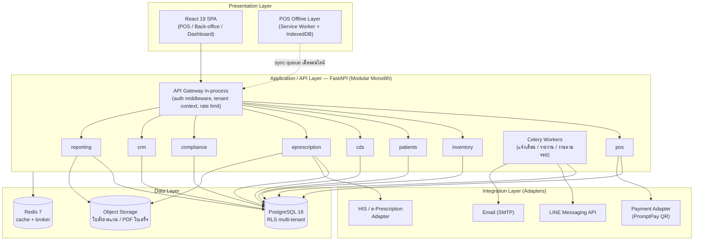
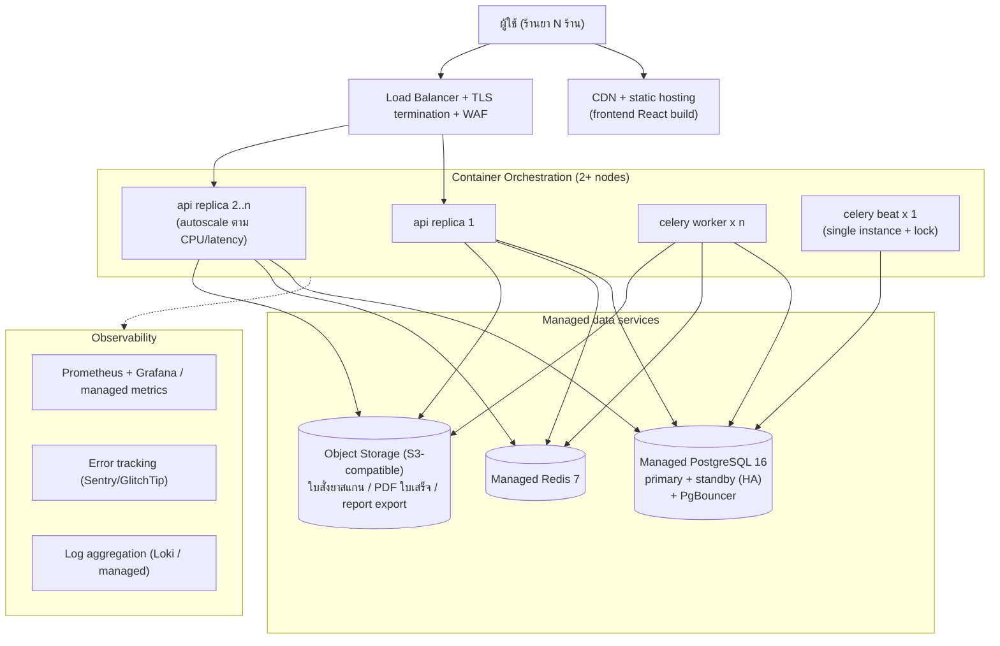
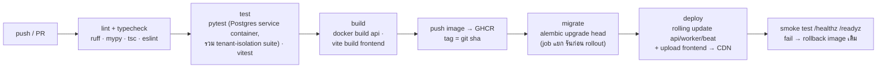
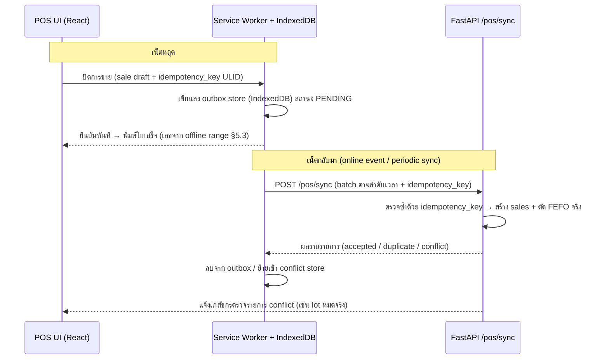

# 01 — สถาปัตยกรรมระบบและ Deployment

เอกสารนี้กำหนดสถาปัตยกรรมของ **ระบบจัดการร้านยาครบวงจร (Pharmacy Management System)**
ตั้งแต่ภาพรวม → โครงสร้าง module ใน backend → multi-tenant design → deployment ทั้งระยะร้านเดียว
และระยะ SaaS → offline-tolerance ของ POS → security/PDPA → integration และ observability
เอกสารอื่นในชุด (schema, API, module design) ต้องอ้างอิงการตัดสินใจในไฟล์นี้เป็นหลัก

## 1. ภาพรวมสถาปัตยกรรม

### 1.1 สรุป technology stack (ค่าคงที่ของทั้งโปรเจกต์ — ห้ามเปลี่ยนโดยไม่แก้เอกสารทุกฉบับ)

| ชั้น | เทคโนโลยี | หมายเหตุ |
|---|---|---|
| Frontend | React 19 + TypeScript + Vite + Tailwind CSS v4 | SPA, build เป็น static assets |
| Backend | Python 3.12 + FastAPI + SQLAlchemy 2.x + Pydantic v2 | ASGI (uvicorn), async-first |
| Migration | Alembic | expand–contract, zero-downtime (ดู §4.4) |
| Database | PostgreSQL 16 | single DB, shared schema, RLS (ดู §3) |
| Cache / Queue | Redis 7 + Celery | งานเบื้องหลัง: แจ้งเตือน, รายงาน, sync |
| สถาปัตยกรรม | Modular Monolith | แยก module ชัดเจน พร้อมแตก service ภายหลัง |
| Multi-tenancy | tenant_id + branch_id + PostgreSQL RLS | single database, shared schema |
| Primary key | UUIDv7 | เรียงตามเวลาได้ ลด index fragmentation |
| เงิน | `DECIMAL(12,2)` สกุล THB | ห้ามใช้ float เด็ดขาด |
| เวลา | `timestamptz` เก็บ UTC | แสดงผลฝั่ง frontend เป็น พ.ศ. |
| Auth | JWT access + refresh, RBAC | OWNER / PHARMACIST / ASSISTANT / CASHIER |
| Inventory | ตัดสต็อกแบบ FEFO ระดับ lot | First Expired First Out |
| Audit | `audit_logs` append-only | trigger ห้าม UPDATE/DELETE |

### 1.2 ทำไมถึงเป็น Modular Monolith ไม่ใช่ Microservices

ระบบนี้เริ่มจากทีมเล็ก (1–3 คน) และผู้ใช้กลุ่มแรกคือร้านยาไม่กี่ร้าน การเริ่มด้วย
microservices จะจ่ายต้นทุนที่ยังไม่จำเป็น:

1. **Transaction ข้าม module เยอะมาก** — การขาย 1 ครั้งแตะทั้ง `sales`, `sale_items`,
   `inventory_movements`, `stock_levels`, `point_transactions`, `controlled_drug_registers`
   ใน monolith ทั้งหมดนี้อยู่ใน **DB transaction เดียว** (ACID) ถ้าเป็น microservices
   ต้องทำ saga/outbox pattern ตั้งแต่วันแรก ซึ่งซับซ้อนเกินความจำเป็นและเสี่ยงต่อ
   ข้อมูลสต็อก/บัญชียาไม่ตรง — เรื่องที่ร้านยา "ผิดไม่ได้" เพราะผูกกับกฎหมาย
2. **Operational overhead** — microservices ต้องมี service discovery, distributed tracing,
   per-service CI/CD, network debugging ทีมเล็กดูแลไม่ไหว
3. **Domain ยังไม่นิ่ง** — ขอบเขต module จะชัดขึ้นหลังใช้งานจริง การย้าย code ข้าม
   module ใน monolith คือการย้ายโฟลเดอร์ แต่ใน microservices คือการย้าย service + API
4. **เส้นทางแตก service ถูกเตรียมไว้แล้ว** — แต่ละ module มี boundary ชัด (ดู §2)
   สื่อสารข้าม module ผ่าน service interface + domain event เท่านั้น เมื่อโหลดถึงจุดที่
   ต้องแยก (เช่น reporting หรือ notification) จะแยกได้โดยแก้จุดเรียกเป็น HTTP/queue

> กติกาเหล็ก: **module ห้าม import model/repository ของ module อื่นโดยตรง** —
> ต้องเรียกผ่าน service layer ของ module นั้น หรือ subscribe domain event
> (บังคับด้วย import-linter ใน CI)

### 1.3 สถาปัตยกรรม 4 ชั้น



- **Presentation** — React SPA เดียว แบ่งเป็นโซน POS (คีย์บอร์ดเป็นหลัก, hotkey),
  back-office (inventory/compliance/CRM) และ dashboard; ฝั่ง POS มีชั้น offline
  (Service Worker + IndexedDB) ตาม §5
- **Application/API** — FastAPI process เดียว โหลด router ของทุก module + Celery
  worker แยก process สำหรับงานเบื้องหลัง
- **Data** — PostgreSQL เป็น source of truth เดียว, Redis เป็น cache/broker
  (ห้ามเก็บข้อมูลที่หายแล้วกู้ไม่ได้ใน Redis), object storage เก็บไฟล์ binary
- **Integration** — ทุกระบบภายนอกคุยผ่าน adapter interface (ดู §7) เพื่อสลับผู้ให้บริการได้

## 2. โครงสร้าง module ภายใน backend (FastAPI)

### 2.1 Directory tree

```
backend/
├── pyproject.toml               # deps + tool config (ruff, mypy, pytest)
├── alembic/
│   ├── env.py                   # ผูก metadata ของทุก module
│   └── versions/                # migration scripts (ลำดับเดียวทั้งระบบ)
├── app/
│   ├── main.py                  # create_app(): รวม router ทุก module + middleware
│   ├── core/                    # โครงสร้างพื้นฐาน — ไม่มี business logic
│   │   ├── config.py            # Pydantic Settings (อ่านจาก env)
│   │   ├── database.py          # async engine + session factory + RLS session var
│   │   ├── security.py          # JWT encode/decode, password hashing (argon2)
│   │   ├── tenancy.py           # TenantContext middleware + dependency
│   │   ├── rbac.py              # require_role(...) dependency
│   │   ├── events.py            # in-process domain event bus (publish/subscribe)
│   │   ├── audit.py             # เขียน audit_logs (append-only)
│   │   ├── logging.py           # structlog JSON config
│   │   └── exceptions.py        # error hierarchy + handler → RFC 7807 problem+json
│   ├── modules/
│   │   ├── auth/                # login, refresh, users, สิทธิ์
│   │   │   ├── router.py        #   endpoint ประกาศ (บาง — ไม่มี logic)
│   │   │   ├── service.py       #   business logic + orchestration
│   │   │   ├── repository.py    #   คุยกับ DB เท่านั้น (SQLAlchemy)
│   │   │   ├── models.py        #   SQLAlchemy models: users, ...
│   │   │   └── schemas.py       #   Pydantic request/response
│   │   ├── pos/                 # ขายหน้าร้าน, ใบเสร็จ, ฉลากยา, sync offline
│   │   │   ├── router.py  service.py  repository.py  models.py  schemas.py
│   │   │   ├── receipt_numbering.py   # per-branch sequence + offline range (§5.3)
│   │   │   └── label_renderer.py      # ฉลากยา (PDF/ESC-POS)
│   │   ├── inventory/           # lot/expiry, FEFO, reorder, PO/GR
│   │   │   ├── router.py  service.py  repository.py  models.py  schemas.py
│   │   │   ├── fefo.py                # อัลกอริทึมตัด lot
│   │   │   └── reorder.py             # reorder point → draft purchase_orders
│   │   ├── patients/            # ผู้ป่วย, แพ้ยา, โรคประจำตัว
│   │   │   └── router.py  service.py  repository.py  models.py  schemas.py
│   │   ├── cds/                 # DDI / drug-disease / allergy check + antibiogram
│   │   │   ├── router.py  service.py  repository.py  models.py  schemas.py
│   │   │   ├── ddi_engine.py          # ประเมิน ddi_rules real-time
│   │   │   ├── allergy_engine.py      # cross-reactivity (allergy_cross_groups)
│   │   │   └── antibiogram.py         # rational antibiotic use (ส่วนขยาย ML/AMR)
│   │   ├── eprescription/       # รับใบสั่งยาดิจิทัลจาก HIS/คลินิก
│   │   │   ├── router.py  service.py  repository.py  models.py  schemas.py
│   │   │   └── adapters/              # ต่อ HIS แต่ละเจ้า (ดู §7.1)
│   │   ├── compliance/          # บัญชี/รายงาน ขย., ยาควบคุมพิเศษ, ใบอนุญาต
│   │   │   ├── router.py  service.py  repository.py  models.py  schemas.py
│   │   │   └── report_builders/       # generator รายงานแต่ละแบบฟอร์ม
│   │   ├── crm/                 # สมาชิก, แต้ม, นัดรับยาต่อเนื่อง
│   │   │   └── router.py  service.py  repository.py  models.py  schemas.py
│   │   ├── reporting/           # dashboard, ยอดขาย/กำไร/stock turnover
│   │   │   └── router.py  service.py  repository.py  schemas.py   # (อ่านอย่างเดียว)
│   │   └── notifications/       # ช่องทางแจ้งเตือน (LINE/email/in-app) — ใช้ร่วมทุก module
│   │       └── service.py  repository.py  models.py  channels/
│   └── workers/
│       ├── celery_app.py        # Celery config (broker = Redis)
│       ├── beat_schedule.py     # งานตามรอบ: expiry scan, reorder scan, นัดรับยา
│       └── tasks/               # task per module (เรียก service เดิม ไม่เขียน logic ซ้ำ)
└── tests/
    ├── conftest.py              # test DB + RLS fixtures + factory
    └── modules/...              # โครงเดียวกับ app/modules
```

### 2.2 กติกา layering ภายใน module

| ชั้น | หน้าที่ | ห้าม |
|---|---|---|
| `router.py` | ประกาศ endpoint, ผูก dependency (auth/RBAC/tenant), แปลง schema | มี business logic, คุย DB ตรง |
| `service.py` | business logic, ประกอบ transaction, publish domain event | รู้จัก HTTP (Request/Response), import repository ของ module อื่น |
| `repository.py` | query/persist ผ่าน SQLAlchemy session | ตัดสินใจทาง business |
| `models.py` | SQLAlchemy ORM models ของตารางที่ module เป็นเจ้าของ | FK ชี้เข้าตารางได้ แต่ห้าม import model ข้าม module (ใช้ชื่อตาราง/`ForeignKey("...")` แบบ string) |
| `schemas.py` | Pydantic v2 request/response | รั่ว ORM object ออกนอก module |

**ตารางเจ้าของ (ownership)** — module เดียวเป็นเจ้าของแต่ละตาราง เขียนได้เฉพาะเจ้าของ:

| Module | ตารางที่เป็นเจ้าของ |
|---|---|
| auth (core) | tenants, branches, users |
| pos | sales, sale_items, sale_payments, receipt_counters, receipt_number_ranges |
| inventory | products, product_barcodes, drug_details, suppliers, lots, stock_levels, inventory_movements, reorder_rules, purchase_orders, purchase_order_items, goods_receipts, goods_receipt_items |
| patients | patients, patient_allergies, patient_conditions |
| cds | cds_rulesets, ddi_rules, drug_disease_rules, allergy_cross_groups, cds_alerts, antibiograms |
| eprescription | prescriptions, prescription_items, dispense_records |
| compliance | controlled_drug_registers, regulatory_reports, licenses |
| crm | loyalty_tiers, point_transactions, refill_reminders |
| notifications | notifications |
| core/audit | audit_logs |

**การสื่อสารข้าม module** มี 2 แบบ:

1. **เรียก service ตรง (synchronous)** — เมื่อผลลัพธ์ต้องอยู่ใน transaction เดียวกัน เช่น
   `pos.service` เรียก `inventory.service.deduct_fefo(...)` ตอนปิดการขาย
2. **Domain event (in-process, ภายหลังเป็น queue)** — เมื่อเป็นผลข้างเคียงที่ยอมช้าได้ เช่น
   `SaleCompleted` → crm สะสมแต้ม, notifications ส่งใบเสร็จ e-receipt, reporting อัปเดต cache
   event bus เริ่มจาก in-process (ฟังก์ชันเรียกต่อใน transaction/after-commit hook)
   สลับ backend เป็น Celery ได้โดย signature เดิม — นี่คือ "รอยตัด" เวลาแตก service

## 3. Multi-tenant design: single DB + RLS

### 3.1 หลักการ

- ทุกตาราง business มีคอลัมน์ `tenant_id UUID NOT NULL` (ร้าน) และตารางที่ผูกกับสาขา
  มี `branch_id UUID NOT NULL` (เช่น sales, stock_levels, controlled_drug_registers)
- การแยกข้อมูลบังคับ **2 ชั้น**: application layer (repository เติม filter อัตโนมัติ) และ
  **PostgreSQL Row-Level Security** เป็น safety net สุดท้าย — ต่อให้ code มี bug ลืม
  filter ข้อมูลข้ามร้านก็ไม่รั่ว
- app connect ด้วย DB role `app_user` ที่ **ไม่ใช่** superuser/owner (RLS ไม่บังคับกับ
  table owner ถ้าไม่ตั้ง `FORCE ROW LEVEL SECURITY`) — migration ใช้ role แยก `app_migrator`

### 3.2 ตัวอย่าง policy SQL

```sql
-- ต่อ 1 ตาราง business (ตัวอย่าง: sales)
ALTER TABLE sales ENABLE ROW LEVEL SECURITY;
ALTER TABLE sales FORCE ROW LEVEL SECURITY;   -- บังคับแม้แต่ owner

CREATE POLICY tenant_isolation ON sales
    USING (tenant_id = current_setting('app.tenant_id')::uuid)
    WITH CHECK (tenant_id = current_setting('app.tenant_id')::uuid);

-- จำกัดสาขา (optional ต่อ role): ผู้ใช้ระดับสาขาเห็นเฉพาะสาขาตัวเอง
-- ค่า 'app.branch_id' = '' หมายถึงระดับร้าน (OWNER) เห็นทุกสาขา
CREATE POLICY branch_scope ON sales AS RESTRICTIVE
    USING (
        current_setting('app.branch_id', true) IS NULL
        OR current_setting('app.branch_id', true) = ''
        OR branch_id = current_setting('app.branch_id')::uuid
    );
```

ฝั่ง application ตั้ง session variable ทุก request ก่อน query แรก (ใน `core/tenancy.py`):

```python
# ทำใน transaction เดียวกับ query — ใช้ SET LOCAL เพื่อไม่รั่วข้าม pooled connection
await session.execute(
    text("SELECT set_config('app.tenant_id', :tid, true),"
         "       set_config('app.branch_id', :bid, true)"),
    {"tid": str(ctx.tenant_id), "bid": str(ctx.branch_id or "")},
)
```

> ⚠️ ข้อควรระวังกับ connection pool (PgBouncer transaction mode): ต้องใช้
> `set_config(..., true)` / `SET LOCAL` เท่านั้น (scope = transaction) ห้ามใช้ `SET`
> ธรรมดา (scope = session) มิฉะนั้น tenant context จะติดไปกับ connection ที่ถูก reuse

ค่า `tenant_id` / `branch_id` มาจาก **JWT claim** ที่เซ็นโดย server ตอน login เท่านั้น
(ห้ามรับจาก header/parameter ที่ client กำหนดเอง) — middleware แกะ token → สร้าง
`TenantContext` → inject เข้า session

### 3.3 เทียบทางเลือก multi-tenancy

| เกณฑ์ | Shared schema + RLS (เลือกใช้) | Schema-per-tenant | Database-per-tenant |
|---|---|---|---|
| ต้นทุน infra ต่อ tenant | ต่ำมาก (แถวใน DB) | กลาง (schema + migration ต่อ tenant) | สูง |
| Migration | รันครั้งเดียว | รัน N ครั้ง (เสี่ยง drift/ค้างครึ่งทาง) | รัน N ครั้ง |
| Query ข้าม tenant (แดชบอร์ดผู้ให้บริการ, benchmark AMR รวม) | ง่าย | ยาก (union ข้าม schema) | ยากมาก |
| Isolation | logical (RLS) — เสี่ยงถ้า policy ผิด | ดีกว่า | ดีที่สุด |
| Backup/restore ราย tenant | ต้อง filter export | ทำได้ระดับ schema | ง่ายสุด |
| Connection pool | ร่วมกันทั้งหมด | search_path ต่อ tenant | pool ต่อ DB (แพง) |
| เหมาะกับ | tenant จำนวนมาก ขนาดเล็ก (ร้านยา) | tenant ใหญ่ isolation สูง | enterprise/regulated แยกเด็ดขาด |

เลือก shared schema + RLS เพราะ tenant ของเราคือร้านยาขนาดเล็กจำนวนมาก ข้อมูลต่อร้านไม่ใหญ่
migration บ่อยในช่วงแรก และมี use case วิเคราะห์รวม (antibiogram ระดับเครือข่าย — ทำแบบ
opt-in และ de-identified ตาม PDPA §6) ความเสี่ยง RLS ปิดด้วย: `FORCE ROW LEVEL SECURITY`,
role แยก, CI test ที่ยิง query ข้าม tenant แล้วต้องได้ 0 แถวเสมอ (tenant-isolation test suite)

## 4. Deployment architecture

### 4.1 ระยะที่ 1 — ร้านเดียว/ไม่กี่ร้าน: Docker Compose บน VPS

VPS เดียว (เริ่มที่ 2 vCPU / 4 GB RAM ก็พอ) รัน 6 containers:

| Container | Image | หน้าที่ |
|---|---|---|
| `caddy` | caddy:2 | reverse proxy + TLS อัตโนมัติ (Let's Encrypt) + เสิร์ฟ frontend static |
| `api` | ghcr.io/…/pharmacy-api | FastAPI (uvicorn, 2–4 workers) |
| `worker` | image เดียวกับ api | Celery worker (แจ้งเตือน, สร้าง PDF, sync) |
| `beat` | image เดียวกับ api | Celery beat (expiry scan รายวัน, reorder scan, นัดรับยา) |
| `postgres` | postgres:16 | ฐานข้อมูลหลัก + volume ถาวร |
| `redis` | redis:7 | cache + Celery broker (`appendonly yes`) |

```yaml
# docker-compose.yml (โครงย่อ — ค่าจริงอยู่ใน repo infra)
services:
  caddy:
    image: caddy:2
    ports: ["80:80", "443:443"]
    volumes: [./Caddyfile:/etc/caddy/Caddyfile, ./frontend/dist:/srv/www]
  api:
    image: ghcr.io/ORG/pharmacy-api:${TAG}
    env_file: .env            # DATABASE_URL, REDIS_URL, JWT_SECRET, ...
    depends_on: {postgres: {condition: service_healthy}, redis: {condition: service_started}}
    healthcheck: {test: ["CMD", "curl", "-f", "http://localhost:8000/healthz"]}
  worker:
    image: ghcr.io/ORG/pharmacy-api:${TAG}
    command: celery -A app.workers.celery_app worker -Q default,notify --concurrency=4
  beat:
    image: ghcr.io/ORG/pharmacy-api:${TAG}
    command: celery -A app.workers.celery_app beat
  postgres:
    image: postgres:16
    volumes: [pgdata:/var/lib/postgresql/data]
    healthcheck: {test: ["CMD-SHELL", "pg_isready -U app"]}
  redis:
    image: redis:7
    command: redis-server --appendonly yes
volumes: {pgdata: {}}
```

ไฟล์แนบ (ใบสั่งยาสแกน/PDF ใบเสร็จ) ในระยะนี้เก็บบน volume ของ VPS ผ่าน interface
`FileStorage` ตัวเดียวกับระยะ SaaS (implementation: `LocalDiskStorage` → สลับเป็น
`S3Storage` โดยไม่แก้ business code)

### 4.2 ระยะที่ 2 — SaaS multi-tenant

เมื่อมีหลายสิบร้านขึ้นไป ย้ายเข้า managed services + container orchestration
(เริ่มจากของง่าย: managed container platform / Docker Swarm / Kubernetes ขนาดเล็ก —
ตัดสินใจตามทีม ops ณ เวลานั้น สิ่งที่เอกสารนี้ fix คือ *รูปทรง* ไม่ใช่ยี่ห้อ):



หลักการสำคัญของระยะนี้:

- **API stateless 100%** — ไม่มี session/ไฟล์ใน container → scale แนวนอนได้ทันที
  ทุก state อยู่ใน PostgreSQL/Redis/S3
- **PgBouncer (transaction pooling)** อยู่หน้า PostgreSQL — จึงต้องรักษากติกา
  `SET LOCAL` ของ §3.2 เคร่งครัด
- **Celery beat มีตัวเดียว** (หรือใช้ distributed lock) กันงานตามรอบยิงซ้ำ
- ข้อมูลอยู่ใน region ใกล้ไทย (เช่น SG/BKK) — ⚠️ PDPA ไม่ได้ห้ามเก็บนอกประเทศ
  แต่การส่งข้อมูลออกนอกราชอาณาจักรมีเงื่อนไขตามมาตรา 28–29 ให้ทบทวนกับ
  ประกาศ สคส. ฉบับล่าสุดก่อนเลือก region/ผู้ให้บริการ

### 4.3 CI/CD ด้วย GitHub Actions

Pipeline ต่อ 1 push เข้า `main` (deploy อัตโนมัติขึ้น staging, ขึ้น production ด้วย tag/manual approve):



ข้อกำหนด:

- test ต้องรันกับ **PostgreSQL จริง** (service container) ไม่ใช่ SQLite — เพราะ RLS,
  `set_config`, trigger ของ audit_logs และ partial index เป็นพฤติกรรมเฉพาะ Postgres
- migration แยกเป็น step ของตัวเอง **ก่อน** rollout code ใหม่ (ดู §4.4) และ pipeline
  มี guard: ถ้า migration ค้าง/ล้มเหลว จะไม่ deploy code
- image เดียว ใช้ทั้ง api/worker/beat (ต่างกันที่ command) — ลด drift

### 4.4 Alembic migration strategy (zero-downtime)

ใช้แบบแผน **expand → migrate → contract** เสมอ เพราะตอน rolling update จะมี code
เวอร์ชันเก่าและใหม่รันพร้อมกันชั่วขณะ:

1. **Expand** (release N): เพิ่มคอลัมน์/ตาราง/index ใหม่แบบ backward-compatible —
   คอลัมน์ใหม่ต้อง nullable หรือมี default; **สร้าง index บนตารางใหญ่ด้วย
   `CREATE INDEX CONCURRENTLY`** (ใน Alembic ตั้ง `postgresql_concurrently=True` +
   ปิด transaction ของ migration นั้น)
2. **Migrate data** (release N หรืองาน backfill แยก): เติมข้อมูลเป็น batch เล็ก ๆ
   ผ่าน Celery task ไม่ lock ตารางยาว
3. **Contract** (release N+1 เป็นต้นไป): ค่อยลบคอลัมน์/ตารางเก่า หลังไม่มี code
   เวอร์ชันไหน read/write มันแล้ว

กติกาเพิ่มเติม: ทุก migration ต้อง reversible (`downgrade` ใช้ได้จริง) ยกเว้นระบุเหตุผล,
ห้าม `ALTER TABLE ... SET NOT NULL` / เปลี่ยน type บนตารางใหญ่ใน migration เดียวกับ expand,
ตั้ง `lock_timeout` (เช่น 5s) ใน migration session กัน DDL ค้างบล็อกทั้งระบบ,
และ **1 branch = 1 head** (CI ตรวจ `alembic heads` ต้องมีหัวเดียว)

### 4.5 Backup & recovery

| หัวข้อ | เป้าหมาย/วิธี |
|---|---|
| เครื่องมือ | **pgBackRest** (ระยะ VPS) หรือ backup ของ managed PostgreSQL (ระยะ SaaS) |
| Full backup | รายสัปดาห์ + differential รายวัน |
| WAL archiving | ต่อเนื่อง → PITR (point-in-time recovery) ได้ทุกจุดเวลา |
| **RPO** | ≤ 5 นาที (WAL push ทุก ≤ 5 นาที; ระยะ SaaS ใช้ streaming → ใกล้ 0) |
| **RTO** | ระยะ VPS ≤ 4 ชั่วโมง; ระยะ SaaS ≤ 30 นาที (failover ไป standby) |
| ที่เก็บ | คนละที่กับเครื่องหลัก (object storage คนละ region/ผู้ให้บริการ), เข้ารหัส (pgBackRest AES-256), retention ≥ 30 วัน |
| Object storage | เปิด versioning + replication สำหรับไฟล์ใบสั่งยา/ใบเสร็จ |
| Redis | ไม่ถือเป็นข้อมูลถาวร — กู้ระบบโดยยอมให้ cache/queue หาย แล้ว rebuild |
| **ซ้อม restore** | **รายไตรมาส**: restore ลง environment แยก → รัน integrity checks (นับแถว audit_logs, ตรวจ stock_levels vs inventory_movements, ยอด controlled_drug_registers) → จดเวลาจริงเทียบ RTO — backup ที่ไม่เคย restore ถือว่าไม่มี backup |

หมายเหตุ: ข้อมูลบัญชียาควบคุม/รายงานตามกฎหมายต้องเก็บย้อนหลังตามที่กฎหมายกำหนด
(รายละเอียด retention ราย entity อยู่ในเอกสาร compliance — ⚠️ ตรวจสอบระยะเวลากับ
ประกาศ อย. ฉบับล่าสุด) ดังนั้น backup retention ของ archive รายปีต้องยาวกว่า 30 วัน
(แยกชุด yearly archive เก็บอย่างน้อยเท่าอายุเอกสารตามกฎหมาย)

## 5. ความพร้อมใช้งานหน้าร้าน — POS ต้องขายได้แม้เน็ตล่ม

หน้าร้านขายยา "หยุดขายไม่ได้" เพราะเน็ตหลุด แนวทางคือ **offline-tolerant POS**
(ไม่ใช่ offline-first ทั้งระบบ — เฉพาะเส้นทางการขายหน้าร้าน):

### 5.1 สิ่งที่ทำงานได้ตอน offline

| ความสามารถ | ออนไลน์ | ออฟไลน์ |
|---|---|---|
| สแกนบาร์โค้ด/ค้นสินค้า/ราคา | ✓ | ✓ (จาก catalog cache ใน IndexedDB, sync เป็นรอบ) |
| ขาย + รับเงินสด + พิมพ์ใบเสร็จ/ฉลากยา | ✓ | ✓ (เข้าคิว sync) |
| ตัดสต็อก FEFO ระดับ lot | ✓ (server) | โดยประมาณจาก stock snapshot — ตัดจริงตอน sync |
| PromptPay QR / e-Prescription / CDS เต็มรูปแบบ | ✓ | ✗ (เงินสดเท่านั้น; CDS ใช้ rule cache ชุดวิกฤต เช่น แพ้ยาของสมาชิกที่ cache ไว้ + DDI ระดับ contraindicated) |
| งาน back-office (PO, รายงาน, ทะเบียนผู้ป่วย) | ✓ | ✗ |

### 5.2 กลไก local queue + sync



- ทุกธุรกรรมมี **idempotency key (ULID สร้างที่ terminal)** — server เก็บ unique index
  → retry ได้ไม่เกิดใบเสร็จซ้ำ
- ตัดสต็อกจริงเกิดที่ server เสมอ (single source of truth) — ตอน offline ตัดจาก snapshot
  เพื่อแสดงผลเท่านั้น ถ้า sync แล้ว lot ไม่พอ ระบบสร้าง movement `ADJUST` ติดลบ
  (พร้อม `reason` ระบุว่าเป็น offline oversell) + insert `notifications` ให้เภสัชกร
  ตรวจสอบเคลียร์ ไม่ block การบันทึกขาย
- catalog cache (products/ราคา/บาร์โค้ด/stock snapshot/DDI ชุดวิกฤต) refresh ทุก 15 นาที
  และหลัง reconnect ทันที
- **การขายยาที่ต้องมีเภสัชกร/ยาควบคุมพิเศษตอน offline**: บังคับ role PHARMACIST
  ล็อกอินอยู่ที่ terminal จึงจะขายหมวดนี้ได้ และรายการจะถูกเขียนเข้า
  controlled_drug_registers ตอน sync พร้อมเวลาขายจริง (ไม่ใช่เวลา sync)

### 5.3 เลขใบเสร็จแบบ per-branch sequence ไม่ชนกัน

ข้อกำหนด: เลขใบเสร็จต่อสาขาต้องไม่ซ้ำ ไล่ลำดับตรวจสอบได้ และออกได้แม้ offline

- **รูปแบบเลข**: `{branch_code}-{YYYYMM (ค.ศ. ตามเวลา Asia/Bangkok)}-{running 6 หลัก}`
  เช่น `PAI01-202607-000123` — ถ้าต้องการแสดงปี พ.ศ. บนใบเสร็จ ให้เป็นการแสดงผลเท่านั้น
  ไม่ใช่ค่าใน `receipt_no` (ตาม schema doc)
- **ออนไลน์**: server ออกเลขจากตาราง `receipt_counters (tenant_id, branch_id, period, last_no)`
  อัปเดตด้วย `UPDATE ... SET last_no = last_no + 1 RETURNING` ใน transaction
  เดียวกับ insert `sales` (row lock ธรรมชาติ → ไม่มี gap จาก rollback ที่มองข้าม
  transaction สำเร็จ) — ไม่ใช้ Postgres SEQUENCE เพราะ sequence ไม่ rollback ทำให้เลขโดด
- **ออฟไลน์**: แต่ละ terminal **จองช่วงเลข (range allocation)** ล่วงหน้าตอนออนไลน์
  เช่น terminal A ได้ `000200–000299` บันทึกใน `receipt_number_ranges
  (branch_id, terminal_id, period, range_start, range_end, issued_upto)` (DDL ใน schema doc
  §3.4 — มี EXCLUDE constraint กันช่วงเลขทับซ้อน) — ตอน offline ใช้เลข
  จาก range ของตัวเอง จึง**ไม่ชนกันข้าม terminal/สาขาโดยโครงสร้าง** เมื่อใช้ถึง 80%
  และออนไลน์อยู่ ระบบจองช่วงถัดไปอัตโนมัติ
- ผลข้างเคียงที่ยอมรับ: เลขใบเสร็จ *ไม่เรียงตามเวลาสนิท* ช่วงที่มี offline (range สลับกัน)
  แต่ยังตรวจนับครบถ้วนได้ (ทุกเลขในทุก range ต้อง reconcile เป็นใบเสร็จหรือถูก void
  พร้อมเหตุผล — มีรายงาน gap analysis ใน compliance module)
  ⚠️ ถ้าร้านต้องออกใบกำกับภาษีเต็มรูป ให้ตรวจข้อกำหนดเลขที่เอกสารกับประกาศ
  กรมสรรพากรฉบับล่าสุดอีกครั้ง

## 6. Security & PDPA

### 6.1 มาตรการทางเทคนิค

| ชั้น | มาตรการ |
|---|---|
| Transport | TLS 1.2+ ทุกเส้นทาง (Caddy/LB จัดการ cert), HSTS; ภายใน cluster ใช้เครือข่ายส่วนตัว/mTLS ตามแพลตฟอร์ม |
| At rest | disk/volume encryption (LUKS บน VPS / encryption ของ managed DB), pgBackRest เข้ารหัส backup, object storage ใช้ SSE |
| Application | argon2id สำหรับรหัสผ่าน, JWT อายุสั้น (access 15 นาที) + refresh rotation + revoke list ใน Redis, rate limit ที่ login/OTP, CORS ล็อก origin, CSP บน frontend |
| Field-level | เลขบัตรประชาชนผู้ป่วย เก็บแบบเข้ารหัส (pgcrypto/app-level AES-GCM) + เก็บ hash แยกไว้ค้นหา; ห้าม log ค่าเต็มทุกกรณี |
| Secrets | อยู่ใน secret manager/CI secrets เท่านั้น — ไม่อยู่ใน image, ไม่อยู่ใน git |
| RBAC | สิทธิ์ผูก endpoint + ข้อมูล (เช่น CASHIER ไม่เห็นประวัติการรักษา, การจ่ายยาควบคุมพิเศษต้องเป็น PHARMACIST) |

### 6.2 การจัดชั้นข้อมูลตาม PDPA

ข้อมูลสุขภาพเป็น **ข้อมูลส่วนบุคคลอ่อนไหวตามมาตรา 26** ของ พ.ร.บ. คุ้มครองข้อมูล
ส่วนบุคคล พ.ศ. 2562 — ระบบจัดชั้นข้อมูลเป็น 3 ระดับและติด tag ระดับไว้ที่ schema doc:

| ระดับ | ตัวอย่างข้อมูล | มาตรการเพิ่ม |
|---|---|---|
| **S — Sensitive (ม.26)** | patient_allergies, patient_conditions, prescriptions, dispense_records, ประวัติซื้อยาที่บ่งชี้โรค | ฐานการประมวลผลหลัก: เพื่อการรักษา/เวชกรรมโดยผู้ประกอบวิชาชีพ (ม.26(5)(ก)) ⚠️ ยืนยันการตีความกับที่ปรึกษากฎหมาย; access log ทุกการอ่าน; role จำกัดสุด |
| **P — Personal** | patients (ชื่อ ที่อยู่ เบอร์), users, สมาชิก CRM | consent/สัญญาเป็นฐานตามกรณี, สิทธิเจ้าของข้อมูลครบ |
| **I — Internal** | products, lots, ยอดขายรวม (ไม่ระบุตัวบุคคล) | ควบคุมตาม RBAC ปกติ |

การปฏิบัติตามสิทธิเจ้าของข้อมูล (Data Subject Rights):

- **เข้าถึง/ขอสำเนา** — endpoint export ข้อมูลผู้ป่วยรายคน (JSON/PDF) ให้เจ้าหน้าที่ร้านทำตามคำขอ
- **แก้ไข** — ผ่านหน้าจอทะเบียนผู้ป่วย (ทุกการแก้ลง audit_logs)
- **ลบ/ระงับ** — ใช้ **soft delete + anonymization**: ข้อมูลใบเสร็จ/บัญชียาควบคุมที่กฎหมาย
  บังคับเก็บ **ลบจริงไม่ได้** — ระบบจะตัดความเชื่อมโยงตัวบุคคล (แทนชื่อด้วย token)
  เมื่อพ้นเหตุจำเป็น และบันทึกคำขอ+ผลไว้เป็นหลักฐาน
- **Retention**: กำหนดต่อ entity ใน schema doc; ค่าเริ่มต้น — ข้อมูลผู้ป่วยไม่เคลื่อนไหว
  เก็บไม่เกินความจำเป็นตามประกาศนโยบายของร้าน, เอกสารตามกฎหมายยา/ภาษีเก็บตามที่
  กฎหมายนั้นกำหนด (⚠️ ระบุปีที่แน่นอนหลังตรวจประกาศ อย./สรรพากรฉบับล่าสุด)
- **Access log**: การอ่านข้อมูลระดับ S ทุกครั้งเขียน audit_logs (ใคร อ่านของใคร เมื่อไร
  จาก IP/terminal ไหน เหตุผล/บริบทหน้าจอ) — append-only ตามกติกา audit ของระบบ
- มีบันทึกรายการประมวลผล (RoPA ตามมาตรา 39) เป็นเอกสารประกอบระบบ และแบนเนอร์/เอกสาร
  แจ้ง privacy notice ที่จุดสมัครสมาชิกและแบบฟอร์มผู้ป่วยใหม่

## 7. Integration layer — adapter ทั้งหมด

ทุกระบบภายนอกอยู่หลัง **interface (Python Protocol)** ต่อโดเมน มี implementation
จริงอย่างน้อย 1 ตัว + `Fake*` สำหรับ test/dev เสมอ และเรียกผ่าน Celery พร้อม retry +
exponential backoff เมื่อไม่จำเป็นต้อง synchronous

### 7.1 HIS / e-Prescription adapter

```python
class EPrescriptionProvider(Protocol):
    async def fetch_prescription(self, ref: str) -> PrescriptionPayload: ...
    async def acknowledge_dispense(self, ref: str, record: DispenseResult) -> None: ...
```

- แต่ละโรงพยาบาล/คลินิก/แพลตฟอร์มมี adapter ของตัวเองใน `modules/eprescription/adapters/`
  แปลงเข้า **canonical model** (`prescriptions`, `prescription_items`) ที่เดียว —
  business logic ไม่รู้จักรูปแบบภายนอก
- มาตรฐานที่เตรียมรองรับ: **FHIR R4** (MedicationRequest/MedicationDispense) เป็น adapter แรก
  เพราะเป็นทิศทางของระบบสุขภาพดิจิทัลไทย ⚠️ มาตรฐาน e-prescription กลางของไทยยังพัฒนาอยู่
  — ตรวจสเปคปัจจุบันกับ สปสช./กระทรวงสาธารณสุข ก่อน implement จริง
- ช่องทางรับ: REST pull (poll ด้วย ref จาก QR บนใบสั่งยา) และ webhook push (ถ้าฝั่ง HIS รองรับ)
  ทุก payload เก็บ raw ลง object storage เพื่อ audit/debug

### 7.2 Payment adapter (PromptPay QR)

```python
class PaymentProvider(Protocol):
    async def create_qr(self, amount: Decimal, ref: str) -> QRPayment: ...
    async def get_status(self, payment_id: str) -> PaymentStatus: ...
    def verify_webhook(self, headers: Mapping, body: bytes) -> PaymentEvent: ...
```

- เริ่มด้วย **dynamic PromptPay QR (มาตรฐาน EMVCo/Thai QR)** ผ่าน payment gateway
  หรือ API ธนาคาร — การยืนยันเงินเข้าใช้ webhook + fallback polling
- การขายผูกกับ `sale_payments` หลายแถวต่อบิลได้ (เงินสด + QR ผสม) และสถานะ QR
  ค้างจ่ายมี timeout อัตโนมัติ (void QR → กลับเป็นเงินสด)
- webhook ทุกช่องทางต้อง verify signature และ endpoint เป็น idempotent

### 7.3 LINE Messaging API (แจ้งเตือนสมาชิก/ร้าน)

- ใช้ **LINE Official Account + Messaging API** ส่ง: นัดรับยาต่อเนื่อง, ยาใกล้หมด
  (refill reminder), แต้ม/สิทธิ์สมาชิก และแจ้งเตือนภายในร้าน (สต็อกต่ำ/ยาใกล้หมดอายุ
  เข้ากลุ่ม LINE ของร้าน)
- ผูกสมาชิกกับ LINE ผ่าน LIFF/QR link ที่หน้าร้าน (เก็บ `line_user_id` เมื่อได้ consent)
- ส่งผ่าน `notifications` module → Celery queue `notify` พร้อม retry; ค่า quota/ค่าใช้จ่าย
  push message เป็นต้นทุนต่อร้าน — ใส่ rate budget ต่อ tenant กันยิงเกิน
- ทางเลือกสำรอง: SMS/email adapter interface เดียวกัน (channel per notification type
  ตั้งค่าได้ต่อร้าน)

## 8. Observability

| ด้าน | แนวทาง |
|---|---|
| **Structured logging** | structlog → JSON บรรทัดเดียว/เหตุการณ์; ทุก log มี `request_id` (มาจาก header `X-Request-ID` หรือสร้างใหม่), `tenant_id`, `branch_id`, `user_id`, `module`; **ห้าม log ข้อมูลระดับ S** (ชื่อผู้ป่วย/การวินิจฉัย) — ใช้ id แทน |
| **Metrics** | Prometheus format ที่ `/metrics` (ปิดจาก public): RED metrics ต่อ endpoint (rate/error/duration), ความยาว Celery queue, sync backlog ของ POS ต่อสาขา, business metrics (ยอดขาย/ชม., alert override rate ของ CDS) → Grafana dashboards + alert (error rate, p95 latency, queue ค้าง, disk DB) |
| **Error tracking** | Sentry (หรือ GlitchTip self-host ถ้าต้องคุมข้อมูลเอง) ทั้ง frontend + backend, ผูก release กับ git sha, scrub ข้อมูลส่วนบุคคลก่อนส่ง |
| **Health checks** | `/healthz` = liveness (process ตอบได้), `/readyz` = readiness (ping DB + Redis + migration head ตรง) — ใช้โดย compose healthcheck / orchestrator / uptime monitor ภายนอก |
| **Tracing (ภายหลัง)** | โครงพร้อมสำหรับ OpenTelemetry (FastAPI + SQLAlchemy instrumentation) — เปิดใช้เมื่อเริ่มแตก service |
| **Uptime / SLO เริ่มต้น** | availability API 99.5% รายเดือน (ระยะ VPS), p95 endpoint ขาย < 300 ms; POS หน้าร้านไม่ผูกกับ SLO นี้เพราะ offline-tolerant ตาม §5 |

## 9. สรุปสิ่งที่เอกสารอื่นต้องยึดตาม

- โมดูล backend 8 โมดูลหลัก: `pos`, `inventory`, `patients`, `cds`, `eprescription`,
  `compliance`, `crm`, `reporting` (+ `auth` และ `notifications` เป็นโมดูลโครงสร้างพื้นฐาน)
  โครงชั้น router → service → repository และกติกาห้าม import ข้าม module
- Multi-tenant: RLS + `app.tenant_id` / `app.branch_id` ผ่าน
  `set_config(..., true)` — ทุกตาราง business มี `tenant_id`
- Deployment ระยะแรก 6 containers: `caddy`, `api`, `worker`, `beat`, `postgres`, `redis`
- เลขใบเสร็จ: per-branch sequence + offline range allocation ต่อ terminal
- Offline: outbox ใน IndexedDB + idempotency key (ULID) + `/pos/sync`
- ข้อมูลสุขภาพ = ข้อมูลอ่อนไหว PDPA ม.26 → จัดชั้น S/P/I + access log ทุกการอ่านระดับ S
- Integration ทุกตัวเป็น adapter interface + Fake implementation สำหรับ test
