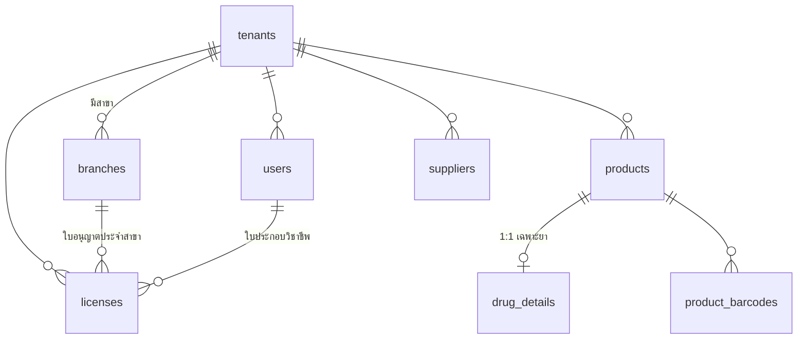
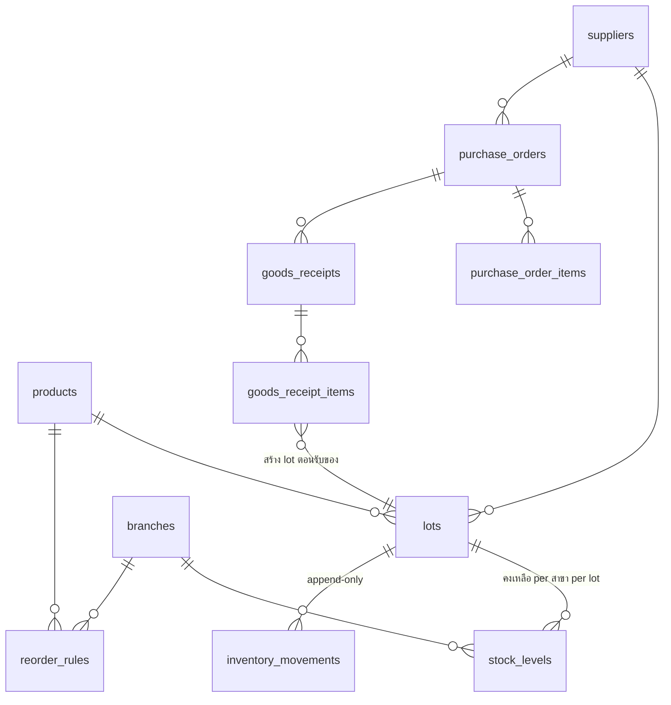
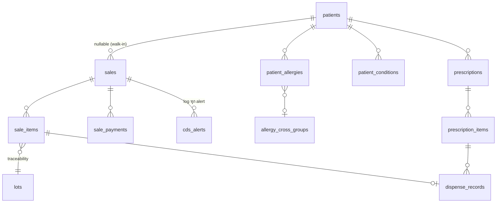
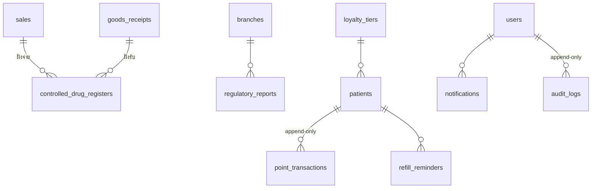

# Database Schema (PostgreSQL 16)

เอกสารนี้คือ **แหล่งอ้างอิงกลาง (canonical)** ของชื่อตาราง/คอลัมน์/enum ทั้งหมดในระบบจัดการร้านยา
เอกสารอื่นทุกฉบับ (API, module design, compliance) ต้องใช้ชื่อตามที่กำหนดที่นี่
Stack ที่เกี่ยวข้อง: PostgreSQL 16 · SQLAlchemy 2.x · Alembic (ทุก DDL ในเอกสารนี้ต้องแปลงเป็น migration)

---

## 1. หลักการออกแบบ

| หลักการ | รายละเอียด |
|---|---|
| Multi-tenant | Single database, shared schema — ทุกตารางข้อมูลธุรกิจมี `tenant_id` (ร้าน) และตารางที่ผูกสาขามี `branch_id` บังคับการมองเห็นด้วย **Row-Level Security (RLS)** |
| Primary key | `UUIDv7` ทุกตาราง (เรียงตามเวลา → index locality ดี, ไม่ชนกันข้าม tenant) ยกเว้น `receipt_counters` ที่ใช้ composite key |
| เงิน | `DECIMAL(12,2)` สกุล THB เสมอ — ห้ามใช้ float |
| จำนวน (ยา/สต็อก) | `NUMERIC(12,3)` รองรับยาน้ำ/แบ่งขาย |
| เวลา | `timestamptz` เก็บ UTC เสมอ — แปลงเป็นเวลาไทย + พ.ศ. ที่ชั้นแสดงผล |
| Soft delete | เฉพาะ **master data** (products, suppliers, patients, users, branches, loyalty_tiers) ใช้คอลัมน์ `deleted_at` — ข้อมูลธุรกรรมห้ามลบ ใช้สถานะ VOIDED/CANCELLED แทน |
| Append-only | `inventory_movements`, `controlled_drug_registers`, `point_transactions`, `cds_alerts`, `audit_logs` — บังคับด้วย trigger ห้าม UPDATE/DELETE |
| ชื่อตาราง | snake_case พหูพจน์ ภาษาอังกฤษ |
| Naming FK | `<singular>_id` เช่น `product_id`, `lot_id` |
| Timestamps มาตรฐาน | ทุกตารางมี `created_at` · ตารางที่แก้ไขได้มี `updated_at` (อัปเดตด้วย trigger `set_updated_at` — ไม่เขียนซ้ำใน DDL ทุกตารางเพื่อความกระชับ) |

### 1.1 Extensions และฟังก์ชันพื้นฐาน

```sql
CREATE EXTENSION IF NOT EXISTS pg_trgm;      -- fuzzy search ชื่อยา
CREATE EXTENSION IF NOT EXISTS btree_gin;    -- composite GIN index
CREATE EXTENSION IF NOT EXISTS btree_gist;   -- EXCLUDE constraint กันช่วงเลขใบเสร็จทับซ้อน (receipt_number_ranges)
CREATE EXTENSION IF NOT EXISTS citext;       -- email แบบ case-insensitive

-- PostgreSQL 16 ยังไม่มี uuidv7() ในตัว (มีใน PG18) — ใช้ฟังก์ชันนี้ไปก่อน
-- ฝัง unix timestamp (ms) 48 bit แรก + ตั้ง version bits เป็น 7
CREATE OR REPLACE FUNCTION uuid_generate_v7() RETURNS uuid AS $$
  SELECT encode(
    set_bit(
      set_bit(
        overlay(uuid_send(gen_random_uuid())
          placing substring(int8send(floor(extract(epoch FROM clock_timestamp()) * 1000)::bigint) FROM 3)
          FROM 1 FOR 6),
        52, 1),
      53, 1),
    'hex')::uuid;
$$ LANGUAGE sql VOLATILE;

-- trigger function: อัปเดต updated_at อัตโนมัติ
CREATE OR REPLACE FUNCTION set_updated_at() RETURNS trigger AS $$
BEGIN NEW.updated_at = now(); RETURN NEW; END;
$$ LANGUAGE plpgsql;

-- trigger function: บังคับ append-only
CREATE OR REPLACE FUNCTION forbid_update_delete() RETURNS trigger AS $$
BEGIN
  RAISE EXCEPTION 'ตาราง % เป็น append-only ห้าม % ', TG_TABLE_NAME, TG_OP;
END;
$$ LANGUAGE plpgsql;
```

### 1.2 Row-Level Security (RLS)

แอปตั้งค่า session variable ต่อ transaction (ผ่าน SQLAlchemy event `after_begin`):

```sql
SET LOCAL app.tenant_id = '<uuid ของร้านจาก JWT>';
SET LOCAL app.branch_id = '<uuid ของสาขาที่ล็อกอิน>';   -- optional ใช้กับ policy ระดับสาขา
```

Pattern เดียวกันทุกตารางที่มี `tenant_id` (ตัวอย่างกับ `products`):

```sql
ALTER TABLE products ENABLE ROW LEVEL SECURITY;
ALTER TABLE products FORCE ROW LEVEL SECURITY;   -- บังคับแม้เป็น table owner

CREATE POLICY tenant_isolation ON products
  USING (tenant_id = current_setting('app.tenant_id')::uuid)
  WITH CHECK (tenant_id = current_setting('app.tenant_id')::uuid);
```

ข้อยกเว้น — ตาราง **ความรู้กลาง (shared reference data)** ไม่มี `tenant_id` และเปิดอ่านได้ทุก tenant:
`ddi_rules`, `drug_disease_rules`, `allergy_cross_groups` (แถวที่ร้านเพิ่มเองใช้ `tenant_id` nullable + policy แยก — ดู DDL)
ส่วน `tenants` เองใช้ policy `id = current_setting('app.tenant_id')::uuid`

การกรองระดับ **สาขา** (เช่น CASHIER เห็นเฉพาะสาขาตัวเอง) ทำที่ application layer เป็นหลัก
RLS ระดับ tenant คือแนวป้องกันสุดท้าย (defense in depth) กันข้อมูลรั่วข้ามร้าน

### 1.3 ER Overview

#### กลุ่ม 1 — Core/Tenancy + Product



#### กลุ่ม 2 — Inventory + Purchasing



#### กลุ่ม 3 — POS + Patient/Clinical + CDS



#### กลุ่ม 4 — Compliance + CRM + System



---

## 2. ENUM ทั้งหมด

```sql
CREATE TYPE user_role AS ENUM ('OWNER', 'PHARMACIST', 'ASSISTANT', 'CASHIER');

-- ⚠️ ชื่อแบบฟอร์ม/ประเภทใบอนุญาต ให้ตรวจสอบกับประกาศ อย./สภาเภสัชกรรมฉบับล่าสุด
CREATE TYPE license_type AS ENUM (
  'PHARMACY_LICENSE',        -- ใบอนุญาตขายยาแผนปัจจุบัน (แบบ ข.ย.5)
  'GPP_CERTIFICATE',         -- หนังสือรับรอง GPP
  'PHARMACIST_PROFESSIONAL', -- ใบประกอบวิชาชีพเภสัชกรรม (ผูก user_id)
  'PSYCHOTROPIC_LICENSE',    -- ใบอนุญาตขายวัตถุออกฤทธิ์ประเภท 3/4
  'NARCOTIC_LICENSE',        -- ใบอนุญาตจำหน่ายยาเสพติดให้โทษประเภท 3
  'OTHER');

CREATE TYPE legal_category AS ENUM (
  'HOUSEHOLD',        -- ยาสามัญประจำบ้าน
  'NON_DANGEROUS',    -- ยาแผนปัจจุบันบรรจุเสร็จที่ไม่ใช่ยาอันตราย/ควบคุมพิเศษ
  'DANGEROUS',        -- ยาอันตราย (เภสัชกรส่งมอบ)
  'SPECIAL_CONTROL',  -- ยาควบคุมพิเศษ (ต้องมีใบสั่งยา + บัญชี ข.ย.10)
  'PSYCHOTROPIC_2',   -- วัตถุออกฤทธิ์ประเภท 2 (ร้านยาทั่วไปขายไม่ได้ — เก็บไว้เพื่อ validation)
  'PSYCHOTROPIC_3_4', -- วัตถุออกฤทธิ์ประเภท 3/4
  'NARCOTIC_3');      -- ยาเสพติดให้โทษประเภท 3

CREATE TYPE movement_type AS ENUM ('RECEIVE', 'SALE', 'RETURN', 'ADJUST', 'TRANSFER', 'DISPOSE');

CREATE TYPE po_status AS ENUM ('DRAFT', 'SUBMITTED', 'PARTIALLY_RECEIVED', 'RECEIVED', 'CANCELLED');

CREATE TYPE sale_status AS ENUM ('COMPLETED', 'VOIDED', 'RETURNED');

CREATE TYPE payment_method AS ENUM ('CASH', 'TRANSFER', 'PROMPTPAY', 'CARD');

CREATE TYPE allergy_severity AS ENUM ('MILD', 'MODERATE', 'SEVERE', 'LIFE_THREATENING');

CREATE TYPE ddi_severity AS ENUM ('CONTRAINDICATED', 'MAJOR', 'MODERATE', 'MINOR');

CREATE TYPE prescription_source AS ENUM ('PAPER', 'E_PRESCRIPTION');

CREATE TYPE prescription_status AS ENUM (
  'RECEIVED', 'VERIFIED', 'PARTIALLY_DISPENSED', 'DISPENSED', 'REJECTED', 'CANCELLED');

CREATE TYPE cds_alert_type AS ENUM (
  'DDI', 'ALLERGY', 'DRUG_DISEASE', 'DRUG_PREGNANCY', 'DRUG_LACTATION',
  'DUPLICATE_THERAPY', 'HIGH_ALERT', 'ANTIBIOGRAM');

-- ชนิดกฎใน ddi_rules (กฎ drug-disease แยกเก็บในตาราง drug_disease_rules — ดู §3.6)
CREATE TYPE cds_rule_type AS ENUM (
  'DDI', 'DRUG_PREGNANCY', 'DRUG_LACTATION', 'DUPLICATE_THERAPY');

CREATE TYPE cds_code_kind AS ENUM ('GENERIC', 'ATC_CLASS');

CREATE TYPE cds_evidence_level AS ENUM ('A', 'B', 'C');

CREATE TYPE cds_ruleset_status AS ENUM ('DRAFT', 'IN_REVIEW', 'PUBLISHED', 'RETIRED');

CREATE TYPE cds_alert_outcome AS ENUM (
  'ACCEPTED',    -- ผู้ใช้ทำตามคำแนะนำ (เปลี่ยน/ตัดรายการ)
  'OVERRIDDEN',  -- ผู้ใช้ยืนยันจ่ายต่อ พร้อมเหตุผล (บังคับกรอก)
  'BLOCKED');    -- ระบบบล็อกเด็ดขาด (เช่น CONTRAINDICATED + แพ้ยา LIFE_THREATENING)

CREATE TYPE controlled_register_type AS ENUM ('SPECIAL_CONTROL', 'PSYCHOTROPIC', 'NARCOTIC');

CREATE TYPE register_entry_type AS ENUM ('RECEIVE', 'DISPENSE', 'RETURN', 'DISPOSE');

-- ⚠️ เลขแบบฟอร์ม ข.ย. อ้างตามกฎกระทรวงการขออนุญาตฯ ขายยาแผนปัจจุบัน พ.ศ. 2556
--    ให้ตรวจสอบฉบับล่าสุด + ประกาศ อย. ก่อน implement จริง
CREATE TYPE report_type AS ENUM (
  'KY9_PURCHASE',              -- บัญชีการซื้อยา (ข.ย.9)
  'KY10_SPECIAL_CONTROL_SALE', -- บัญชีการขายยาควบคุมพิเศษ (ข.ย.10)
  'KY11_DANGEROUS_SALE',       -- บัญชีการขายยาอันตราย เฉพาะรายการที่ อย. กำหนด (ข.ย.11)
  'KY12_PRESCRIPTION_SALE',    -- บัญชีการขายยาตามใบสั่งยา (ข.ย.12)
  'KY13_SALE_REPORT',          -- รายงานการขายยาตามที่เลขาธิการ อย. กำหนด (ข.ย.13) — รอบส่งตามประกาศ
                               --   (ปัจจุบันทุก 4 เดือน ยื่นภายใน 30 วันนับแต่ครบงวด; หน้าที่ผูกกับการขายส่ง/
                               --    รายการยาที่ประกาศกำหนด ⚠️ ตรวจฉบับล่าสุด — ดู 05-gpp-compliance.md §3.1)
  'PSY_MONTHLY', 'PSY_ANNUAL', -- รายงานวัตถุออกฤทธิ์ รายเดือน/รายปี
  'NARC_MONTHLY',              -- รายงานยาเสพติดให้โทษประเภท 3 รายเดือน
  'OTHER');

CREATE TYPE report_status AS ENUM ('DRAFT', 'GENERATED', 'SUBMITTED');

CREATE TYPE point_txn_type AS ENUM ('EARN', 'REDEEM', 'ADJUST', 'EXPIRE');

CREATE TYPE refill_status AS ENUM ('PENDING', 'NOTIFIED', 'FULFILLED', 'CANCELLED');

CREATE TYPE notification_type AS ENUM (
  'EXPIRY_WARNING', 'LOW_STOCK', 'LICENSE_EXPIRY', 'REFILL_DUE', 'PO_AUTO_CREATED', 'SYSTEM');

CREATE TYPE notification_channel AS ENUM ('IN_APP', 'EMAIL', 'LINE', 'SMS');

CREATE TYPE notification_status AS ENUM ('PENDING', 'SENT', 'READ', 'FAILED');
```

---

## 3. DDL

### 3.1 Core / Tenancy

```sql
CREATE TABLE tenants (
  id            uuid PRIMARY KEY DEFAULT uuid_generate_v7(),
  name          text NOT NULL,                 -- ชื่อร้าน (แสดงผล)
  legal_name    text,                          -- ชื่อนิติบุคคล/เจ้าของตามใบอนุญาต
  tax_id        varchar(13),
  is_active     boolean NOT NULL DEFAULT true,
  created_at    timestamptz NOT NULL DEFAULT now(),
  updated_at    timestamptz NOT NULL DEFAULT now()
);

CREATE TABLE branches (
  id            uuid PRIMARY KEY DEFAULT uuid_generate_v7(),
  tenant_id     uuid NOT NULL REFERENCES tenants(id),
  code          varchar(10) NOT NULL,          -- รหัสสาขา ใช้ประกอบเลขใบเสร็จ เช่น 'BKK01'
  name          text NOT NULL,
  address       text,
  province      text,
  phone         varchar(20),
  is_active     boolean NOT NULL DEFAULT true,
  deleted_at    timestamptz,
  created_at    timestamptz NOT NULL DEFAULT now(),
  updated_at    timestamptz NOT NULL DEFAULT now(),
  UNIQUE (tenant_id, code)
);

CREATE TABLE users (
  id             uuid PRIMARY KEY DEFAULT uuid_generate_v7(),
  tenant_id      uuid NOT NULL REFERENCES tenants(id),
  branch_id      uuid REFERENCES branches(id),  -- สาขาหลัก (NULL = ทุกสาขา เช่น OWNER)
  email          citext NOT NULL,
  password_hash  text NOT NULL,                 -- argon2id
  full_name      text NOT NULL,
  role           user_role NOT NULL,
  phone          varchar(20),
  is_active      boolean NOT NULL DEFAULT true,
  last_login_at  timestamptz,
  deleted_at     timestamptz,
  created_at     timestamptz NOT NULL DEFAULT now(),
  updated_at     timestamptz NOT NULL DEFAULT now(),
  UNIQUE (tenant_id, email)
);

CREATE TABLE licenses (
  id             uuid PRIMARY KEY DEFAULT uuid_generate_v7(),
  tenant_id      uuid NOT NULL REFERENCES tenants(id),
  branch_id      uuid REFERENCES branches(id),  -- ใบอนุญาตร้าน/GPP ผูกสาขา
  user_id        uuid REFERENCES users(id),     -- ใบประกอบวิชาชีพ ผูกเภสัชกร
  license_type   license_type NOT NULL,
  license_no     text NOT NULL,
  issued_date    date,
  expiry_date    date NOT NULL,                 -- ใช้ตั้ง alert ต่ออายุ (Celery beat สแกนทุกวัน)
  issuing_authority text,                       -- เช่น 'สสจ.แม่ฮ่องสอน', 'สภาเภสัชกรรม'
  file_path      text,                          -- สแกนใบอนุญาต (object storage key)
  note           text,
  created_at     timestamptz NOT NULL DEFAULT now(),
  updated_at     timestamptz NOT NULL DEFAULT now(),
  CHECK (branch_id IS NOT NULL OR user_id IS NOT NULL)
);
```

### 3.2 Product / Drug

```sql
CREATE TABLE products (
  id             uuid PRIMARY KEY DEFAULT uuid_generate_v7(),
  tenant_id      uuid NOT NULL REFERENCES tenants(id),
  sku            varchar(30) NOT NULL,          -- รหัสสินค้าภายในร้าน
  name           text NOT NULL,                 -- ชื่อการค้า/ชื่อสินค้า
  is_drug        boolean NOT NULL DEFAULT true, -- false = สินค้าทั่วไป (อาหารเสริม เวชสำอาง ฯลฯ)
  category       text,                          -- หมวดจัดกลุ่มภายในร้าน (free text/ตาม config)
  base_unit      text NOT NULL DEFAULT 'เม็ด',  -- หน่วยพื้นฐานที่ใช้ตัดสต็อก
  selling_price  DECIMAL(12,2) NOT NULL DEFAULT 0,
  vat_applicable boolean NOT NULL DEFAULT false, -- ยาส่วนใหญ่ยกเว้น VAT / สินค้าทั่วไปมี VAT
  image_path     text,
  deleted_at     timestamptz,
  created_at     timestamptz NOT NULL DEFAULT now(),
  updated_at     timestamptz NOT NULL DEFAULT now(),
  UNIQUE (tenant_id, sku)
);

CREATE TABLE product_barcodes (
  id          uuid PRIMARY KEY DEFAULT uuid_generate_v7(),
  tenant_id   uuid NOT NULL REFERENCES tenants(id),
  product_id  uuid NOT NULL REFERENCES products(id),
  barcode     varchar(64) NOT NULL,
  pack_size   NUMERIC(12,3) NOT NULL DEFAULT 1, -- 1 บาร์โค้ด = กี่หน่วยพื้นฐาน (แผง 10 เม็ด = 10)
  is_primary  boolean NOT NULL DEFAULT false,
  created_at  timestamptz NOT NULL DEFAULT now(),
  UNIQUE (tenant_id, barcode)
);

CREATE TABLE drug_details (                      -- 1:1 กับ products เฉพาะ is_drug = true
  product_id     uuid PRIMARY KEY REFERENCES products(id),
  tenant_id      uuid NOT NULL REFERENCES tenants(id),
  generic_name   text NOT NULL,                 -- ชื่อสามัญ normalize เป็นตัวพิมพ์เล็ก อังกฤษ
  tmt_code       varchar(20),                   -- รหัส Thai Medicines Terminology (ถ้ามี)
  tpu_code       varchar(20),                   -- รหัส TPU (Trade Product Use) (ถ้ามี)
  atc_code       varchar(10),                   -- WHO ATC เช่น 'J01CA04' — ใช้จับคู่ DDI/antibiogram
  dosage_form    text,                          -- tablet, capsule, syrup, injection ...
  strength       text,                          -- เช่น '500 mg', '125 mg/5 mL'
  legal_category legal_category NOT NULL,
  is_high_alert  boolean NOT NULL DEFAULT false, -- ยา high-alert → CDS แจ้งเตือนก่อนจ่ายเสมอ
  is_antibiotic  boolean NOT NULL DEFAULT false, -- ใช้กับโมดูล antibiogram/AMR
  storage_condition text,                       -- เช่น 'เก็บ 2-8°C'
  default_label_instruction text,               -- วิธีใช้ตั้งต้นสำหรับพิมพ์ฉลากยา
  warning_text   text,                          -- คำเตือนบนฉลาก
  created_at     timestamptz NOT NULL DEFAULT now(),
  updated_at     timestamptz NOT NULL DEFAULT now()
);

CREATE TABLE suppliers (
  id           uuid PRIMARY KEY DEFAULT uuid_generate_v7(),
  tenant_id    uuid NOT NULL REFERENCES tenants(id),
  code         varchar(20) NOT NULL,
  name         text NOT NULL,
  tax_id       varchar(13),
  address      text,
  phone        varchar(20),
  email        citext,
  payment_terms_days int,                       -- เครดิตกี่วัน
  deleted_at   timestamptz,
  created_at   timestamptz NOT NULL DEFAULT now(),
  updated_at   timestamptz NOT NULL DEFAULT now(),
  UNIQUE (tenant_id, code)
);
```

### 3.3 Inventory

```sql
CREATE TABLE lots (
  id           uuid PRIMARY KEY DEFAULT uuid_generate_v7(),
  tenant_id    uuid NOT NULL REFERENCES tenants(id),
  product_id   uuid NOT NULL REFERENCES products(id),
  supplier_id  uuid REFERENCES suppliers(id),
  lot_no       varchar(50) NOT NULL,
  mfg_date     date,
  exp_date     date NOT NULL,                   -- หัวใจของ FEFO
  unit_cost    DECIMAL(12,2) NOT NULL,          -- ทุนต่อหน่วยพื้นฐาน ณ ตอนรับ
  created_at   timestamptz NOT NULL DEFAULT now(),
  UNIQUE (tenant_id, product_id, lot_no)
);

CREATE TABLE stock_levels (                      -- คงเหลือ per สาขา per lot
  id           uuid PRIMARY KEY DEFAULT uuid_generate_v7(),
  tenant_id    uuid NOT NULL REFERENCES tenants(id),
  branch_id    uuid NOT NULL REFERENCES branches(id),
  product_id   uuid NOT NULL REFERENCES products(id), -- denormalize จาก lots เพื่อ query ตรง
  lot_id       uuid NOT NULL REFERENCES lots(id),
  qty_on_hand  NUMERIC(12,3) NOT NULL DEFAULT 0 CHECK (qty_on_hand >= 0),
  qty_reserved NUMERIC(12,3) NOT NULL DEFAULT 0 CHECK (qty_reserved >= 0), -- บิลพัก/รอชำระ
  updated_at   timestamptz NOT NULL DEFAULT now(),
  UNIQUE (branch_id, lot_id)
);

CREATE TABLE inventory_movements (               -- append-only: ทุกการเคลื่อนไหวของสต็อก
  id            uuid PRIMARY KEY DEFAULT uuid_generate_v7(),
  tenant_id     uuid NOT NULL REFERENCES tenants(id),
  branch_id     uuid NOT NULL REFERENCES branches(id),
  product_id    uuid NOT NULL REFERENCES products(id),
  lot_id        uuid NOT NULL REFERENCES lots(id),
  movement_type movement_type NOT NULL,
  qty           NUMERIC(12,3) NOT NULL,          -- บวก = เข้า / ลบ = ออก (SALE, DISPOSE เป็นลบ)
  unit_cost     DECIMAL(12,2),                   -- snapshot ทุน ณ เวลาเคลื่อนไหว
  ref_type      text,                            -- 'sale' | 'goods_receipt' | 'transfer' | 'adjustment'
  ref_id        uuid,                            -- id ของเอกสารต้นทาง
  counter_branch_id uuid REFERENCES branches(id),-- สาขาปลายทาง/ต้นทาง กรณี TRANSFER
  reason        text,                            -- บังคับกรอกเมื่อ ADJUST/DISPOSE
  performed_by  uuid NOT NULL REFERENCES users(id),
  moved_at      timestamptz NOT NULL DEFAULT now(),
  created_at    timestamptz NOT NULL DEFAULT now(),
  CHECK (qty <> 0)
);
CREATE TRIGGER inventory_movements_append_only
  BEFORE UPDATE OR DELETE ON inventory_movements
  FOR EACH ROW EXECUTE FUNCTION forbid_update_delete();

CREATE TABLE reorder_rules (                     -- จุดสั่งซื้อ per product per branch
  id             uuid PRIMARY KEY DEFAULT uuid_generate_v7(),
  tenant_id      uuid NOT NULL REFERENCES tenants(id),
  branch_id      uuid NOT NULL REFERENCES branches(id),
  product_id     uuid NOT NULL REFERENCES products(id),
  min_qty        NUMERIC(12,3) NOT NULL DEFAULT 0,
  max_qty        NUMERIC(12,3),
  reorder_point  NUMERIC(12,3) NOT NULL,         -- คงเหลือรวมทุก lot <= ค่านี้ → เข้า queue สั่งซื้อ
  reorder_qty    NUMERIC(12,3) NOT NULL,         -- จำนวนที่จะเสนอสั่งใน PO อัตโนมัติ
  preferred_supplier_id uuid REFERENCES suppliers(id),
  is_active      boolean NOT NULL DEFAULT true,
  updated_at     timestamptz NOT NULL DEFAULT now(),
  created_at     timestamptz NOT NULL DEFAULT now(),
  UNIQUE (branch_id, product_id)
);

CREATE TABLE purchase_orders (
  id            uuid PRIMARY KEY DEFAULT uuid_generate_v7(),
  tenant_id     uuid NOT NULL REFERENCES tenants(id),
  branch_id     uuid NOT NULL REFERENCES branches(id),
  supplier_id   uuid NOT NULL REFERENCES suppliers(id),
  po_no         varchar(30) NOT NULL,            -- รูปแบบ PO-{branch_code}-{YYYYMM}-{run}
  status        po_status NOT NULL DEFAULT 'DRAFT',
  is_auto_generated boolean NOT NULL DEFAULT false, -- สร้างจาก reorder_rules โดย Celery job
  expected_date date,
  total_amount  DECIMAL(12,2) NOT NULL DEFAULT 0,
  note          text,
  ordered_by    uuid REFERENCES users(id),
  approved_by   uuid REFERENCES users(id),
  created_at    timestamptz NOT NULL DEFAULT now(),
  updated_at    timestamptz NOT NULL DEFAULT now(),
  UNIQUE (tenant_id, po_no)
);

CREATE TABLE purchase_order_items (
  id           uuid PRIMARY KEY DEFAULT uuid_generate_v7(),
  tenant_id    uuid NOT NULL REFERENCES tenants(id),
  purchase_order_id uuid NOT NULL REFERENCES purchase_orders(id),
  product_id   uuid NOT NULL REFERENCES products(id),
  qty_ordered  NUMERIC(12,3) NOT NULL CHECK (qty_ordered > 0),
  qty_received NUMERIC(12,3) NOT NULL DEFAULT 0, -- denormalize จาก goods_receipt_items
  unit_cost    DECIMAL(12,2) NOT NULL,
  line_total   DECIMAL(12,2) NOT NULL,
  created_at   timestamptz NOT NULL DEFAULT now(),
  updated_at   timestamptz NOT NULL DEFAULT now()
);

CREATE TABLE goods_receipts (
  id           uuid PRIMARY KEY DEFAULT uuid_generate_v7(),
  tenant_id    uuid NOT NULL REFERENCES tenants(id),
  branch_id    uuid NOT NULL REFERENCES branches(id),
  purchase_order_id uuid REFERENCES purchase_orders(id), -- NULL = รับตรงไม่มี PO
  supplier_id  uuid NOT NULL REFERENCES suppliers(id),
  gr_no        varchar(30) NOT NULL,
  invoice_no   text,                             -- เลขใบกำกับ/ใบส่งของของ supplier
  received_by  uuid NOT NULL REFERENCES users(id),
  received_at  timestamptz NOT NULL DEFAULT now(),
  note         text,
  created_at   timestamptz NOT NULL DEFAULT now(),
  UNIQUE (tenant_id, gr_no)
);

CREATE TABLE goods_receipt_items (
  id           uuid PRIMARY KEY DEFAULT uuid_generate_v7(),
  tenant_id    uuid NOT NULL REFERENCES tenants(id),
  goods_receipt_id uuid NOT NULL REFERENCES goods_receipts(id),
  purchase_order_item_id uuid REFERENCES purchase_order_items(id),
  product_id   uuid NOT NULL REFERENCES products(id),
  lot_id       uuid NOT NULL REFERENCES lots(id), -- lot ถูก insert ในธุรกรรมเดียวกับการรับ
  qty_received NUMERIC(12,3) NOT NULL CHECK (qty_received > 0),
  unit_cost    DECIMAL(12,2) NOT NULL,
  created_at   timestamptz NOT NULL DEFAULT now()
);
```

การรับของ 1 ครั้ง = ธุรกรรมเดียว: insert `lots` → insert `goods_receipt_items` → upsert `stock_levels` → insert `inventory_movements (RECEIVE)` → ถ้าเป็นยาควบคุม insert `controlled_drug_registers (RECEIVE)`

### 3.4 POS

```sql
CREATE TABLE receipt_counters (                  -- ตัวรันเลขใบเสร็จ per สาขา per เดือน
  tenant_id  uuid NOT NULL REFERENCES tenants(id),
  branch_id  uuid NOT NULL REFERENCES branches(id),
  period     char(6) NOT NULL,                   -- 'YYYYMM' (ค.ศ.) ตามเวลา Asia/Bangkok
  last_no    int NOT NULL DEFAULT 0,
  PRIMARY KEY (branch_id, period)
);

CREATE TABLE sales (
  id            uuid PRIMARY KEY DEFAULT uuid_generate_v7(),
  tenant_id     uuid NOT NULL REFERENCES tenants(id),
  branch_id     uuid NOT NULL REFERENCES branches(id),
  receipt_no    varchar(30) NOT NULL,            -- '{branch_code}-{YYYYMM}-{run 6 หลัก}' เช่น BKK01-202607-000123
  status        sale_status NOT NULL DEFAULT 'COMPLETED',
  patient_id    uuid REFERENCES patients(id),    -- NULL = walk-in ไม่ระบุตัวตน
  prescription_id uuid REFERENCES prescriptions(id),
  cashier_id    uuid NOT NULL REFERENCES users(id),
  pharmacist_id uuid REFERENCES users(id),       -- เภสัชกรผู้ส่งมอบ — app บังคับ NOT NULL เมื่อบิลมียาอันตรายขึ้นไป
  subtotal      DECIMAL(12,2) NOT NULL,
  bill_discount DECIMAL(12,2) NOT NULL DEFAULT 0, -- ส่วนลดระดับบิล (รวมส่วนลดจากแต้ม/tier)
  vat_amount    DECIMAL(12,2) NOT NULL DEFAULT 0,
  total         DECIMAL(12,2) NOT NULL,
  points_earned int NOT NULL DEFAULT 0,
  sold_at       timestamptz NOT NULL DEFAULT now(),
  voided_at     timestamptz,
  void_reason   text,                            -- บังคับกรอกเมื่อ VOID + ลง audit_logs เสมอ
  note          text,
  created_at    timestamptz NOT NULL DEFAULT now(),
  updated_at    timestamptz NOT NULL DEFAULT now(),
  UNIQUE (branch_id, receipt_no)
);

CREATE TABLE sale_items (
  id            uuid PRIMARY KEY DEFAULT uuid_generate_v7(),
  tenant_id     uuid NOT NULL REFERENCES tenants(id),
  sale_id       uuid NOT NULL REFERENCES sales(id),
  product_id    uuid NOT NULL REFERENCES products(id),
  lot_id        uuid REFERENCES lots(id),        -- traceability ระดับ lot (NULL ได้เฉพาะสินค้าทั่วไปที่ไม่คุม lot)
  qty           NUMERIC(12,3) NOT NULL CHECK (qty > 0),
  unit_price    DECIMAL(12,2) NOT NULL,
  item_discount DECIMAL(12,2) NOT NULL DEFAULT 0, -- ส่วนลดระดับรายการ
  line_total    DECIMAL(12,2) NOT NULL,
  unit_cost     DECIMAL(12,2),                   -- snapshot ทุนจาก lot → คำนวณกำไรได้โดยไม่ join ย้อน
  label_instruction text,                        -- วิธีใช้ที่พิมพ์ลงฉลากยาของบิลนี้
  created_at    timestamptz NOT NULL DEFAULT now()
);

CREATE TABLE sale_payments (                     -- 1 บิลจ่ายหลายช่องทางได้ (split payment)
  id         uuid PRIMARY KEY DEFAULT uuid_generate_v7(),
  tenant_id  uuid NOT NULL REFERENCES tenants(id),
  sale_id    uuid NOT NULL REFERENCES sales(id),
  method     payment_method NOT NULL,
  amount     DECIMAL(12,2) NOT NULL CHECK (amount > 0),
  ref_no     text,                               -- เลขอ้างอิงโอน/PromptPay/สลิปบัตร
  paid_at    timestamptz NOT NULL DEFAULT now(),
  created_at timestamptz NOT NULL DEFAULT now()
);
```

**การขาย 1 บิล = ธุรกรรมเดียว**: ออก `receipt_no` → insert `sales` + `sale_items` + `sale_payments` → หักสต็อก (FEFO ดู §5.1) → insert `inventory_movements (SALE)` → insert `dispense_records` (เมื่อผูกผู้ป่วย/ใบสั่งยา) → insert `controlled_drug_registers (DISPENSE)` เมื่อเป็นยาควบคุม → insert `point_transactions (EARN)` เมื่อเป็นสมาชิก

### 3.5 Patient / Clinical

> ตารางกลุ่มนี้เป็นข้อมูลอ่อนไหวตาม PDPA — ดูมาตรการในเอกสาร security/compliance (การเข้ารหัส, สิทธิเข้าถึง, retention, consent)
> หมายเหตุลำดับ migration: `patients` มี FK ไป `loyalty_tiers` (§3.8) — ใน Alembic ให้สร้าง `loyalty_tiers` ก่อน หรือเพิ่ม FK ภายหลังด้วย `ALTER TABLE`

```sql
CREATE TABLE patients (
  id               uuid PRIMARY KEY DEFAULT uuid_generate_v7(),
  tenant_id        uuid NOT NULL REFERENCES tenants(id),
  member_no        varchar(20),                  -- เลขสมาชิก CRM (NULL = ผู้ป่วยไม่สมัครสมาชิก)
  citizen_id_enc   bytea,                        -- เลขบัตรประชาชน เข้ารหัสที่ app layer (AES-GCM)
  citizen_id_hash  varchar(64),                  -- SHA-256 ไว้ค้นหา/กันซ้ำ โดยไม่ต้องถอดรหัส
  prefix           text,
  first_name       text NOT NULL,
  last_name        text,
  birth_date       date,
  gender           varchar(10),
  phone            varchar(20),
  address          text,
  weight_kg        NUMERIC(5,2),                 -- ใช้ตรวจ dose เด็ก
  loyalty_tier_id  uuid REFERENCES loyalty_tiers(id),
  points_balance   int NOT NULL DEFAULT 0,       -- denormalize จาก point_transactions
  pdpa_consent_at  timestamptz,                  -- เวลาให้ความยินยอม
  pdpa_consent_version text,
  note             text,
  deleted_at       timestamptz,
  created_at       timestamptz NOT NULL DEFAULT now(),
  updated_at       timestamptz NOT NULL DEFAULT now(),
  UNIQUE (tenant_id, member_no),
  UNIQUE (tenant_id, citizen_id_hash)
);

CREATE TABLE patient_allergies (
  id             uuid PRIMARY KEY DEFAULT uuid_generate_v7(),
  tenant_id      uuid NOT NULL REFERENCES tenants(id),
  patient_id     uuid NOT NULL REFERENCES patients(id),
  generic_name   text,                           -- ชื่อสามัญที่แพ้ (normalize ให้ตรง drug_details.generic_name)
  allergy_cross_group_id uuid REFERENCES allergy_cross_groups(id), -- แพ้ทั้งกลุ่ม เช่น penicillins
  reaction       text,                           -- อาการ เช่น 'ผื่น MP rash', 'anaphylaxis'
  severity       allergy_severity NOT NULL,
  source         text,                           -- 'ผู้ป่วยแจ้ง' | 'บัตรแพ้ยา รพ.' | 'ประเมินโดยเภสัชกร'
  noted_by       uuid REFERENCES users(id),
  noted_at       timestamptz NOT NULL DEFAULT now(),
  is_active      boolean NOT NULL DEFAULT true,  -- ปิดเมื่อ rule out แล้ว (ห้ามลบ — ประวัติสำคัญ)
  created_at     timestamptz NOT NULL DEFAULT now(),
  updated_at     timestamptz NOT NULL DEFAULT now(),
  CHECK (generic_name IS NOT NULL OR allergy_cross_group_id IS NOT NULL)
);

CREATE TABLE patient_conditions (                -- โรคประจำตัว → ใช้กับ drug-disease CDS
  id             uuid PRIMARY KEY DEFAULT uuid_generate_v7(),
  tenant_id      uuid NOT NULL REFERENCES tenants(id),
  patient_id     uuid NOT NULL REFERENCES patients(id),
  icd10_code     varchar(10),                    -- เช่น 'N18.3', 'E11'
  condition_name text NOT NULL,                  -- ชื่อโรคภาษาไทย/อังกฤษ
  is_active      boolean NOT NULL DEFAULT true,
  note           text,
  created_at     timestamptz NOT NULL DEFAULT now(),
  updated_at     timestamptz NOT NULL DEFAULT now()
);

CREATE TABLE prescriptions (
  id              uuid PRIMARY KEY DEFAULT uuid_generate_v7(),
  tenant_id       uuid NOT NULL REFERENCES tenants(id),
  branch_id       uuid NOT NULL REFERENCES branches(id),
  patient_id      uuid NOT NULL REFERENCES patients(id),
  source          prescription_source NOT NULL,
  status          prescription_status NOT NULL DEFAULT 'RECEIVED',
  external_ref    text,                          -- เลขที่ใบสั่งยาจาก HIS/คลินิก (e-prescription)
  facility_name   text,                          -- รพ./คลินิกผู้ออกใบสั่ง
  prescriber_name text NOT NULL,
  prescriber_license_no text,                    -- เลข ว. ของแพทย์ — จำเป็นสำหรับบัญชียาควบคุม
  prescribed_date date NOT NULL,
  scanned_file_path text,                        -- สแกนใบสั่งกระดาษ (object storage key)
  raw_payload     jsonb,                         -- payload ดิบจาก HIS (FHIR ฯลฯ) ไว้ตรวจย้อน
  verified_by     uuid REFERENCES users(id),     -- เภสัชกรผู้ตรวจสอบใบสั่ง
  received_at     timestamptz NOT NULL DEFAULT now(),
  created_at      timestamptz NOT NULL DEFAULT now(),
  updated_at      timestamptz NOT NULL DEFAULT now(),
  UNIQUE (tenant_id, source, external_ref)       -- กันรับ e-prescription ซ้ำ
);

CREATE TABLE prescription_items (
  id              uuid PRIMARY KEY DEFAULT uuid_generate_v7(),
  tenant_id       uuid NOT NULL REFERENCES tenants(id),
  prescription_id uuid NOT NULL REFERENCES prescriptions(id),
  product_id      uuid REFERENCES products(id),  -- NULL จนกว่าจะ map กับสินค้าในร้านสำเร็จ
  drug_text       text NOT NULL,                 -- ข้อความยาตามใบสั่ง (ก่อน map)
  qty_prescribed  NUMERIC(12,3) NOT NULL,
  qty_dispensed   NUMERIC(12,3) NOT NULL DEFAULT 0,
  dosage_instruction text,                       -- sig ตามใบสั่ง
  note            text,
  created_at      timestamptz NOT NULL DEFAULT now(),
  updated_at      timestamptz NOT NULL DEFAULT now()
);

CREATE TABLE dispense_records (                  -- บันทึกการส่งมอบยา: ใคร จ่ายอะไร ให้ใคร เมื่อไหร่
  id              uuid PRIMARY KEY DEFAULT uuid_generate_v7(),
  tenant_id       uuid NOT NULL REFERENCES tenants(id),
  branch_id       uuid NOT NULL REFERENCES branches(id),
  patient_id      uuid NOT NULL REFERENCES patients(id),
  prescription_item_id uuid REFERENCES prescription_items(id), -- NULL = จ่ายโดยไม่มีใบสั่ง (ยาอันตราย OTC-flow)
  sale_item_id    uuid REFERENCES sale_items(id),
  product_id      uuid NOT NULL REFERENCES products(id),
  lot_id          uuid REFERENCES lots(id),
  qty             NUMERIC(12,3) NOT NULL,
  pharmacist_id   uuid NOT NULL REFERENCES users(id), -- ผู้ส่งมอบ (ต้อง role PHARMACIST)
  counseling_note text,                          -- คำแนะนำที่ให้ผู้ป่วย (GPP กำหนดให้ให้คำแนะนำ)
  dispensed_at    timestamptz NOT NULL DEFAULT now(),
  created_at      timestamptz NOT NULL DEFAULT now()
);
```

### 3.6 CDS (Clinical Decision Support)

`ddi_rules` / `drug_disease_rules` / `allergy_cross_groups` เป็น **ความรู้กลาง** — `tenant_id` เป็น NULL สำหรับชุดข้อมูลมาตรฐานที่ระบบ maintain, ไม่ NULL เมื่อร้านเพิ่ม rule เอง (RLS policy: `tenant_id IS NULL OR tenant_id = app.tenant_id`)

```sql
CREATE TABLE ddi_rules (
  id           uuid PRIMARY KEY DEFAULT uuid_generate_v7(),
  tenant_id    uuid REFERENCES tenants(id),      -- NULL = rule กลางของระบบ
  drug_a       text NOT NULL,                    -- generic name (normalize lower) — เก็บเรียง drug_a < drug_b
  drug_b       text NOT NULL,
  atc_a        varchar(10),                      -- จับคู่ระดับ ATC prefix ได้ (เช่น 'J01FA' ทั้งกลุ่ม macrolides)
  atc_b        varchar(10),
  severity     ddi_severity NOT NULL,
  mechanism    text,                             -- กลไก เช่น 'CYP3A4 inhibition → QT prolongation'
  clinical_effect text,                          -- ผลทางคลินิกที่คาด
  management   text NOT NULL,                    -- คำแนะนำการจัดการ (ข้อความที่โชว์ให้เภสัชกร)
  evidence_ref text,                             -- แหล่งอ้างอิง เช่น 'Stockley 2024', 'Micromedex'
  is_active    boolean NOT NULL DEFAULT true,
  created_at   timestamptz NOT NULL DEFAULT now(),
  updated_at   timestamptz NOT NULL DEFAULT now(),
  CHECK (drug_a < drug_b),                       -- canonical order → unique จับคู่ทิศทางเดียวพอ
  UNIQUE NULLS NOT DISTINCT (tenant_id, drug_a, drug_b)
);

CREATE TABLE allergy_cross_groups (              -- กลุ่ม cross-reactivity เช่น penicillins ↔ cephalosporins
  id            uuid PRIMARY KEY DEFAULT uuid_generate_v7(),
  tenant_id     uuid REFERENCES tenants(id),     -- NULL = กลุ่มกลางของระบบ
  code          varchar(30) NOT NULL,            -- 'PENICILLINS', 'CEPHALOSPORINS', 'SULFONAMIDES', 'NSAIDS' ...
  name          text NOT NULL,
  member_generics text[] NOT NULL,               -- ชื่อสามัญสมาชิกกลุ่ม (GIN index — ดู §4)
  cross_reactive_group_codes text[] NOT NULL DEFAULT '{}', -- code ของกลุ่มที่ cross-react
  cross_reactivity_note text,                    -- เช่น 'penicillin→cephalosporin ~1-2% (ยกเว้น side chain เหมือน)'
  is_active     boolean NOT NULL DEFAULT true,
  created_at    timestamptz NOT NULL DEFAULT now(),
  updated_at    timestamptz NOT NULL DEFAULT now(),
  UNIQUE NULLS NOT DISTINCT (tenant_id, code)
);

CREATE TABLE drug_disease_rules (                -- ข้อห้าม/ข้อควรระวัง ยา-โรค
  id            uuid PRIMARY KEY DEFAULT uuid_generate_v7(),
  tenant_id     uuid REFERENCES tenants(id),
  generic_name  text,                            -- ระบุอย่างใดอย่างหนึ่ง: generic หรือ ATC prefix
  atc_prefix    varchar(10),                     -- เช่น 'M01A' = NSAIDs ทั้งกลุ่ม
  icd10_prefix  varchar(10) NOT NULL,            -- เช่น 'N18' = CKD ทุก stage
  condition_label text NOT NULL,                 -- ชื่อโรคที่โชว์ใน alert
  severity      ddi_severity NOT NULL,           -- ใช้ scale เดียวกับ DDI
  recommendation text NOT NULL,
  evidence_ref  text,
  is_active     boolean NOT NULL DEFAULT true,
  created_at    timestamptz NOT NULL DEFAULT now(),
  updated_at    timestamptz NOT NULL DEFAULT now(),
  CHECK (generic_name IS NOT NULL OR atc_prefix IS NOT NULL)
);

CREATE TABLE cds_alerts (                        -- append-only: log ทุก alert + ผลการตัดสินใจ (GPP audit)
  id           uuid PRIMARY KEY DEFAULT uuid_generate_v7(),
  tenant_id    uuid NOT NULL REFERENCES tenants(id),
  branch_id    uuid NOT NULL REFERENCES branches(id),
  patient_id   uuid REFERENCES patients(id),
  sale_id      uuid REFERENCES sales(id),
  prescription_id uuid REFERENCES prescriptions(id),
  alert_type   cds_alert_type NOT NULL,
  severity     ddi_severity,                     -- NULL ได้สำหรับ HIGH_ALERT/ANTIBIOGRAM
  rule_ref_type text,                            -- 'ddi_rules' | 'drug_disease_rules' | 'patient_allergies' | ...
  rule_ref_id  uuid,
  message      text NOT NULL,                    -- ข้อความ alert ที่แสดงจริง (snapshot)
  outcome      cds_alert_outcome NOT NULL,
  override_reason text,                          -- app บังคับกรอกเมื่อ outcome = OVERRIDDEN
  decided_by   uuid NOT NULL REFERENCES users(id),
  triggered_at timestamptz NOT NULL DEFAULT now(),
  created_at   timestamptz NOT NULL DEFAULT now(),
  CHECK (outcome <> 'OVERRIDDEN' OR override_reason IS NOT NULL)
);
CREATE TRIGGER cds_alerts_append_only
  BEFORE UPDATE OR DELETE ON cds_alerts
  FOR EACH ROW EXECUTE FUNCTION forbid_update_delete();
```

> `cds_alerts` insert **หลัง** ผู้ใช้ตัดสินใจแล้ว (alert flow เป็น synchronous ใน UI ก่อนปิดบิล) จึงเขียนครั้งเดียวจบ ไม่ต้อง UPDATE

### 3.7 Compliance / รายงาน ขย.

```sql
CREATE TABLE controlled_drug_registers (         -- append-only: บัญชีรับ-จ่ายยาควบคุม
  id              uuid PRIMARY KEY DEFAULT uuid_generate_v7(),
  tenant_id       uuid NOT NULL REFERENCES tenants(id),
  branch_id       uuid NOT NULL REFERENCES branches(id),
  register_type   controlled_register_type NOT NULL, -- แยกเล่มบัญชี: ยาควบคุมพิเศษ/วัตถุออกฤทธิ์/ยาเสพติด ปท.3
  entry_type      register_entry_type NOT NULL,
  entry_date      date NOT NULL,
  product_id      uuid NOT NULL REFERENCES products(id),
  lot_id          uuid REFERENCES lots(id),
  qty_in          NUMERIC(12,3) NOT NULL DEFAULT 0,
  qty_out         NUMERIC(12,3) NOT NULL DEFAULT 0,
  balance_after   NUMERIC(12,3) NOT NULL,        -- ยอดคงเหลือหลังรายการ (คำนวณใน transaction ที่ lock แถวล่าสุดของ product+branch)
  sale_id         uuid REFERENCES sales(id),
  goods_receipt_id uuid REFERENCES goods_receipts(id),
  prescription_no text,                          -- เลขที่ใบสั่งยา (บังคับที่ app เมื่อจ่ายยาที่ต้องมีใบสั่ง)
  prescriber_name text,                          -- ชื่อแพทย์ผู้สั่ง + เลขใบประกอบ
  prescriber_license_no text,
  buyer_name      text,                          -- ชื่อผู้ซื้อ/ผู้รับยา ตามที่แบบบัญชีกำหนด
  pharmacist_id   uuid NOT NULL REFERENCES users(id), -- เภสัชกรผู้รับผิดชอบรายการ
  note            text,
  created_at      timestamptz NOT NULL DEFAULT now(),
  CHECK (qty_in > 0 OR qty_out > 0)
);
CREATE TRIGGER controlled_drug_registers_append_only
  BEFORE UPDATE OR DELETE ON controlled_drug_registers
  FOR EACH ROW EXECUTE FUNCTION forbid_update_delete();
```

> การแก้รายการผิด: insert รายการปรับปรุง (entry_type เดิม, qty ทิศตรงข้าม + note อ้างรายการเดิม) — ตามหลักบัญชี ห้ามแก้ของเดิม
> ⚠️ ฟิลด์ที่แบบบัญชีแต่ละประเภทต้องการ (เช่น เลขบัตรผู้ซื้อ, ที่อยู่) ให้เทียบกับแบบฟอร์มจริงของ อย. ฉบับล่าสุดก่อน freeze schema

```sql
CREATE TABLE regulatory_reports (
  id            uuid PRIMARY KEY DEFAULT uuid_generate_v7(),
  tenant_id     uuid NOT NULL REFERENCES tenants(id),
  branch_id     uuid NOT NULL REFERENCES branches(id),
  report_type   report_type NOT NULL,
  period_start  date NOT NULL,
  period_end    date NOT NULL,
  status        report_status NOT NULL DEFAULT 'DRAFT',
  file_path     text,                            -- ไฟล์ export (PDF/Excel) ใน object storage
  generated_by  uuid REFERENCES users(id),
  generated_at  timestamptz,
  submitted_by  uuid REFERENCES users(id),
  submitted_at  timestamptz,                     -- วันที่ยื่น สสจ./อย.
  note          text,
  created_at    timestamptz NOT NULL DEFAULT now(),
  updated_at    timestamptz NOT NULL DEFAULT now(),
  UNIQUE (branch_id, report_type, period_start)
);
```

### 3.8 CRM / Loyalty

```sql
CREATE TABLE loyalty_tiers (
  id               uuid PRIMARY KEY DEFAULT uuid_generate_v7(),
  tenant_id        uuid NOT NULL REFERENCES tenants(id),
  name             text NOT NULL,                -- 'Silver', 'Gold' ...
  min_points       int NOT NULL DEFAULT 0,       -- แต้มสะสมขั้นต่ำเพื่อเข้า tier
  discount_percent NUMERIC(5,2) NOT NULL DEFAULT 0, -- ส่วนลดบิลอัตโนมัติของ tier
  point_multiplier NUMERIC(4,2) NOT NULL DEFAULT 1, -- ตัวคูณแต้ม เช่น 1.5 เท่า
  is_active        boolean NOT NULL DEFAULT true,
  deleted_at       timestamptz,
  created_at       timestamptz NOT NULL DEFAULT now(),
  updated_at       timestamptz NOT NULL DEFAULT now(),
  UNIQUE (tenant_id, name)
);

CREATE TABLE point_transactions (                -- append-only: สมุดบัญชีแต้ม
  id            uuid PRIMARY KEY DEFAULT uuid_generate_v7(),
  tenant_id     uuid NOT NULL REFERENCES tenants(id),
  branch_id     uuid NOT NULL REFERENCES branches(id),
  patient_id    uuid NOT NULL REFERENCES patients(id),
  sale_id       uuid REFERENCES sales(id),
  txn_type      point_txn_type NOT NULL,
  points        int NOT NULL,                    -- บวก = ได้แต้ม / ลบ = ใช้/หมดอายุ
  balance_after int NOT NULL,                    -- sync กลับ patients.points_balance ใน transaction เดียวกัน
  note          text,
  created_by    uuid REFERENCES users(id),       -- NULL = ระบบ (เช่น EXPIRE โดย Celery)
  created_at    timestamptz NOT NULL DEFAULT now(),
  CHECK (points <> 0)
);
CREATE TRIGGER point_transactions_append_only
  BEFORE UPDATE OR DELETE ON point_transactions
  FOR EACH ROW EXECUTE FUNCTION forbid_update_delete();

CREATE TABLE refill_reminders (                  -- นัดรับยาต่อเนื่อง (ยาโรคเรื้อรัง)
  id               uuid PRIMARY KEY DEFAULT uuid_generate_v7(),
  tenant_id        uuid NOT NULL REFERENCES tenants(id),
  branch_id        uuid NOT NULL REFERENCES branches(id),
  patient_id       uuid NOT NULL REFERENCES patients(id),
  product_id       uuid NOT NULL REFERENCES products(id),
  last_dispensed_at timestamptz NOT NULL,
  days_supply      int NOT NULL,                 -- จ่ายไปกี่วัน → due_date = last + days_supply - lead
  due_date         date NOT NULL,                -- วันที่ควรมารับยารอบถัดไป
  status           refill_status NOT NULL DEFAULT 'PENDING',
  notified_at      timestamptz,
  fulfilled_sale_id uuid REFERENCES sales(id),   -- บิลที่มารับจริง
  note             text,
  created_at       timestamptz NOT NULL DEFAULT now(),
  updated_at       timestamptz NOT NULL DEFAULT now()
);
```

### 3.9 System

```sql
CREATE TABLE notifications (
  id           uuid PRIMARY KEY DEFAULT uuid_generate_v7(),
  tenant_id    uuid NOT NULL REFERENCES tenants(id),
  branch_id    uuid REFERENCES branches(id),
  user_id      uuid REFERENCES users(id),        -- NULL = ส่งถึงทุกคนใน role ที่ระบุ
  audience_role user_role,                       -- ใช้คู่กับ user_id IS NULL
  type         notification_type NOT NULL,
  channel      notification_channel NOT NULL DEFAULT 'IN_APP',
  title        text NOT NULL,
  body         text,
  payload      jsonb,                            -- deep-link/context เช่น {"product_id": "...", "lot_id": "..."}
  status       notification_status NOT NULL DEFAULT 'PENDING',
  scheduled_at timestamptz NOT NULL DEFAULT now(),
  sent_at      timestamptz,
  read_at      timestamptz,
  created_at   timestamptz NOT NULL DEFAULT now(),
  updated_at   timestamptz NOT NULL DEFAULT now()
);

CREATE TABLE audit_logs (                        -- append-only: หลักฐานทุกการกระทำสำคัญ
  id          uuid PRIMARY KEY DEFAULT uuid_generate_v7(),
  tenant_id   uuid NOT NULL,                     -- ไม่ใส่ FK เพื่อให้ log อยู่ได้แม้ tenant ถูกจัดการ
  branch_id   uuid,
  actor_id    uuid,                              -- NULL = system job
  actor_role  user_role,
  action      text NOT NULL,                     -- convention: '<entity>.<verb>' เช่น 'sale.void', 'stock.adjust'
  entity_type text NOT NULL,                     -- ชื่อตาราง เช่น 'sales'
  entity_id   uuid,
  before      jsonb,                             -- สภาพก่อนแก้ (NULL เมื่อ create)
  after       jsonb,                             -- สภาพหลังแก้ (NULL เมื่อ delete)
  ip          inet,
  user_agent  text,
  occurred_at timestamptz NOT NULL DEFAULT now()
);
CREATE TRIGGER audit_logs_append_only
  BEFORE UPDATE OR DELETE ON audit_logs
  FOR EACH ROW EXECUTE FUNCTION forbid_update_delete();
```

---

## 4. Index Strategy

```sql
-- === Inventory (query ร้อนสุดของระบบ) ===
CREATE INDEX idx_stock_branch_product ON stock_levels (branch_id, product_id) INCLUDE (qty_on_hand, lot_id);
CREATE INDEX idx_stock_positive ON stock_levels (branch_id, lot_id) WHERE qty_on_hand > 0;  -- FEFO pick
CREATE INDEX idx_lots_product_exp ON lots (tenant_id, product_id, exp_date);
CREATE INDEX idx_movements_branch_product_time ON inventory_movements (branch_id, product_id, moved_at DESC);
CREATE INDEX idx_movements_ref ON inventory_movements (ref_type, ref_id);   -- ตรวจย้อนจากเอกสาร

-- === POS / รายงานยอดขาย ===
CREATE INDEX idx_sales_branch_time ON sales (branch_id, sold_at DESC);
CREATE INDEX idx_sales_patient ON sales (patient_id, sold_at DESC) WHERE patient_id IS NOT NULL;
CREATE INDEX idx_sale_items_sale ON sale_items (sale_id);
CREATE INDEX idx_sale_items_product_lot ON sale_items (product_id, lot_id);  -- lot recall trace

-- === ค้นหาชื่อยา/สินค้า (pg_trgm — พิมพ์บางส่วน/สะกดคลาดเคลื่อนก็เจอ) ===
CREATE INDEX idx_products_name_trgm ON products USING gin (name gin_trgm_ops);
CREATE INDEX idx_drug_generic_trgm ON drug_details USING gin (generic_name gin_trgm_ops);
CREATE INDEX idx_barcodes_lookup ON product_barcodes (tenant_id, barcode);   -- ยิงบาร์โค้ด = exact match

-- === Patient / Clinical ===
CREATE INDEX idx_patients_phone ON patients (tenant_id, phone);
CREATE INDEX idx_patients_name_trgm ON patients USING gin ((first_name || ' ' || coalesce(last_name,'')) gin_trgm_ops);
CREATE INDEX idx_allergies_patient ON patient_allergies (patient_id) WHERE is_active;
CREATE INDEX idx_conditions_patient ON patient_conditions (patient_id) WHERE is_active;
CREATE INDEX idx_dispense_patient_time ON dispense_records (patient_id, dispensed_at DESC);

-- === CDS lookup (in-memory cache ที่ app ช่วยอีกชั้น) ===
CREATE INDEX idx_ddi_drug_a ON ddi_rules (drug_a) WHERE is_active;
CREATE INDEX idx_ddi_drug_b ON ddi_rules (drug_b) WHERE is_active;
CREATE INDEX idx_cross_groups_members ON allergy_cross_groups USING gin (member_generics);
CREATE INDEX idx_cds_alerts_tenant_time ON cds_alerts (tenant_id, triggered_at DESC);
CREATE INDEX idx_cds_alerts_overridden ON cds_alerts (tenant_id, triggered_at DESC)
  WHERE outcome = 'OVERRIDDEN';                  -- รายงาน override สำหรับ GPP audit

-- === Compliance ===
CREATE INDEX idx_registers_branch_product_date ON controlled_drug_registers (branch_id, product_id, entry_date DESC);
CREATE INDEX idx_registers_type_date ON controlled_drug_registers (branch_id, register_type, entry_date);
CREATE INDEX idx_licenses_expiry ON licenses (tenant_id, expiry_date);       -- job สแกนใบอนุญาตใกล้หมดอายุ

-- === CRM / System ===
CREATE INDEX idx_points_patient_time ON point_transactions (patient_id, created_at DESC);
CREATE INDEX idx_refill_due ON refill_reminders (tenant_id, due_date) WHERE status = 'PENDING';
CREATE INDEX idx_notifications_user_unread ON notifications (user_id, created_at DESC) WHERE read_at IS NULL;
CREATE INDEX idx_audit_entity ON audit_logs (tenant_id, entity_type, entity_id);
CREATE INDEX idx_audit_time_brin ON audit_logs USING brin (occurred_at);     -- ตารางโตเร็ว BRIN ประหยัดกว่า btree
```

หลักคิด:
- **Composite index เรียงคอลัมน์ตาม selectivity + pattern การ query จริง** — เช่น `(branch_id, sold_at DESC)` รองรับทั้ง dashboard รายวันและ pagination ประวัติขาย
- **Partial index** กับเงื่อนไขที่ query เกือบทุกครั้ง (`qty_on_hand > 0`, `is_active`, `read_at IS NULL`) — เล็กกว่าและ hot กว่า
- **GIN + pg_trgm** สำหรับช่องค้นหายาที่ POS (พิมพ์ 'amoxi' → เจอ Amoxicillin ทุกยี่ห้อ) — ต้อง `ILIKE '%...%'` หรือ `similarity()`
- **BRIN** สำหรับตาราง append-only ที่ query ด้วยช่วงเวลาเป็นหลัก (audit_logs)
- ทุก FK ที่ join บ่อยควรมี index — Alembic migration ต้อง review เรื่องนี้ทุกครั้ง

---

## 5. ตัวอย่าง Query สำคัญ

### 5.1 FEFO pick (หัวใจการตัดสต็อกที่ POS)

เลือก lot ที่หมดอายุเร็วสุดก่อน + lock แถวกัน race ระหว่างเครื่อง POS หลายเครื่อง:

```sql
BEGIN;

-- 1) หา lot ตาม FEFO (ข้าม lot ที่เครื่องอื่นกำลัง lock อยู่ — ไม่ต้องรอ)
SELECT sl.id AS stock_level_id, sl.lot_id, sl.qty_on_hand, l.exp_date
FROM stock_levels sl
JOIN lots l ON l.id = sl.lot_id
WHERE sl.branch_id = :branch_id
  AND sl.product_id = :product_id
  AND sl.qty_on_hand - sl.qty_reserved > 0
  AND l.exp_date > CURRENT_DATE            -- ห้ามจ่ายยาหมดอายุเด็ดขาด
ORDER BY l.exp_date ASC, l.created_at ASC  -- exp เท่ากัน → lot ที่รับก่อนออกก่อน
FOR UPDATE OF sl SKIP LOCKED;

-- 2) app วนหักทีละ lot จนครบจำนวนที่ขาย (1 sale_item อาจกินหลาย lot → แตกเป็นหลายแถว sale_items)
UPDATE stock_levels SET qty_on_hand = qty_on_hand - :take_qty, updated_at = now()
WHERE id = :stock_level_id;                -- CHECK >= 0 เป็น safety net ชั้นสุดท้าย

-- 3) บันทึกการเคลื่อนไหว
INSERT INTO inventory_movements
  (tenant_id, branch_id, product_id, lot_id, movement_type, qty, unit_cost, ref_type, ref_id, performed_by)
VALUES (:tenant_id, :branch_id, :product_id, :lot_id, 'SALE', -:take_qty, :unit_cost, 'sale', :sale_id, :user_id);

COMMIT;
```

### 5.2 ออกเลขใบเสร็จ (per-branch, atomic)

```sql
INSERT INTO receipt_counters (tenant_id, branch_id, period, last_no)
VALUES (:tenant_id, :branch_id, to_char(now() AT TIME ZONE 'Asia/Bangkok', 'YYYYMM'), 1)
ON CONFLICT (branch_id, period)
DO UPDATE SET last_no = receipt_counters.last_no + 1
RETURNING last_no;
-- app ประกอบเป็น receipt_no: '{branch_code}-{period}-{last_no เติมศูนย์ 6 หลัก}'
```

### 5.3 ยาใกล้หมดอายุภายใน 90 วัน (Celery job รายวัน → notifications)

```sql
SELECT p.name, d.generic_name, l.lot_no, l.exp_date,
       sl.branch_id, sl.qty_on_hand,
       (sl.qty_on_hand * l.unit_cost)::DECIMAL(12,2) AS value_at_cost,
       (l.exp_date - CURRENT_DATE) AS days_left
FROM stock_levels sl
JOIN lots l      ON l.id = sl.lot_id
JOIN products p  ON p.id = sl.product_id
LEFT JOIN drug_details d ON d.product_id = p.id
WHERE sl.qty_on_hand > 0
  AND l.exp_date <= CURRENT_DATE + INTERVAL '90 days'
ORDER BY l.exp_date ASC, value_at_cost DESC;
```

### 5.4 มูลค่าสต็อกคงเหลือ (ราคาทุน) รายสาขา

```sql
SELECT b.code AS branch, p.category,
       SUM(sl.qty_on_hand * l.unit_cost)::DECIMAL(14,2) AS stock_value
FROM stock_levels sl
JOIN lots l ON l.id = sl.lot_id
JOIN products p ON p.id = sl.product_id
JOIN branches b ON b.id = sl.branch_id
WHERE sl.qty_on_hand > 0
GROUP BY ROLLUP (b.code, p.category)
ORDER BY b.code NULLS LAST, stock_value DESC;
```

### 5.5 ยอดขาย/กำไรขั้นต้นรายวัน (dashboard)

```sql
SELECT date_trunc('day', s.sold_at AT TIME ZONE 'Asia/Bangkok')::date AS sale_date,
       COUNT(DISTINCT s.id)                                   AS bills,
       SUM(si.line_total)::DECIMAL(14,2)                      AS revenue,
       SUM(si.line_total - si.qty * coalesce(si.unit_cost,0))::DECIMAL(14,2) AS gross_profit
FROM sales s
JOIN sale_items si ON si.sale_id = s.id
WHERE s.branch_id = :branch_id
  AND s.status = 'COMPLETED'
  AND s.sold_at >= :from_utc AND s.sold_at < :to_utc
GROUP BY 1 ORDER BY 1;
```

### 5.6 ตรวจ DDI ก่อนปิดบิล (แนวคิด — โค้ดจริงอยู่ในโมดูล CDS)

```sql
-- รวบ generic ของยาในตะกร้า + ยาที่ผู้ป่วยได้รับใน 30 วันล่าสุด แล้วจับคู่กับ ddi_rules
WITH active_drugs AS (
  SELECT DISTINCT lower(d.generic_name) AS g
  FROM unnest(:cart_product_ids::uuid[]) AS c(pid)
  JOIN drug_details d ON d.product_id = c.pid
  UNION
  SELECT DISTINCT lower(d.generic_name)
  FROM dispense_records dr
  JOIN drug_details d ON d.product_id = dr.product_id
  WHERE dr.patient_id = :patient_id AND dr.dispensed_at >= now() - INTERVAL '30 days'
)
SELECT r.* FROM ddi_rules r
JOIN active_drugs a ON a.g = r.drug_a
JOIN active_drugs b ON b.g = r.drug_b
WHERE r.is_active AND (r.tenant_id IS NULL OR r.tenant_id = current_setting('app.tenant_id')::uuid)
ORDER BY r.severity;
```

---

## 6. Data Lifecycle / Retention / Partitioning

### 6.1 Retention ตามกฎหมายและ PDPA

| ข้อมูล | นโยบาย | หมายเหตุ |
|---|---|---|
| `controlled_drug_registers` | **ห้ามลบตลอดอายุระบบ** (เก็บออนไลน์ ≥ 5 ปี จากนั้น archive) | ⚠️ กฎหมายกำหนดระยะเวลาเก็บบัญชีขั้นต่ำ (พ.ร.บ.ยา/วัตถุออกฤทธิ์/ยาเสพติด กำหนดต่างกัน) — ตรวจสอบตัวเลขจริงกับประกาศฉบับล่าสุดก่อนตั้ง archive policy |
| `prescriptions` + ไฟล์สแกน | เก็บ ≥ 5 ปี | ⚠️ ใบสั่งยาสำหรับยาควบคุมพิเศษ/วัตถุออกฤทธิ์มีข้อกำหนดเก็บเฉพาะ — ตรวจสอบ |
| `audit_logs` | เก็บออนไลน์ 2 ปี → export archive (cold storage) | append-only ตลอด |
| `sales`, `inventory_movements` | เก็บถาวร (เป็นบัญชีธุรกิจ) | เอกสารภาษีเก็บ ≥ 5 ปีตามประมวลรัษฎากร ⚠️ ตรวจสอบ |
| `patients` | ตาม PDPA: ลบ/anonymize เมื่อพ้นความจำเป็นหรือผู้ป่วยขอใช้สิทธิ | soft delete ก่อน → job anonymize (คงสถิติยอดขายไว้โดยตัด PII) — ยกเว้นข้อมูลที่กฎหมายอื่นบังคับเก็บ |
| `cds_alerts` | เก็บ ≥ 5 ปี (หลักฐาน GPP) | |
| `notifications` | ลบได้หลัง 6 เดือน (housekeeping job) | ตารางเดียวที่อนุญาต hard delete เป็นรอบ |

### 6.2 Partitioning เมื่อข้อมูลโต

เริ่มต้น **ยังไม่ต้อง partition** — PostgreSQL รับล้านแถวสบาย ๆ ถ้า index ถูก
เมื่อ tenant รวมกันดันตารางเกิน ~50–100M แถว ให้แปลงเป็น **declarative range partition รายเดือน**:

```sql
-- ตารางเป้าหมาย: inventory_movements, sales (+ sale_items), audit_logs, cds_alerts
CREATE TABLE inventory_movements (
  ...,
  moved_at timestamptz NOT NULL DEFAULT now(),
  PRIMARY KEY (id, moved_at)                     -- partition key ต้องอยู่ใน PK
) PARTITION BY RANGE (moved_at);

CREATE TABLE inventory_movements_2026_07
  PARTITION OF inventory_movements
  FOR VALUES FROM ('2026-07-01') TO ('2026-08-01');
```

- ใช้ **pg_partman** สร้าง partition ล่วงหน้า + detach เก่าอัตโนมัติ
- Partition เก่า `DETACH` → dump ไป cold storage แล้วค่อย drop (ยกเว้นตารางที่ retention ห้ามลบ)
- การแปลงตารางเดิมเป็น partitioned ต้องทำผ่าน migration แบบ create-new → backfill → swap (มี downtime window สั้น ๆ หรือใช้ logical replication)

### 6.3 Backup

- `pg_dump` รายวัน + WAL archiving (PITR) — RPO ≤ 5 นาที
- ทดสอบ restore จริงทุกไตรมาส (backup ที่ไม่เคย restore = ไม่มี backup)
- ไฟล์แนบ (สแกนใบสั่งยา/ใบอนุญาต) อยู่ object storage แยก มี versioning + lifecycle rule ของตัวเอง

---

## ภาคผนวก: สรุปรายชื่อตารางทั้งหมด (37 ตาราง)

| กลุ่ม | ตาราง |
|---|---|
| Core/Tenancy | `tenants`, `branches`, `users`, `licenses` |
| Product/Drug | `products`, `product_barcodes`, `drug_details`, `suppliers` |
| Inventory | `lots`, `stock_levels`, `inventory_movements`, `reorder_rules`, `purchase_orders`, `purchase_order_items`, `goods_receipts`, `goods_receipt_items` |
| POS | `receipt_counters`, `sales`, `sale_items`, `sale_payments` |
| Patient/Clinical | `patients`, `patient_allergies`, `patient_conditions`, `prescriptions`, `prescription_items`, `dispense_records` |
| CDS | `ddi_rules`, `allergy_cross_groups`, `drug_disease_rules`, `cds_alerts` |
| Compliance | `controlled_drug_registers`, `regulatory_reports` |
| CRM | `loyalty_tiers`, `point_transactions`, `refill_reminders` |
| System | `notifications`, `audit_logs` |

ตาราง append-only (มี trigger ห้าม UPDATE/DELETE): `inventory_movements`, `cds_alerts`, `controlled_drug_registers`, `point_transactions`, `audit_logs`
