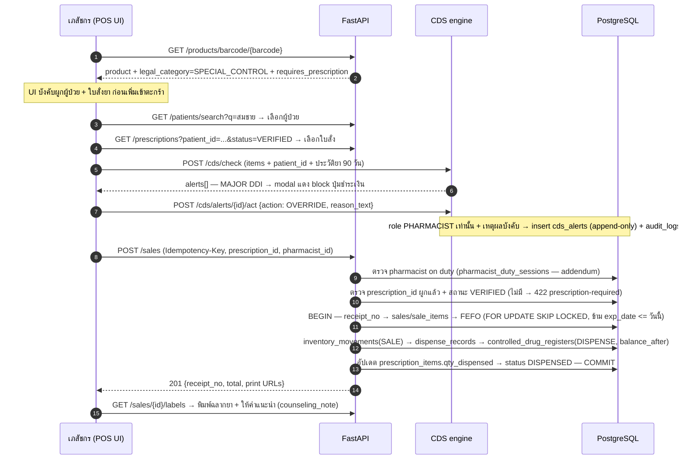
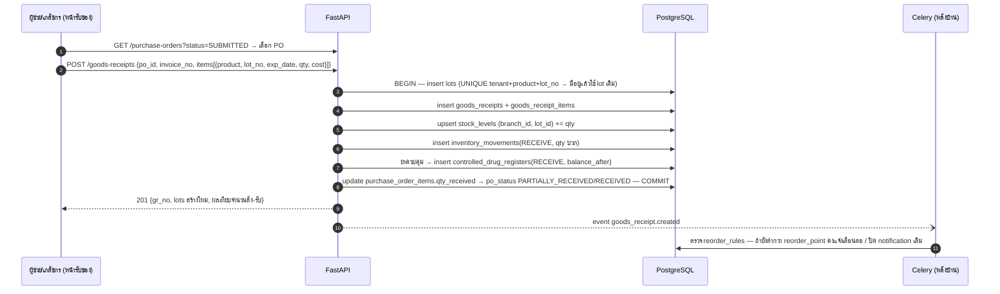
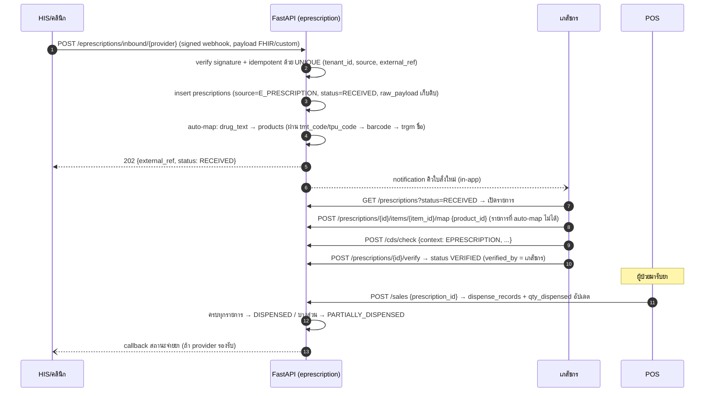

# รายละเอียดโมดูลและ API Specification

เอกสารนี้ลงรายละเอียด **8 โมดูลหลักตาม `01-architecture.md` (นำเสนอเป็น 7 หมวด — patients กับ cds
รวมอยู่หมวดเดียวกันเพราะ flow หน้างานเป็นเรื่องเดียวกัน)**: user story/flow หน้างานจริง,
REST API ครบทุก endpoint, UI/UX หลัก และ domain events ระหว่างโมดูล
ชื่อตาราง/คอลัมน์/enum ทั้งหมดยึดตาม `02-database-schema.md` (canonical) —
API contract ของ CDS ยึดตาม `04-ddi-engine.md` และข้อบังคับ GPP ยึดตาม `05-gpp-compliance.md`

> ตารางที่อ้างในเอกสารนี้แต่ **ยังเป็น addendum** (เสนอไว้ใน `05-gpp-compliance.md` §8 รอ merge เข้า schema):
> `pharmacist_duty_sessions`, `temperature_logs`, `patient_consents` และคอลัมน์ `drug_details.requires_ky11/requires_ky13/max_qty_per_sale`
> จะติดป้าย *(addendum)* ทุกครั้งที่อ้างถึง

---

## 1. กติการ่วมของ API (ใช้กับทุกโมดูล)

### 1.1 พื้นฐาน

| เรื่อง | กติกา |
|---|---|
| Base URL | `/api/v1` — versioning ที่ URL path; การเปลี่ยนแบบ additive (เพิ่ม field/endpoint) ไม่ขยับเวอร์ชัน, breaking change เท่านั้นที่เปิด `/api/v2` พร้อมช่วง deprecation ≥ 6 เดือน (ส่ง header `Deprecation` + `Sunset`) |
| Auth | `Authorization: Bearer <JWT access token>` (อายุ 15 นาที) — `tenant_id`, `branch_id`, `role`, `user_id` ฝังใน claims; **ไม่รับ tenant_id/branch_id จาก request body เด็ดขาด** (กัน tenant spoofing) — ฝั่ง DB ตั้ง `SET LOCAL app.tenant_id` ต่อ transaction ตาม RLS |
| RBAC | ประกาศต่อ endpoint ด้วย dependency `require_role(...)` — ตารางสิทธิ์ในแต่ละโมดูลใช้อักษรย่อ **O**=OWNER, **P**=PHARMACIST, **A**=ASSISTANT, **C**=CASHIER |
| Content type | `application/json; charset=utf-8` — ยกเว้น endpoint download คืน `application/pdf` / `xlsx` |
| เวลา | ISO 8601 UTC เสมอ (`2026-07-09T04:12:33Z`) — แปลงเป็นเวลาไทย + พ.ศ. ที่ frontend |
| เงิน | string decimal 2 ตำแหน่ง เช่น `"185.00"` (map กับ `DECIMAL(12,2)`) — ไม่ใช้ float ใน JSON |
| จำนวนยา | decimal 3 ตำแหน่ง เช่น `"0.500"` (map กับ `NUMERIC(12,3)`) |
| ID | UUIDv7 string ทุก resource (ยกเว้นเลขเอกสารที่มี format เฉพาะ เช่น `receipt_no`) |

### 1.2 Pagination — cursor-based

ทุก endpoint แบบ list ใช้ cursor (ไม่ใช้ offset — ตารางใหญ่ + แถวใหม่แทรกตลอดทำให้ offset เพี้ยน):

```
GET /api/v1/sales?limit=50&cursor=eyJzIjoiMjAyNi0wNy0wOVQuLi4iLCJpZCI6IjAxOGY5YTJjLSJ9
```

- `limit` default 50, max 200
- `cursor` = base64(JSON ของ sort key ตัวสุดท้าย + id) — โปร่งใสต่อ client (opaque, ห้าม parse)
- response แบบเดียวกันทุก endpoint:

```json
{ "items": [ ... ], "next_cursor": "eyJ...", "has_more": true }
```

- เรียงลำดับ default: เวลาสร้างล่าสุดก่อน (ได้ index locality ฟรีจาก UUIDv7)

### 1.3 Error format — RFC 7807 `application/problem+json`

```json
{
  "type": "https://docs.example-pharmacy.dev/errors/cds-blocking-alert",
  "title": "มี CDS alert ระดับ blocking ที่ยังไม่ได้รับการ override",
  "status": 422,
  "detail": "พบ DDI ระดับ CONTRAINDICATED (warfarin + aspirin) — ต้องให้เภสัชกร override ก่อนปิดบิล",
  "instance": "/api/v1/sales",
  "trace_id": "0af7651916cd43dd8448eb211c80319c",
  "errors": [ { "field": "items[1].product_id", "code": "CDS_BLOCKING", "alert_ids": ["018f9a2d-..."] } ]
}
```

รหัส `type` ที่ใช้บ่อย (slug ท้าย URL): `validation-error` (422), `insufficient-role` (403),
`tenant-not-found` (404), `insufficient-stock` (409), `expired-lot-blocked` (409),
`cds-blocking-alert` (422), `no-pharmacist-on-duty` (409), `prescription-required` (422),
`duplicate-idempotency-key` (409 พร้อม body ของ response เดิม), `rate-limited` (429)

### 1.4 Idempotency — กัน double-submit ที่ POS

- `POST /api/v1/sales` และ `POST /api/v1/pos/sync` **บังคับ** header `Idempotency-Key: <ULID>`
  (terminal สร้างตอนกดปิดบิล — ใช้ซ้ำเมื่อ retry/sync จาก offline queue ตาม `01-architecture.md` §5)
- Server เก็บ key + response ที่สำเร็จไว้ 48 ชั่วโมง — ยิงซ้ำด้วย key เดิม + payload เดิม →
  คืน response เดิม `200` พร้อม header `Idempotency-Replayed: true`; key เดิม + payload ต่างกัน → `409`
- Schema รองรับแล้ว: คอลัมน์ `sales.idempotency_key varchar(26)` +
  `UNIQUE (tenant_id, idempotency_key)` (ดู 02-database-schema.md §3.4)

### 1.5 Rate limit

| ขอบเขต | เพดาน | เมื่อเกิน |
|---|---|---|
| `POST /auth/login`, `POST /auth/refresh` | 5 ครั้ง/นาที/IP | `429` + `Retry-After` |
| ทั่วไป ต่อ user | 300 req/นาที | `429` |
| ต่อ tenant (ทุก user รวมกัน) | 3,000 req/นาที | `429` — กัน tenant เดียวเบียด resource (noisy neighbor) |
| `POST /cds/check` | 60 req/นาที/terminal | debounce ที่ client 250–300ms ตาม `04-ddi-engine.md` ช่วยอยู่แล้ว |

Implement ด้วย sliding window ใน Redis; ทุก response ติด `X-RateLimit-Remaining`

---

## 2. โมดูล 1 — POS ขายหน้าร้าน

### 2.1 User story หลัก

> "ลูกค้าเดินเข้ามาซื้อ amoxicillin ตามใบสั่งแพทย์ + พาราเซตามอล ฉันสแกนบาร์โค้ด 2 ตัว
> ระบบดึง lot ที่ใกล้หมดอายุที่สุดให้เอง เตือนว่าผู้ป่วยเคยแพ้ penicillin ฉันตรวจสอบบัตรแพ้ยา
> แล้วเปลี่ยนเป็นยากลุ่มอื่นตามแพทย์สั่งใหม่ทางโทรศัพท์ เก็บเงิน พิมพ์ใบเสร็จกับฉลากยา —
> ทั้งหมดต้องจบใน 2 นาที และบัญชี ข.ย. ต้องถูกลงให้เองโดยฉันไม่ต้องจดอะไรเพิ่ม"

Flow ปกติ (ยาไม่ควบคุม): สแกนบาร์โค้ด → `GET /products/barcode/{barcode}` → เพิ่มเข้าตะกร้า →
CDS ตรวจเบื้องหลัง (debounce) → กด F8 ชำระเงิน → `POST /sales` → server ทำทุกอย่างใน transaction เดียว
(ออก `receipt_no` จาก `receipt_counters` → insert `sales`/`sale_items`/`sale_payments` → FEFO ตัด
`stock_levels` → insert `inventory_movements(SALE)` → `point_transactions(EARN)` ถ้าเป็นสมาชิก) →
พิมพ์ใบเสร็จ + ฉลากยา

### 2.2 Flow ขายยาควบคุมพิเศษ (SPECIAL_CONTROL — ซับซ้อนสุดของ POS)



จุดบังคับที่ server (ไม่ไว้ใจ UI):
- ทุก item ที่ `legal_category` ≥ `DANGEROUS` → `sales.pharmacist_id` ต้องไม่ NULL และ user นั้น
  role `PHARMACIST` ที่มีเวรเปิดอยู่ (*(addendum)* `pharmacist_duty_sessions`) — ไม่ผ่าน → `409 no-pharmacist-on-duty`
- `SPECIAL_CONTROL` / `PSYCHOTROPIC_3_4` / `NARCOTIC_3` → บังคับ `prescription_id` + ผู้ป่วยระบุตัวตน
- `PSYCHOTROPIC_2` → บล็อกเด็ดขาด `422` (ร้านยาขายไม่ได้ — ตาม `05-gpp-compliance.md`)
- CDS: server เรียก `cds/check` ซ้ำก่อน commit — blocking alert ที่ไม่ถูก override → `422 cds-blocking-alert`
- ห้ามตัด lot ที่ `exp_date <= CURRENT_DATE` (อยู่ใน WHERE ของ FEFO query — `02-database-schema.md` §5.1)

### 2.3 Endpoints

| Method | Path | คำอธิบาย | สิทธิ์ |
|---|---|---|---|
| GET | `/api/v1/products/search?q=&limit=` | autocomplete ชื่อการค้า/generic (pg_trgm) + สต็อกคงเหลือ | O P A C |
| GET | `/api/v1/products/barcode/{barcode}` | ยิงบาร์โค้ด → product + pack_size + ราคา + legal_category | O P A C |
| POST | `/api/v1/sales` | ปิดบิลขาย (บังคับ `Idempotency-Key`) | O P A C¹ |
| GET | `/api/v1/sales` | รายการบิล (filter: วันที่/สถานะ/ผู้ป่วย/สาขา) | O P A C |
| GET | `/api/v1/sales/{id}` | รายละเอียดบิล + items + payments | O P A C |
| POST | `/api/v1/sales/{id}/void` | ยกเลิกบิล (บังคับ `void_reason`; คืนสต็อก + ลง audit_logs) | O P |
| POST | `/api/v1/sales/{id}/return` | รับคืนสินค้า (movement RETURN + register RETURN ถ้ายาควบคุม) | O P |
| GET | `/api/v1/sales/{id}/receipt` | ใบเสร็จ PDF / payload ESC-POS | O P A C |
| GET | `/api/v1/sales/{id}/labels` | ฉลากยาทุกรายการของบิล (PDF ขนาดสติกเกอร์) | O P A C |
| POST | `/api/v1/pos/holds` | พักบิล (เก็บใน Redis TTL 24 ชม. + จอง `stock_levels.qty_reserved`) | O P A C |
| GET / DELETE | `/api/v1/pos/holds/{id}` | เรียกบิลพัก / ยกเลิก (คืน qty_reserved) | O P A C |
| POST | `/api/v1/pos/sync` | batch sync บิลจาก offline queue (Idempotency-Key ต่อรายการ) | O P A C |
| POST | `/api/v1/duty-sessions/check-in` | เภสัชกรกดเข้าเวร *(addendum)* | P |
| POST | `/api/v1/duty-sessions/{id}/check-out` | ออกเวร | P |

¹ CASHIER ปิดบิลได้เฉพาะบิลที่ทุกรายการเป็น `HOUSEHOLD`/`NON_DANGEROUS` — เกินนั้น UI ส่งต่อให้เภสัชกรยืนยัน

### 2.4 ตัวอย่าง: สร้างบิลขาย

```json
POST /api/v1/sales
Authorization: Bearer <token>
Idempotency-Key: 01J1ZK7E9GVQZ3M8S2T4W5X6Y7

{
  "patient_id": "018f9a2c-7e10-7a11-9c33-0a1b2c3d4e5f",
  "prescription_id": "018f9a2c-7e10-7d20-8000-bbbb0001",
  "pharmacist_id": "018f8899-1234-7000-8000-cccc0001",
  "items": [
    { "product_id": "018f9a2c-7e10-7c02-8000-aaaa0002", "qty": "20.000",
      "unit_price": "18.00", "item_discount": "0.00",
      "label_instruction": "ครั้งละ 1 เม็ด วันละ 2 ครั้ง เช้า-เย็น หลังอาหาร จนหมด" },
    { "product_id": "018f9a2c-7e10-7c05-8000-aaaa0005", "qty": "10.000",
      "unit_price": "1.00", "item_discount": "0.00",
      "label_instruction": "ครั้งละ 1-2 เม็ด ทุก 4-6 ชม. เวลาปวด ไม่เกินวันละ 8 เม็ด" }
  ],
  "bill_discount": "5.00",
  "payments": [ { "method": "PROMPTPAY", "amount": "365.00", "ref_no": "PP20260709xxxx" } ],
  "overridden_alert_ids": ["018f9a2d-0000-7000-8000-000000000001"]
}
```

```json
HTTP/1.1 201 Created

{
  "id": "018f9a2e-5555-7000-8000-dddd0001",
  "receipt_no": "BKK01-202607-000124",
  "status": "COMPLETED",
  "subtotal": "370.00", "bill_discount": "5.00", "vat_amount": "0.00", "total": "365.00",
  "points_earned": 36,
  "sold_at": "2026-07-09T04:12:33Z",
  "items": [
    { "sale_item_id": "018f9a2e-...", "product_id": "018f9a2c-7e10-7c02-8000-aaaa0002",
      "qty": "20.000", "lot_id": "018f9a1b-...", "lot_no": "AMX2026A", "exp_date": "2027-11-30",
      "line_total": "360.00" },
    { "sale_item_id": "018f9a2e-...", "product_id": "018f9a2c-7e10-7c05-8000-aaaa0005",
      "qty": "10.000", "lot_id": "018f9a1c-...", "lot_no": "PARA512", "exp_date": "2028-02-28",
      "line_total": "10.00" }
  ],
  "controlled_register_entries": 0,
  "print": {
    "receipt_url": "/api/v1/sales/018f9a2e-5555-7000-8000-dddd0001/receipt",
    "labels_url": "/api/v1/sales/018f9a2e-5555-7000-8000-dddd0001/labels"
  }
}
```

หมายเหตุ: client **ไม่ส่ง lot_id** — server เป็นผู้เลือกตาม FEFO เสมอ (1 รายการอาจแตกเป็นหลาย
`sale_items` ถ้ากินหลาย lot); `receipt_no` ออกจาก `receipt_counters` ด้วย `INSERT ... ON CONFLICT
DO UPDATE` รูปแบบ `{branch_code}-{YYYYMM ค.ศ. Asia/Bangkok}-{run 6 หลัก}`

### 2.5 ตัวอย่าง: ค้นหายา autocomplete

```json
GET /api/v1/products/search?q=amoxi&limit=5

{
  "items": [
    {
      "product_id": "018f9a2c-7e10-7c02-8000-aaaa0002",
      "sku": "MED-0042", "name": "Amoksiklav 625",
      "generic_name": "amoxicillin/clavulanate", "strength": "500/125 mg",
      "dosage_form": "tablet", "legal_category": "DANGEROUS",
      "is_antibiotic": true, "selling_price": "18.00",
      "stock": { "qty_on_hand": "184.000", "nearest_exp_date": "2027-03-31" },
      "requires_pharmacist": true, "requires_prescription": false
    }
  ],
  "next_cursor": null, "has_more": false
}
```

`requires_pharmacist`/`requires_prescription` เป็น field ที่ derive จาก `legal_category`
(ให้ UI ใช้ตัดสินใจโชว์ป้าย/บังคับ flow โดยไม่ต้อง hardcode ตารางกฎที่ frontend)

### 2.6 UI: layout หน้า POS + hotkey

```
┌─────────────────────────────────────────────┬───────────────────────┐
│ [ช่องสแกน/ค้นหา F2]        [ผู้ป่วย F3]     │ ตะกร้า (รายการ/lot/฿) │
│ ผลค้นหา + สต็อก + ป้าย legal_category       │ ...                   │
│                                             │ ส่วนลด → รวมสุทธิ     │
│ แถบ CDS alert (สี/ระดับตาม §4.5)            │ [F8 ชำระเงิน]         │
├─────────────────────────────────────────────┴───────────────────────┤
│ สถานะ: เภสัชกรเวร: ภญ.สมศรี │ ออนไลน์ ✓ │ บิลพัก: 2 │ กะ: 08:00-17:00│
└──────────────────────────────────────────────────────────────────────┘
```

| Hotkey | การทำงาน |
|---|---|
| `F2` | โฟกัสช่องค้นหายา/สแกนบาร์โค้ด |
| `F3` | ค้นหา/ผูกผู้ป่วย-สมาชิก (เบอร์โทร/ชื่อ/เลขสมาชิก) |
| `F4` | พักบิลปัจจุบัน |
| `F5` | เรียกรายการบิลพัก |
| `F6` | แก้จำนวน/ราคา/ส่วนลดรายการที่เลือก |
| `F7` | ส่วนลดท้ายบิล / ใช้แต้ม |
| `F8` | ชำระเงิน (เปิด dialog เลือกช่องทาง + split payment) |
| `F9` | ผูกใบสั่งยา (เปิดคิวใบสั่งที่ VERIFIED ของผู้ป่วยที่ผูกอยู่) |
| `F10` | พิมพ์ฉลากยาซ้ำจากบิลล่าสุด |
| `Del` | ลบรายการที่เลือกออกจากตะกร้า |
| `Esc` | ล้างตะกร้า (ต้อง confirm) |

### 2.7 ฉลากยา (ข้อมูลบังคับตาม GPP)

พิมพ์ 1 ฉลากต่อ 1 `sale_item` (สติกเกอร์ thermal 8×5 ซม.) — field ทั้งหมด:

| ช่อง | แหล่งข้อมูล |
|---|---|
| ชื่อร้าน + ที่อยู่ + โทร | `tenants.name` + `branches.address/phone` |
| วันที่จ่ายยา (พ.ศ.) | `sales.sold_at` แปลงเขตเวลาไทย |
| ชื่อผู้ป่วย | `patients.prefix + first_name + last_name` (บิล walk-in ไม่ระบุ → เว้นบรรทัด เขียนมือได้) |
| ชื่อยา (การค้า + สามัญ + ความแรง) | `products.name` + `drug_details.generic_name/strength` |
| จำนวนจ่าย | `sale_items.qty` + `products.base_unit` |
| วิธีใช้ | `sale_items.label_instruction` (ตั้งต้นจาก `drug_details.default_label_instruction` — เภสัชกรแก้ได้ต่อบิล) |
| คำเตือน | `drug_details.warning_text` |
| วันหมดอายุของ lot ที่จ่าย | `lots.exp_date` |
| ชื่อเภสัชกรผู้ส่งมอบ + เลขใบประกอบ | `users.full_name` (จาก `sales.pharmacist_id`) + `licenses.license_no` (type `PHARMACIST_PROFESSIONAL`) |

---

## 3. โมดูล 2 — Inventory

### 3.1 User story + flow รับของเข้าคลัง

> "ของมาส่งตอนบ่าย ฉันเปิด PO ที่สั่งไว้ สแกนรับทีละรายการ กรอก lot กับวันหมดอายุจากกล่องจริง
> ระบบเทียบจำนวนกับที่สั่ง ถ้าเป็นยาควบคุมต้องลงบัญชีรับ — ทั้งหมดต้องจบที่หน้าจอเดียว"



Flow อื่นที่สำคัญ:
- **Reorder อัตโนมัติ**: Celery beat รายวัน scan `stock_levels` รวมทุก lot เทียบ `reorder_rules.reorder_point`
  → สร้าง `purchase_orders` สถานะ `DRAFT` (`is_auto_generated=true`, จำนวน = `reorder_qty`, ผู้ขาย =
  `preferred_supplier_id`) + notification `PO_AUTO_CREATED` → คนกดยืนยันเป็น `SUBMITTED` เอง (ไม่สั่งอัตโนมัติเงียบ ๆ)
- **แจ้งเตือนใกล้หมดอายุ**: job รายวันตาม query §5.3 ของ schema doc → notification `EXPIRY_WARNING`
  ที่ 90/60/30 วัน (บันไดเดียวกับ `05-gpp-compliance.md` §4) → หน้า expiry dashboard (§3.4)
- **ทำลายยาหมดอายุ**: ย้ายเข้าโซนกักก่อน (`ADJUST` ออกจากขาย) → เมื่อทำลายจริง `POST /inventory/disposals`
  → `inventory_movements(DISPOSE)` + `controlled_drug_registers(DISPOSE)` ถ้าเป็นยาควบคุม + บังคับ `reason`

### 3.2 Endpoints

| Method | Path | คำอธิบาย | สิทธิ์ |
|---|---|---|---|
| GET/POST/PATCH | `/api/v1/products`, `/api/v1/products/{id}` | CRUD สินค้า + `drug_details` + บาร์โค้ด (soft delete) | O P A |
| GET/POST/PATCH | `/api/v1/suppliers`, `/api/v1/suppliers/{id}` | CRUD ผู้ขาย | O P A |
| GET | `/api/v1/inventory/stock-levels?product_id=&branch_id=` | คงเหลือแยก lot + qty_reserved | O P A C |
| GET | `/api/v1/inventory/fefo-suggestion?product_id=&qty=` | ลำดับ lot ที่จะถูกตัด (preview — ตัดจริงตอน POST /sales) | O P A C |
| GET | `/api/v1/inventory/expiring?days=90` | ยาใกล้หมดอายุ + มูลค่าทุน | O P A |
| GET | `/api/v1/inventory/movements?product_id=&lot_id=` | ประวัติเคลื่อนไหว (append-only ledger) | O P A |
| POST | `/api/v1/inventory/adjustments` | ปรับสต็อก (นับจริงต่างจากระบบ — บังคับ reason) | O P |
| POST | `/api/v1/inventory/transfers` | โอนระหว่างสาขา (TRANSFER ลบต้นทาง/บวกปลายทาง + counter_branch_id) | O P A |
| POST | `/api/v1/inventory/disposals` | ทำลาย/ตัดจำหน่ายยาหมดอายุ (DISPOSE + บังคับ reason) | O P |
| GET/POST/PATCH | `/api/v1/reorder-rules` | จุดสั่งซื้อ per product per branch | O P |
| GET/POST | `/api/v1/purchase-orders` | สร้าง/ดูใบสั่งซื้อ | O P A |
| POST | `/api/v1/purchase-orders/{id}/submit` | DRAFT → SUBMITTED (ยืนยัน PO อัตโนมัติด้วย) | O P |
| POST | `/api/v1/purchase-orders/{id}/cancel` | ยกเลิก PO (เฉพาะยังไม่รับของ) | O P |
| POST | `/api/v1/goods-receipts` | รับของเข้าคลัง (ธุรกรรมเดียวตาม §3.1) | O P A |
| GET | `/api/v1/lots/{id}/trace` | recall trace: lot นี้รับจากใคร ขายให้ใครบ้าง (join `sale_items`) | O P |

### 3.3 ตัวอย่าง: FEFO suggestion + รับของ

```json
GET /api/v1/inventory/fefo-suggestion?product_id=018f9a2c-7e10-7c02-8000-aaaa0002&qty=30

{
  "product_id": "018f9a2c-7e10-7c02-8000-aaaa0002",
  "requested_qty": "30.000",
  "fully_allocatable": true,
  "allocations": [
    { "lot_id": "018f9a1b-...", "lot_no": "AMX2026A", "exp_date": "2027-03-31",
      "qty_take": "20.000", "qty_available": "20.000" },
    { "lot_id": "018f9a1c-...", "lot_no": "AMX2026B", "exp_date": "2027-08-31",
      "qty_take": "10.000", "qty_available": "164.000" }
  ],
  "excluded_lots": [
    { "lot_id": "018f9a19-...", "lot_no": "AMX2025X", "reason": "EXPIRED",
      "exp_date": "2026-06-30", "qty_on_hand": "5.000" }
  ]
}
```

```json
POST /api/v1/goods-receipts

{
  "purchase_order_id": "018f9a2f-1111-7000-8000-eeee0001",
  "supplier_id": "018f9a2f-2222-7000-8000-eeee0002",
  "invoice_no": "IV-2026-4412",
  "items": [
    { "purchase_order_item_id": "018f9a2f-3333-...", "product_id": "018f9a2c-7e10-7c02-8000-aaaa0002",
      "lot_no": "AMX2026C", "mfg_date": "2026-05-01", "exp_date": "2028-05-31",
      "qty_received": "500.000", "unit_cost": "1.85" }
  ]
}

HTTP/1.1 201 Created
{
  "id": "018f9a30-...", "gr_no": "GR-BKK01-202607-0031",
  "received_at": "2026-07-09T07:30:11Z",
  "lots_created": [ { "lot_id": "018f9a30-aaaa-...", "lot_no": "AMX2026C" } ],
  "po_status": "PARTIALLY_RECEIVED",
  "variances": [ { "product_id": "...", "qty_ordered": "600.000", "qty_received_total": "500.000" } ],
  "controlled_register_entries": 0
}
```

### 3.4 UI: Expiry dashboard

- ตัวกรองช่วงเวลา: 30 / 60 / 90 / 180 วัน + แยกสาขา — สีตามความเร่งด่วน:
  แดง (≤30 วัน), ส้ม (31–90), เหลือง (91–180)
- แต่ละแถว: สินค้า / lot_no / exp_date (พ.ศ.) / จำนวนคงเหลือ / **มูลค่าทุนที่จะเสีย** (เรียง default
  ตามมูลค่า) / ปุ่ม action: [ทำโปรโมชัน] [คืนผู้ขาย] [โอนสาขาอื่น] [ย้ายเข้าโซนกักรอทำลาย]
- การ์ดสรุปหัวตาราง: มูลค่ารวมที่เสี่ยง, จำนวนรายการ, เทียบเดือนก่อน
- แถวที่หมดอายุแล้ว (`exp_date <= วันนี้`) ล็อกเป็นสีเทา — ทำได้อย่างเดียวคือส่งเข้า flow ทำลาย
  (FEFO ไม่มีวันหยิบ lot กลุ่มนี้อยู่แล้ว)

---

## 4. โมดูล 3 — ข้อมูลผู้ป่วย + Drug Interaction Checker (CDS)

### 4.1 User story

> "ผู้ป่วยความดันประจำร้านมาซื้อยาแก้ปวด ฉันผูกบัตรสมาชิกแล้วหยิบ ibuprofen ลงตะกร้า —
> ระบบต้องเด้งทันทีว่าเขากินยา enalapril + เคยมีไตเสื่อม stage 3 ก่อนที่ฉันจะเดินไปหยิบถุงยา
> ไม่ใช่มาบอกตอนจ่ายเงินเสร็จแล้ว"

Flow: ผูกผู้ป่วย (F3) → ทุกครั้งที่ตะกร้าเปลี่ยน POS เรียก `POST /cds/check` (debounce 250–300ms) →
engine รวม **ยาในตะกร้า + ยา 90 วันล่าสุดจาก `dispense_records` + ยาปัจจุบันที่กรอกมือ** → ตรวจ
DDI / แพ้ยา (รวม cross-group) / drug-disease → แสดง alert ตาม severity → การตัดสินใจทุกครั้ง
เขียน `cds_alerts` (append-only) — สเปกเต็มของ engine + payload อยู่ `04-ddi-engine.md` §6

### 4.2 Endpoints — patients

| Method | Path | คำอธิบาย | สิทธิ์ |
|---|---|---|---|
| GET | `/api/v1/patients/search?q=` | ค้นหา ชื่อ/เบอร์/เลขสมาชิก/เลขบัตร (ผ่าน `citizen_id_hash`) | O P A C² |
| GET/POST/PATCH | `/api/v1/patients`, `/api/v1/patients/{id}` | CRUD ผู้ป่วย (เลขบัตร → เข้ารหัส AES-GCM ที่ app เป็น `citizen_id_enc`) | O P A |
| GET | `/api/v1/patients/{id}/profile` | โปรไฟล์รวม: แพ้ยา + โรคประจำตัว + ยาล่าสุด (จอเดียวที่ POS ใช้) | O P A |
| POST/PATCH | `/api/v1/patients/{id}/allergies` | บันทึก/ปิด (is_active=false) ประวัติแพ้ยา — ห้ามลบ | P |
| POST/PATCH | `/api/v1/patients/{id}/conditions` | โรคประจำตัว (ICD-10) | P A |
| GET | `/api/v1/patients/{id}/medication-history?days=90` | ประวัติจ่ายยาจาก `dispense_records` | O P A |
| POST | `/api/v1/patients/{id}/consents` | บันทึก consent/ถอน consent *(addendum `patient_consents`)* | O P A |
| GET | `/api/v1/patients/{id}/consents` | ประวัติ consent ทุกเวอร์ชัน | O P |

² CASHIER ค้นหาเพื่อผูกบิลได้ แต่เห็นเฉพาะชื่อ+เลขสมาชิก+แต้ม — **ไม่เห็น**แพ้ยา/โรค/ประวัติยา (RBAC ระดับ field)

### 4.3 Endpoints — CDS (สอดคล้อง `04-ddi-engine.md`)

| Method | Path | คำอธิบาย | สิทธิ์ |
|---|---|---|---|
| POST | `/api/v1/cds/check` | ตรวจ DDI/แพ้ยา/drug-disease/duplicate ทุกมิติครั้งเดียว (<100ms) | O P A C |
| POST | `/api/v1/cds/alerts/{alert_id}/act` | บันทึกการตัดสินใจ: `OVERRIDE` (P เท่านั้นเมื่อ CONTRAINDICATED/MAJOR + บังคับเหตุผล) / `ACKNOWLEDGE` | O P A³ |
| GET | `/api/v1/cds/alerts?outcome=OVERRIDDEN&from=&to=` | log alert สำหรับ GPP audit (อ่าน `cds_alerts`) | O P |
| GET | `/api/v1/cds/rulesets` | เวอร์ชัน ruleset + สถานะ | O P |
| POST | `/api/v1/cds/rulesets/{version}/publish` | publish ruleset (ผ่าน golden regression test ก่อน) | O P |
| GET/POST/PATCH | `/api/v1/cds/rules/ddi` | จัดการ `ddi_rules` ที่ร้านเพิ่มเอง (`tenant_id` ไม่ NULL — rule กลางแก้ไม่ได้) | P |
| POST | `/api/v1/cds/antibiogram/recommend` | empiric therapy decision support (UTI/pharyngitis/SSTI) | P |

³ การ act บน alert ระดับ MODERATE/MINOR (`ACKNOWLEDGE`) ทำได้ทุก role ที่ขายได้ —
mapping ไปคอลัมน์ `cds_alerts.outcome`: `ACKNOWLEDGE` → `ACCEPTED`, `OVERRIDE` → `OVERRIDDEN`
(+ `override_reason` บังคับด้วย CHECK), ระบบบล็อกเด็ดขาด → `BLOCKED`

### 4.4 ตัวอย่าง: CDS check (ย่อ — payload เต็มดู `04-ddi-engine.md` §6)

```json
POST /api/v1/cds/check
{
  "context": "POS",
  "patient_id": "018f9a2c-7e10-7a11-9c33-0a1b2c3d4e5f",
  "include_history_days": 90,
  "items": [ { "product_id": "018f9a2c-7e10-7c01-8000-aaaa0001", "quantity": 30 } ],
  "extra_current_medications": [ { "generic_name": "warfarin" } ]
}

HTTP/1.1 200 OK
{
  "ruleset_version": 42,
  "highest_severity": "MAJOR",
  "blocking": true,
  "unmapped_items": [],
  "alerts": [ {
      "alert_id": "018f9a2d-0000-7000-8000-000000000001",
      "alert_type": "DDI", "severity": "MAJOR",
      "requires_override": true, "override_role": "PHARMACIST",
      "title": "Warfarin + NSAID (M01A)",
      "management": "เลี่ยงการใช้ร่วม; เลือก paracetamol และเฝ้าระวัง INR/อาการเลือดออก",
      "rule_id": "018f9a10-0000-7000-8000-0000000000aa"
  } ]
}
```

### 4.5 UI: หน้าจอเตือน DDI แยกตาม severity

| Severity | รูปแบบ UI | พฤติกรรม |
|---|---|---|
| `CONTRAINDICATED` | **Modal เต็มจอ พื้นแดง** ไอคอนอันตราย + กลไก/ผลทางคลินิก/คำแนะนำ | บล็อกปุ่มชำระเงิน; ต้องเภสัชกรยืนยันตัว (re-auth PIN) + พิมพ์เหตุผล ≥ 10 ตัวอักษร หรือเอายาออก; กรณีระบบตัดสิน `BLOCKED` (เช่น แพ้ยา LIFE_THREATENING) — ไม่มีปุ่ม override เลย |
| `MAJOR` | **Modal สีแดงส้ม** เนื้อหาเดียวกัน | บล็อกปุ่มชำระเงิน; override ได้เฉพาะ PHARMACIST + เหตุผลบังคับ |
| `MODERATE` | **Banner สีเหลืองส้ม** ปักบนตะกร้า พร้อมปุ่ม "รับทราบ" | ไม่บล็อก แต่ต้องกดรับทราบก่อนปุ่มชำระเงินทำงาน (1 คลิก — ไม่บังคับเหตุผล) |
| `MINOR` | ป้าย info สีฟ้าใต้รายการยา (expand ดูรายละเอียดได้) | ไม่บล็อก ไม่บังคับกด |

กติกา anti-alert-fatigue: alert เดิม (rule เดียวกัน + คู่ยาเดิม + ผู้ป่วยเดิม) ที่ acknowledge
แล้วในบิลเดียวกัน ไม่เด้งซ้ำเมื่อแก้จำนวน; ML ranking ช่วยเรียงลำดับเท่านั้น **ห้ามซ่อน/ลดระดับ** MAJOR ขึ้นไป

---

## 5. โมดูล 4 — e-Prescription

### 5.1 User story + flow รับใบสั่งยาจาก HIS/คลินิก

> "คลินิกข้างร้านส่งใบสั่งยาเข้าระบบ ฉันเห็นคิวเด้งขึ้นมา เปิดดู ยา 3 ตัว ระบบ map ได้ 2 ตัว
> อีกตัวสะกดไม่ตรงต้องเลือกเอง ตรวจ DDI ผ่าน กดยืนยันใบสั่ง แล้วพอผู้ป่วยเดินมาถึง
> ก็ดึงใบสั่งเข้าบิล POS ได้เลย"



### 5.2 Endpoints

| Method | Path | คำอธิบาย | สิทธิ์ |
|---|---|---|---|
| POST | `/api/v1/eprescriptions/inbound/{provider}` | webhook รับใบสั่งจาก HIS (auth ด้วย HMAC signature ต่อ provider — ไม่ใช่ JWT ผู้ใช้) | system |
| GET | `/api/v1/prescriptions?status=&patient_id=` | คิว/ประวัติใบสั่งยา | O P A |
| POST | `/api/v1/prescriptions` | คีย์ใบสั่งกระดาษ (source=PAPER + upload scan → `scanned_file_path`) | P A |
| GET | `/api/v1/prescriptions/{id}` | รายละเอียด + items + สถานะ map | O P A |
| POST | `/api/v1/prescriptions/{id}/items/{item_id}/map` | ผูก `drug_text` → `product_id` ในร้าน | P |
| POST | `/api/v1/prescriptions/{id}/verify` | เภสัชกรยืนยันความถูกต้อง → `VERIFIED` | P |
| POST | `/api/v1/prescriptions/{id}/reject` | ปฏิเสธ (ไม่ชัดเจน/สงสัยปลอม) + เหตุผล → `REJECTED` | P |
| POST | `/api/v1/prescriptions/{id}/cancel` | ยกเลิก (ผู้ป่วยไม่มารับ/คลินิกถอน) → `CANCELLED` | O P |

การจ่ายยาตามใบสั่ง **ไม่มี endpoint แยก** — ทำผ่าน `POST /sales` โดยส่ง `prescription_id`
(เดินบัญชี ข.ย.12 จาก join `prescriptions` + `dispense_records` + `sales` โดยอัตโนมัติ)

หมายเหตุ NER-assisted mapping: ใบสั่งกระดาษที่สแกน ใช้ OCR + NER (`04-ddi-engine.md` §ML)
เป็นตัว **เสนอ** การ map เท่านั้น — ทุกรายการต้องผ่านคน (human-in-the-loop) ก่อน `verify`

### 5.3 e-Referral (การรับผู้ป่วยส่งต่อผ่านแพลตฟอร์มเครือข่าย)

นอกจากใบสั่งยาตรงจาก HIS/คลินิก ระบบต้องรองรับ **e-Referral** — ผู้ป่วยที่ถูกส่งต่อมารับยาที่
ร้านยาผ่านแพลตฟอร์มเครือข่าย (เช่น โครงการร้านยาชุมชนอบอุ่น/รับยาใกล้บ้านของ สปสช.,
เครือข่าย รพ.แม่ข่าย) ซึ่ง payload และวงจรสถานะต่างจากใบสั่งยาตรง:

- **สถาปัตยกรรม**: เป็น adapter อีกตัวใน `modules/eprescription/adapters/` (ตาม
  `01-architecture.md` §7.1) — แปลง payload ใบส่งต่อเข้า canonical model เดิม
  (`prescriptions` + `prescription_items`) โดยใช้ `source = 'E_PRESCRIPTION'` และเก็บข้อมูล
  เฉพาะของ e-Referral (เลข referral, สิทธิการรักษา, รอบนัด) ใน `raw_payload` jsonb
- **ความต่างจากใบสั่งตรง**: (1) มักเป็นยาโรคเรื้อรังตามรอบนัด → สร้าง `refill_reminders`
  อัตโนมัติเมื่อจ่ายครบ (2) ต้องรายงานสถานะกลับแพลตฟอร์มต้นทาง (รับเรื่อง/จ่ายแล้ว/ผู้ป่วยไม่มา)
  ผ่าน callback ของ adapter (3) การเบิกจ่ายค่าบริการผูกกับสิทธิ สปสช./ประกันสังคม —
  ระยะแรกบันทึกเลขอ้างอิงเบิกจ่ายไว้ใน `sales.note`/`raw_payload` ก่อน (โมดูลเบิกจ่ายเต็มรูปเป็น
  ส่วนขยายภายหลัง)
- ⚠️ สเปคการเชื่อมต่อ e-Referral ของแต่ละแพลตฟอร์ม (สปสช./เขตสุขภาพ/รพ.แม่ข่าย) ต่างกันและ
  ปรับเป็นระยะ — สำรวจสเปคจริง + ขั้นตอนสมัครเข้าร่วมเครือข่ายก่อน implement adapter แต่ละตัว
  (แนวเดียวกับธง ⚠️ ของ e-prescription กลางใน `01-architecture.md` §7.1)

---

## 6. โมดูล 5 — Compliance และรายงาน ขย.

### 6.1 User story

> "สิ้นเดือน ฉันต้องส่งบัญชี ข.ย.10 กับรายงานวัตถุออกฤทธิ์ — ระบบต้อง generate ให้เองวันที่ 1
> ถ้ายอดคงเหลือในบัญชีไม่ตรงกับสต็อกจริง ต้องบอกฉันก่อน ไม่ใช่ปล่อยรายงานผิด ๆ ออกไป
> และตอน สสจ. เข้าตรวจ ฉันต้องกด export ทุกอย่างได้ใน 5 นาที"

Flow อัตโนมัติ: Celery beat วันที่ 1 เวลา 02:00 → ตรวจ **reconciliation**
(`balance_after` ล่าสุด = Σ`qty_in` − Σ`qty_out` และตรงกับ `stock_levels`) → ผ่าน: render
PDF/Excel → `regulatory_reports` status `DRAFT`→`GENERATED` + notification; ไม่ผ่าน: ค้างที่ `DRAFT`
+ แจ้งเภสัชกรพร้อมรายการที่ diff → แก้ด้วยการ insert รายการปรับปรุงใน register (ห้ามแก้ของเดิม —
append-only) → กด generate ใหม่ → ยื่นจริงแล้วกด `submit` → `SUBMITTED` (ห้ามแก้อีก)

### 6.2 Endpoints

| Method | Path | คำอธิบาย | สิทธิ์ |
|---|---|---|---|
| GET | `/api/v1/compliance/registers?register_type=&from=&to=&product_id=` | บัญชีรับ-จ่ายยาควบคุม (อ่าน `controlled_drug_registers`) | O P |
| POST | `/api/v1/compliance/registers/adjustments` | insert รายการปรับปรุง (qty ทิศตรงข้าม + note อ้างรายการเดิม) | P |
| GET | `/api/v1/compliance/registers/balance?register_type=&as_of=` | ยอดคงเหลือ ณ วันที่ (ใช้ตอน สสจ. เข้าตรวจ) | O P |
| GET | `/api/v1/compliance/reports?report_type=&status=` | รายการรายงาน ขย./วัตถุออกฤทธิ์/ยาเสพติด | O P |
| POST | `/api/v1/compliance/reports` | สั่ง generate รายงาน (async — คืน `202`) | O P |
| GET | `/api/v1/compliance/reports/{id}` | สถานะ + ผล reconciliation | O P |
| GET | `/api/v1/compliance/reports/{id}/download?format=pdf\|xlsx` | ดาวน์โหลดไฟล์ | O P |
| POST | `/api/v1/compliance/reports/{id}/submit` | ปิดรายงานเป็น `SUBMITTED` (บันทึกผู้ยื่น/วันยื่น) | O P |
| GET | `/api/v1/compliance/inspection-pack?from=&to=` | export ชุดรับการตรวจ 8 รายการ (ZIP: ข.ย.9–12, ยอดคงเหลือ, เวรเภสัชกร, recall trace, บันทึกทำลาย, temperature log, ประวัติ void, สำเนาใบอนุญาต) | O P |
| GET/POST | `/api/v1/licenses` | ทะเบียนใบอนุญาต — ต่ออายุ = **insert แถวใหม่** ไม่ UPDATE ทับ | O P |
| GET | `/api/v1/licenses/expiring?days=90` | ใบอนุญาต/ใบประกอบใกล้หมดอายุ (บันได alert 90/60/30/14/7 วัน) | O P |
| GET/POST | `/api/v1/temperature-logs` | บันทึกอุณหภูมิ manual + endpoint ingest IoT *(addendum)* | O P A |
| GET | `/api/v1/compliance/gpp-checklist?quarter=` | GPP self-audit checklist auto-fill จากข้อมูลระบบ | O P |
| GET | `/api/v1/audit-logs?entity_type=&entity_id=&actor_id=` | สืบค้น audit trail (อ่านอย่างเดียว) | O |

### 6.3 ตัวอย่าง: generate + export รายงาน ข.ย.10

```json
POST /api/v1/compliance/reports
{ "report_type": "KY10_SPECIAL_CONTROL_SALE", "branch_id": "018f9a2b-...",
  "period_start": "2026-06-01", "period_end": "2026-06-30" }

HTTP/1.1 202 Accepted
{ "id": "018f9a31-...", "status": "DRAFT", "reconciliation": "RUNNING" }
```

```json
GET /api/v1/compliance/reports/018f9a31-...

{
  "id": "018f9a31-...",
  "report_type": "KY10_SPECIAL_CONTROL_SALE",
  "period_start": "2026-06-01", "period_end": "2026-06-30",
  "status": "GENERATED",
  "reconciliation": {
    "passed": true,
    "checked_products": 14,
    "mismatches": []
  },
  "generated_at": "2026-07-01T02:04:19Z",
  "download": {
    "pdf": "/api/v1/compliance/reports/018f9a31-.../download?format=pdf",
    "xlsx": "/api/v1/compliance/reports/018f9a31-.../download?format=xlsx"
  }
}
```

⚠️ Layout คอลัมน์ของแบบ ข.ย.9–13 และเลขแบบรายงานวัตถุออกฤทธิ์/ยาเสพติด ให้เทียบแบบฟอร์มจริง
ฉบับล่าสุดจาก อย./สสจ. ก่อน freeze template (ธงที่เปิดไว้ใน `05-gpp-compliance.md` §9)

---

## 7. โมดูล 6 — สมาชิก / CRM

### 7.1 User story

> "ลูกค้าใหม่อยากสมัครสมาชิก ฉันขอบัตรประชาชน กรอก 30 วินาที ให้เขาติ๊ก consent 2 ข้อ
> (สมาชิก+สะสมแต้ม / รับข่าวการตลาด) บนแท็บเล็ต — แต้มขึ้นทันทีในบิลแรก
> ส่วนคนไข้เบาหวานประจำ ระบบต้องเตือน LINE เขาเองก่อนยาหมด 3 วัน"

- สะสมแต้ม: `sale.completed` → EARN อัตโนมัติ (บาท → แต้ม × `loyalty_tiers.point_multiplier`)
  ลง `point_transactions` + sync `patients.points_balance` ใน transaction เดียว
- ใช้แต้ม/ส่วนลด tier: กด F7 ที่ POS → REDEEM เป็นส่วนลดท้ายบิล (`sales.bill_discount`)
- นัดรับยาต่อเนื่อง: บิลที่มียาโรคเรื้อรัง + ระบุ `days_supply` → สร้าง `refill_reminders`
  → Celery beat แจ้งเตือนก่อน `due_date` (ช่องทางตาม consent) → มารับจริง → `FULFILLED`
  (ผูก `fulfilled_sale_id`)

### 7.2 Endpoints

| Method | Path | คำอธิบาย | สิทธิ์ |
|---|---|---|---|
| POST | `/api/v1/crm/members` | สมัครสมาชิก (สร้าง/upgrade `patients` + `member_no` + consents) | O P A C |
| GET | `/api/v1/crm/members/{patient_id}/points` | ยอดแต้ม + ประวัติ `point_transactions` | O P A C |
| POST | `/api/v1/crm/points/adjust` | ปรับแต้ม manual (ADJUST + เหตุผล → audit_logs) | O |
| GET/POST/PATCH | `/api/v1/crm/loyalty-tiers` | จัดการ tier (ชื่อ/แต้มขั้นต่ำ/ส่วนลด/ตัวคูณ) | O |
| GET | `/api/v1/crm/refill-reminders?status=&due=` | คิวนัดรับยาต่อเนื่อง | O P A |
| POST | `/api/v1/crm/refill-reminders` | สร้างนัด manual (กรณีไม่ auto จากบิล) | P A |
| POST | `/api/v1/crm/refill-reminders/{id}/cancel` | ยกเลิกนัด | O P A |

### 7.3 ตัวอย่าง: สมัครสมาชิก + consent

```json
POST /api/v1/crm/members
{
  "patient": {
    "citizen_id": "1103700123456",
    "prefix": "นาย", "first_name": "สมชาย", "last_name": "ใจดี",
    "birth_date": "1988-04-12", "gender": "M", "phone": "0812345678"
  },
  "consents": [
    { "consent_type": "MEMBERSHIP", "action": "GIVEN", "notice_version": "2026-01", "channel": "IN_STORE" },
    { "consent_type": "MARKETING",  "action": "GIVEN", "notice_version": "2026-01", "channel": "IN_STORE" }
  ]
}

HTTP/1.1 201 Created
{
  "patient_id": "018f9a32-...",
  "member_no": "M-000481",
  "loyalty_tier": { "id": "018f9a00-...", "name": "Silver", "discount_percent": "0.00" },
  "points_balance": 0,
  "consents_recorded": 2
}
```

- `citizen_id` ถูกเข้ารหัสเป็น `citizen_id_enc` (AES-GCM ที่ app) + `citizen_id_hash` (SHA-256) —
  **ไม่ปรากฏใน response และไม่ log ค่าเต็มทุกกรณี**; เลขซ้ำ → `409` พร้อมเลขสมาชิกเดิมแบบ mask
- consent เขียนลง `patient_consents` *(addendum — append-only)* + อัปเดต
  `patients.pdpa_consent_at/pdpa_consent_version`; การถอน = insert แถว `WITHDRAWN` ใหม่
- ผู้ป่วยที่มีอยู่แล้ว (เคยซื้อยาแบบระบุตัว) → ส่ง `patient.citizen_id` เดิม ระบบ match ด้วย hash
  แล้ว upgrade เป็นสมาชิก (เติม `member_no`) แทนสร้างซ้ำ

---

## 8. โมดูล 7 — Dashboard และรายงานเชิงบริหาร

### 8.1 User story

> "ฉันเปิดร้าน 3 สาขา เช้าวันจันทร์อยากเห็นใน 1 จอ: เมื่อวานขายเท่าไร กำไรเท่าไร สาขาไหนแผ่ว
> ยาตัวไหนขายดีจนของใกล้ขาด และเงินจมกับของใกล้หมดอายุเท่าไร"

โมดูลนี้**อ่านอย่างเดียว** (ตาม `01-architecture.md` — reporting ไม่มี models.py ของตัวเอง)
คำนวณจาก `sales`/`sale_items` (มี `unit_cost` snapshot → กำไรขั้นต้นไม่ต้อง join ย้อน),
`stock_levels` + `lots`, `inventory_movements` — cache ผล aggregate ใน Redis TTL 5 นาที

### 8.2 Endpoints

| Method | Path | คำอธิบาย | สิทธิ์ |
|---|---|---|---|
| GET | `/api/v1/dashboard/summary?branch_id=&date=` | การ์ดสรุปวันเดียว (ยอดขาย/กำไร/บิล/เตือน) — จอแรก | O P |
| GET | `/api/v1/dashboard/sales-trend?granularity=day\|week\|month&from=&to=` | กราฟยอดขาย/กำไร | O P |
| GET | `/api/v1/dashboard/top-products?by=revenue\|qty\|profit&limit=` | ยาขายดี | O P |
| GET | `/api/v1/dashboard/stock-turnover?period=` | อัตราหมุนเวียนสต็อก per หมวด (COGS ÷ avg inventory) | O |
| GET | `/api/v1/dashboard/expiry-risk` | มูลค่าทุนที่เสี่ยงหมดอายุ 30/90/180 วัน | O P |
| GET | `/api/v1/dashboard/branch-comparison?from=&to=` | เทียบยอด/กำไร/บิลเฉลี่ยรายสาขา | O |
| GET | `/api/v1/dashboard/cds-overrides?from=&to=` | สถิติ override (จำนวน, ต่อเภสัชกร, ต่อ rule) — GPP audit | O P |
| GET | `/api/v1/dashboard/antibiotic-use?from=&to=` | DDD ยากลุ่ม J01 + สัดส่วนจ่ายไม่มีใบสั่ง (stewardship — `04-ddi-engine.md`) | O P |

### 8.3 ตัวอย่าง: dashboard summary

```json
GET /api/v1/dashboard/summary?branch_id=018f9a2b-...&date=2026-07-09

{
  "date": "2026-07-09", "branch_id": "018f9a2b-...",
  "sales": {
    "bills": 142, "revenue": "48250.50", "gross_profit": "13890.25",
    "avg_bill": "339.79", "voids": 1
  },
  "vs_previous_day": { "revenue_pct": 6.2, "bills_pct": -2.1 },
  "inventory": {
    "low_stock_products": 8,
    "expiring_90d": { "items": 23, "value_at_cost": "12400.00" }
  },
  "cds": { "alerts_today": 12, "overrides_today": 2, "blocked_today": 1 },
  "pending": {
    "prescriptions_to_verify": 3,
    "refill_due_today": 5,
    "po_drafts_auto": 2,
    "licenses_expiring_90d": 1
  }
}
```

UI: การ์ดตัวเลข 4 ใบ (ยอดขาย/กำไร/บิล/บิลเฉลี่ย + ลูกศรเทียบวันก่อน) → กราฟ trend 30 วัน →
ตาราง top 10 → แถบ "ต้องทำวันนี้" (ใบสั่งรอ verify, นัดรับยา, PO รออนุมัติ, ใบอนุญาตใกล้หมด) ลิงก์ deep-link เข้าโมดูลนั้น

---

## 9. Domain Events (in-process bus → Celery ภายหลัง)

การสื่อสารข้ามโมดูลตาม `01-architecture.md` §2.2: งานที่ต้องอยู่ transaction เดียวกัน = เรียก
service ตรง (**sync**), ผลข้างเคียงที่ยอมช้าได้ = domain event หลัง commit (**async**)

| Event | ผู้ publish | Payload หลัก | Consumer → การกระทำ | โหมด |
|---|---|---|---|---|
| `sale.completed` | pos | sale_id, branch_id, patient_id?, items[] | inventory: ตัด FEFO + `inventory_movements` — **เรียกตรงใน txn** ไม่ใช่ event | sync (in-txn) |
| | | | compliance: `controlled_drug_registers(DISPENSE)` — ใน txn เดียวกัน | sync (in-txn) |
| | | | crm: `point_transactions(EARN)` + สร้าง/เลื่อน `refill_reminders` | async |
| | | | notifications: e-receipt (LINE/email ตาม consent) | async |
| | | | reporting: invalidate cache summary ของสาขา/วัน | async |
| `sale.voided` | pos | sale_id, void_reason | inventory: movement RETURN คืนสต็อก (ใน txn ของ void) · crm: หักแต้มคืน (ADJUST) · compliance: รายการปรับปรุง register · audit_logs | sync (in-txn) + async |
| `goods_receipt.created` | inventory | gr_id, po_id?, items[] | compliance: register RECEIVE (in-txn) · inventory: re-check `reorder_rules` ปิด/คงเตือน low stock · reporting: cache | sync + async |
| `stock.below_reorder_point` | inventory (Celery scan) | branch_id, product_id, qty | inventory: draft PO อัตโนมัติ · notifications: `PO_AUTO_CREATED` ถึง OWNER/PHARMACIST | async |
| `lot.expiring` | inventory (Celery scan) | lot_id, exp_date, days_left, value | notifications: `EXPIRY_WARNING` (บันได 90/60/30 วัน) | async |
| `prescription.received` | eprescription | prescription_id, source | notifications: in-app คิวใบสั่งใหม่ถึง PHARMACIST ของสาขา | async |
| `prescription.dispensed` | eprescription | prescription_id, sale_id | crm: สร้าง `refill_reminders` จาก days_supply · HIS callback สถานะ | async |
| `cds.alert_overridden` | cds | alert_id, severity, decided_by | audit_logs (in-txn กับ insert `cds_alerts`) · reporting: สถิติ override | sync + async |
| `license.expiring` | compliance (Celery scan) | license_id, days_left | notifications: `LICENSE_EXPIRY` บันได 90/60/30/14/7 วัน ถึง OWNER + เภสัชกรเจ้าของใบ | async |
| `report.generated` / `report.reconciliation_failed` | compliance (Celery) | report_id, mismatches[] | notifications: แจ้งผล + deep-link | async |
| `refill.due` | crm (Celery scan) | reminder_id, patient_id | notifications: `REFILL_DUE` ช่องทางตาม consent (LINE/SMS) → status `NOTIFIED` | async |
| `patient.consent_withdrawn` | patients | patient_id, consent_type | crm/notifications: หยุดช่องทางการตลาด/นัดเตือนตามชนิด consent ที่ถอน | async |
| `temperature.out_of_range` | compliance (IoT ingest) | location, temp_c | notifications: แจ้งด่วนถึงเภสัชกรเวร + OWNER | async |

กติกา: consumer ทุกตัวต้อง **idempotent** (event ส่งซ้ำได้เมื่อ retry) และ handler async
ห้ามทำให้ธุรกรรมหลักล้มเหลว — ความผิดพลาดฝั่ง consumer เข้าคิว retry + dead letter

---

## 10. สรุป checklist สำหรับผู้ implement

- ทุก endpoint เขียน (write) ต้องระบุ: role ที่อนุญาต, ตารางที่แตะ, event ที่ publish, รายการ audit_logs
- ทุก endpoint ผ่าน middleware เดียวกัน: JWT → TenantContext (`SET LOCAL app.tenant_id`) → RBAC → rate limit
- การทดสอบขั้นต่ำต่อโมดูล: happy path + RLS cross-tenant (ต้องได้ 404 ไม่ใช่ 403 — ไม่เผยว่ามี resource) +
  idempotency replay + สิทธิ์ทุก role
- Merge เข้า 02 แล้ว (ไม่ต้องทำซ้ำ): `sales.idempotency_key` + unique index (§1.4),
  `receipt_number_ranges`, `cds_rulesets` + ruleset versioning, `antibiograms`,
  `patients.is_pregnant/is_lactating`, `drug_details.preg_category/ddd_value/ddd_unit`,
  `dispense_records.syndrome_code`
- สิ่งที่ **ต้องเพิ่มในการปรับ schema ครั้งถัดไป** (อ้างแล้วในเอกสารนี้):
  1. merge addendum จาก `05-gpp-compliance.md` §8: `pharmacist_duty_sessions`, `temperature_logs`,
     `patient_consents`, `advertising_media`, คอลัมน์
     `drug_details.requires_ky11/requires_ky13/max_qty_per_sale/max_qty_note`,
     `controlled_drug_registers.buyer_address`
- ⚠️ ธงกฎหมายทั้งหมด (เลขแบบฟอร์ม ขย., แบบรายงานวัตถุออกฤทธิ์/ยาเสพติด, ระยะเก็บบัญชี)
  ต้อง resolve กับประกาศ อย./สภาเภสัชกรรมฉบับล่าสุดก่อน freeze — รายการรวมอยู่ `05-gpp-compliance.md` §9
