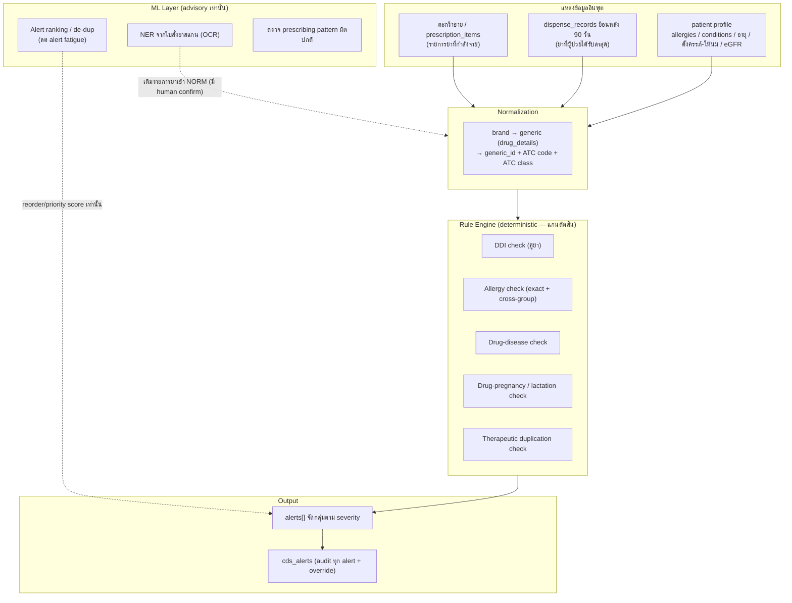
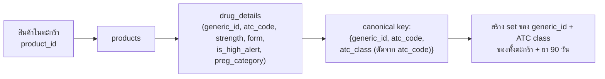
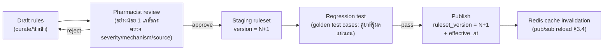
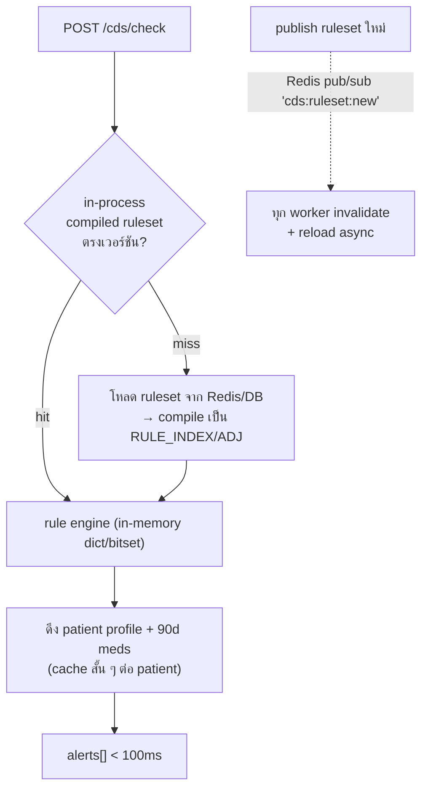
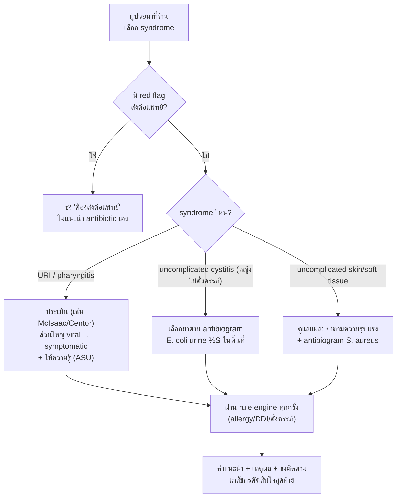

# 04 — Drug Interaction Checker & Clinical Decision Support (CDS)

เอกสารนี้ออกแบบ **โมดูล `cds`** ซึ่งเป็นสมองด้าน safety ของระบบร้านยา — ตรวจปฏิกิริยาระหว่างยา (DDI),
การแพ้ยา (allergy + cross-reactivity), ยา-โรค (drug-disease), ยา-การตั้งครรภ์/ให้นมบุตร และให้คำแนะนำ
เชิงคลินิกแบบ real-time ที่หน้า POS/e-Prescription รวมถึงส่วนขยาย **antibiogram-based decision support**
สำหรับ rational antibiotic use (AMR)

เอกสารยึดการตัดสินใจสถาปัตยกรรมจาก `01-architecture.md` (โมดูล `cds` เป็นเจ้าของตาราง
`ddi_rules`, `allergy_cross_groups`, `cds_alerts`) และอ้างชื่อตาราง/รายละเอียด field สุดท้ายจาก schema doc

> **หลักการตัดสินใจแกนกลางของเอกสารนี้ (rule-engine-first):**
> การตัดสิน DDI/allergy/contraindication ทั้งหมดทำด้วย **deterministic rule engine** เป็นแกน
> ML เป็น **ส่วนเสริม (advisory)** ที่ *จัดลำดับ/ช่วยดึงข้อมูล* เท่านั้น — **ห้าม ML ตัดสินว่าคู่ยาปลอดภัยหรือไม่**
> เหตุผลอยู่ใน §1.2

---

## 1. สถาปัตยกรรม CDS

### 1.1 ภาพรวม



ลำดับการทำงาน: (1) รวมยาในตะกร้า + ยา 90 วันล่าสุด → (2) normalize เป็น generic/ATC →
(3) rule engine ประเมินทุกมิติ → (4) ML จัดลำดับ/ยุบ alert ซ้ำ (ไม่เพิ่ม/ลบข้อสรุป safety) →
(5) ส่ง `alerts[]` กลับ POS + เขียน `cds_alerts` ทุกครั้ง

### 1.2 ทำไม rule engine เป็นแกน และ **ห้าม** ใช้ ML ล้วน ๆ ตัดสิน DDI

| เหตุผล | รายละเอียด |
|---|---|
| **ตรวจสอบได้ (auditable)** | ทุก alert ต้องระบุได้ว่ามาจาก **rule ไหน เวอร์ชันไหน แหล่งอ้างอิงอะไร** เพื่อ audit ตาม GPP และเพื่อให้เภสัชกรตรวจทานได้ — ML แบบ black-box อธิบายที่มาไม่ได้ในระดับที่ยอมรับได้ในงาน safety-critical |
| **Deterministic** | อินพุตเดิมต้องได้ผลเดิมทุกครั้ง (reproducible) — จำเป็นต่อการรับผิดทางกฎหมายและการทดสอบ regression; ML มี drift/ความไม่แน่นอน |
| **False negative = อันตรายถึงชีวิต** | การ "พลาดแจ้ง" คู่ยาห้ามใช้ร่วม (contraindicated) คือความเสียหายที่ยอมรับไม่ได้ กฎที่เภสัชกร curate ให้ recall ~100% บนชุดกฎที่นิยามไว้; ML ที่ optimize accuracy อาจแลก recall เพื่อ precision |
| **ข้อมูล train ไม่พอ/มี bias** | คู่ยาอันตรายจริงเกิดน้อย (class imbalance รุนแรง) การ train classifier ให้ครอบคลุมคู่ยา/ATC ทุกกรณีด้วยข้อมูลจริงในไทยแทบเป็นไปไม่ได้ |
| **ความรับผิดชอบวิชาชีพ** | การตัดสินใจจ่ายยาอยู่บนดุลยพินิจของ **เภสัชกรผู้มีหน้าที่ปฏิบัติการ** ระบบเป็นเครื่องมือช่วย ไม่ใช่ผู้ตัดสิน — กฎที่มนุษย์ตรวจทานสอดคล้องกับหลักนี้ |

**สรุปการแบ่งบทบาท:** rule engine = "ตัดสินว่ามีความเสี่ยงอะไร" (must be right) · ML = "ช่วยให้เภสัชกร
โฟกัสกับความเสี่ยงที่สำคัญก่อน และช่วยกรอกข้อมูลเร็วขึ้น" (nice to have, ตรวจสอบโดยมนุษย์เสมอ)

---

## 2. Rule Engine Design

### 2.1 โครงสร้าง `ddi_rules` (ระดับ generic / ATC class)

กฎเก็บที่ระดับ **generic name** และ/หรือ **ATC class** ไม่เก็บที่ระดับ brand เพราะยา 1 generic มีได้หลายสิบ
brand — เก็บระดับ generic ทำให้กฎชุดเดียวครอบคลุมทุก brand และดูแลง่าย (รายละเอียด field สุดท้ายอยู่ใน schema doc)

| คอลัมน์ | ชนิด | ความหมาย |
|---|---|---|
| `id` | UUIDv7 | PK |
| `rule_type` | enum | `DDI` \| `DRUG_DISEASE` \| `DRUG_PREGNANCY` \| `DRUG_LACTATION` \| `DUPLICATE` |
| `left_kind` / `right_kind` | enum | `GENERIC` \| `ATC_CLASS` — ระบุว่าฝั่งซ้าย/ขวาเป็น generic หรือ class |
| `left_code` / `right_code` | text | ค่า generic_id (canonical) หรือ ATC code (เช่น `C09` = ACE inhibitors ระดับ class) |
| `condition_code` | text null | สำหรับ drug-disease: รหัสภาวะ (map กับ `patient_conditions`); pregnancy/lactation ใช้ค่าพิเศษ |
| `severity` | enum | `CONTRAINDICATED` \| `MAJOR` \| `MODERATE` \| `MINOR` |
| `mechanism` | text | กลไก (pharmacokinetic/pharmacodynamic) — สำหรับแสดงผลและ audit |
| `clinical_effect` | text | ผลทางคลินิกที่กังวล (เช่น เพิ่มความเสี่ยงเลือดออก, QT prolongation) |
| `management` | text | คำแนะนำการจัดการ (เว้นระยะ, เลี่ยง, ปรับขนาด, monitor อะไร) |
| `evidence_level` | enum | `A` \| `B` \| `C` (คุณภาพหลักฐาน) |
| `source_ref` | text | อ้างอิงแหล่ง (ชื่อฐานข้อมูล + id ในฐาน หรือ citation) — **บังคับกรอก** |
| `ruleset_version` | int | เวอร์ชันชุดกฎที่กฎนี้อยู่ (ดู §2.6) |
| `is_active` | bool | เปิด/ปิดโดยไม่ลบ (soft) |

หมายเหตุ: กฎเก็บแบบ **normalized คู่เดียว** — เก็บ `(left, right)` โดยกำหนด convention ให้ `left_code <= right_code`
(เรียงตามสตริง) เพื่อกันกฎซ้ำ 2 ทิศ และตอน query สร้าง key แบบเรียงก่อนเสมอ

### 2.2 Normalization: brand → generic → ATC



- ยาแต่ละ `product` ผูกกับ `drug_details` ที่มี `generic_id` (canonical id ภายในระบบ ควร map กับ
  มาตรฐานสากล) และ `atc_code` (WHO ATC) — จาก `atc_code` ตัดเอาระดับ class ได้หลายชั้น (เช่น
  `C09AA05` → `C09AA`, `C09A`, `C09`) เพื่อจับกฎระดับ class
- ยาที่ไม่มี `generic_id`/`atc_code` (สินค้าไม่ใช่ยา หรือยังไม่ map) → **ข้ามการตรวจแต่ติดธง `unmapped`
  ใน response** ให้เภสัชกรรู้ว่ารายการนี้ยังไม่ได้ตรวจ (เหมือนเช็คไม่ได้ ไม่ใช่ผ่าน) — สำคัญมาก อย่านับเป็น "ปลอดภัย"
- ยาสูตรผสม (combination) มีได้หลาย `generic_id` ต่อ 1 product → ขยายเป็นหลาย component ก่อนตรวจ

### 2.3 อัลกอริทึมตรวจคู่ยา

จำนวนยาต่อการขาย 1 ครั้ง (n) เล็กมาก (ปกติ < 15 แม้รวม 90 วันล่าสุดก็มัก < 50) การตรวจคู่แบบ O(n²)
จึงเพียงพอและง่ายต่อการพิสูจน์ความถูกต้อง แต่ optimize ด้วย **set/bitmap** เพื่อลดการ lookup กฎ:

```
รวบรวม items = ตะกร้า ∪ ยา 90 วัน (แต่ละตัวมี generic_id + ชุด ATC class หลายชั้น)

# 1) DDI — pairwise ระดับ generic และ class
codes = union ของ generic_id + ATC class ทุกชั้น ของทุก item     # set
for i in range(len(items)):
    for j in range(i+1, len(items)):
        for a in codes(items[i]):          # generic + class ของ i
            for b in codes(items[j]):
                key = sorted((a, b))
                if key in RULE_INDEX_DDI:   # dict/hash lookup O(1)
                    emit_alert(RULE_INDEX_DDI[key], items[i], items[j])
```

**Bitmap/set optimization (เมื่อ ruleset ใหญ่):** precompute ตอนคอมไพล์ ruleset ให้แต่ละ code มี
"เซตของ code ที่มันชนด้วย" (adjacency set). ตอน runtime:

```
basket_set = set(codes ทั้งหมดในตะกร้า+ประวัติ)          # เซตเดียว
for code in codes(each item):
    hits = ADJ[code] & basket_set     # intersection → คู่ที่มีกฎ ทันที
```

ให้แต่ละ generic/class มี integer bit index → ตะกร้าเป็น `int` (Python big-int เป็น bitset ในตัว) →
`ADJ_MASK[code] & basket_mask` ได้คู่ที่ชนด้วยการ AND ครั้งเดียว หลีกเลี่ยง inner loop เมื่อ ruleset โต
(หลักหมื่นกฎ). ในทางปฏิบัติ n เล็กพอที่ทั้งสองวิธีเข้าเป้า latency §3 — เลือก set-intersection ก่อนเพื่อความอ่านง่าย

Allergy / drug-disease / pregnancy เป็น **single-sided lookup** (ยาแต่ละตัวเทียบกับ profile ผู้ป่วย)
จึงเป็น O(n) ไม่ใช่ O(n²)

### 2.4 ระดับความรุนแรง (severity) และ UX ต่อระดับ

`severity` เป็น enum 4 ระดับ ใช้ **ตรงกันทุกเอกสาร/ทุก alert_type**:

| severity | ความหมาย | UX ที่ POS | บันทึก |
|---|---|---|---|
| **CONTRAINDICATED** | ห้ามใช้ร่วม/ห้ามในผู้ป่วยรายนี้เด็ดขาด | **Hard block** สีแดง — ปิดปุ่มจ่าย/ชำระเงิน จนกว่า **เภสัชกร (PHARMACIST)** จะ override พร้อม**เหตุผลบังคับกรอก** (free text + เลือกเหตุผลมาตรฐาน) | override เขียน `cds_alerts` + `audit_logs` ระบุ user, เหตุผล, เวลา |
| **MAJOR** | เสี่ยงสูง มักต้องปรับแผน/เฝ้าระวังใกล้ชิด | Hard block เช่นกัน (override โดย PHARMACIST + เหตุผล) หรือ config เป็น soft ต่อร้านได้ — **ค่า default = block** | เหมือนบน |
| **MODERATE** | เสี่ยงปานกลาง จัดการได้ | **Soft warning** สีส้ม — เตือนเด่น แต่กด "รับทราบ" ผ่านได้ (role ไหนก็รับทราบได้ แต่ log ว่าใคร) | เขียน `cds_alerts` (acknowledged) |
| **MINOR** | ข้อควรทราบ/นัยสำคัญต่ำ | **Info** สีเทา/เหลืองอ่อน — แสดงแบบไม่ขวางงาน (badge/รายการพับได้) | เขียน `cds_alerts` แบบ info (อาจ sample เพื่อลด noise) |

กติกา: **เฉพาะ role `PHARMACIST` เท่านั้น** ที่ override CONTRAINDICATED/MAJOR ได้ (CASHIER/ASSISTANT
กดผ่านไม่ได้ ต้องเรียกเภสัชกร) — สอดคล้อง RBAC ใน `01-architecture.md`

### 2.5 มิติการตรวจอื่นนอกจาก DDI

**Allergy check — exact + cross-reactivity**

- **Exact match**: `patient_allergies.substance_code` ตรงกับ `generic_id` ของยาที่จ่าย → alert
  `severity` = ตามความรุนแรงที่บันทึก (แพ้รุนแรง/anaphylaxis → CONTRAINDICATED)
- **Cross-reactivity group** ผ่านตาราง `allergy_cross_groups` — จับกลุ่มที่มีปฏิกิริยาข้ามกัน เช่น
  - beta-lactams (penicillins ↔ cephalosporins — ⚠️ ความเสี่ยง cross-reactivity ระหว่างกลุ่มย่อยไม่เท่ากัน
    ควรระบุความน่าจะเป็นและ side-chain ใน group metadata ไม่เหมารวมทุกคู่เป็นห้ามเด็ดขาด)
  - sulfonamides (antibiotic sulfa ↔ non-antibiotic sulfa — หลักฐาน cross-reactivity จริงจำกัด ให้ระดับ warning)
  - NSAIDs (cross-sensitivity ในผู้ป่วย NSAID-exacerbated respiratory disease)
  - โครงสร้าง: `allergy_cross_groups(group_code, member_kind, member_code, cross_risk_level, note)`
    ผู้ป่วยแพ้สมาชิกในกลุ่มใด → เตือนเมื่อจ่ายสมาชิกอื่นในกลุ่มเดียวกัน ตาม `cross_risk_level`

**Drug-disease check** (`rule_type = DRUG_DISEASE`) — เทียบยากับ `patient_conditions` เช่น
- NSAIDs ในผู้ป่วย CKD / heart failure / peptic ulcer
- metformin ใน renal impairment (ผูกกับ eGFR ถ้ามีค่า — ⚠️ ค่า eGFR ในร้านยามักไม่มี ใช้ condition flag แทนได้)
- ยากลุ่ม QT-prolonging ในผู้ป่วยที่มีประวัติ long QT
- beta-blocker (non-selective) ในผู้ป่วยหอบหืด
- กฎที่ต้องใช้ค่าแล็บ (eGFR, K+) ให้เก็บ threshold ใน `condition_code` + logic ตีความใน engine และ
  degrade เป็น warning เมื่อไม่มีค่า (ไม่เงียบ)

**Drug-pregnancy / lactation** (`DRUG_PREGNANCY` / `DRUG_LACTATION`)
- ใช้ flag `patient.is_pregnant` / `is_lactating` + `drug_details.preg_category`
- ⚠️ ระบบจัดหมวดตั้งครรภ์แบบเดิม (A/B/C/D/X) ถูกยกเลิกใน labeling สมัยใหม่บางประเทศ (เปลี่ยนเป็น
  narrative PLLR) — เก็บได้ทั้งสองแบบ แต่ตัดสินด้วยกฎ generic-level ที่เภสัชกร curate ไม่พึ่งตัวอักษรหมวดล้วน

### 2.6 แหล่งข้อมูล rule set — เปรียบเทียบทางเลือกจริง

> ⚠️ **licensing สำคัญมาก** — การนำฐานข้อมูล DDI เชิงพาณิชย์มาใช้ในผลิตภัณฑ์ SaaS เชิงพาณิชย์
> ต้องมีสัญญาอนุญาตที่ถูกต้อง การใช้ผิดเงื่อนไข (โดยเฉพาะ academic license กับงานเชิงพาณิชย์) มีความเสี่ยงทางกฎหมาย
> ให้ตรวจเงื่อนไขล่าสุดกับผู้ให้บริการแต่ละรายก่อนตัดสินใจ

| แหล่ง | ครอบคลุม | ข้อดี | ข้อจำกัด / licensing |
|---|---|---|---|
| **DrugBank** | DDI, target, ATC, ชื่อ generic/brand | ข้อมูลลึก มี structured DDI | academic license **ใช้เชิงพาณิชย์ไม่ได้** ต้องซื้อ commercial license สำหรับ SaaS |
| **OpenFDA** | drug labeling, adverse events | ฟรี เปิด API | ข้อมูลเป็น label สหรัฐ ไม่ใช่ DDI แบบ pairwise สำเร็จรูป ต้อง derive เอง; ไม่ครอบคลุมยาไทย |
| **WHO ATC/DDD** | รหัส ATC + DDD | ฟรี เป็นมาตรฐานสากล ใช้จัด class และคำนวณ DDD | **ไม่มี** ข้อมูล DDI/severity — เป็นแค่ classification (แต่จำเป็นสำหรับ antibiogram/AMR §5) |
| **First Databank / Micromedex / Lexicomp** | DDI, allergy cross, drug-disease ครบ พร้อม severity | คุณภาพคลินิกสูง มี severity/management สำเร็จ เหมาะ production | เชิงพาณิชย์ ค่าใช้จ่ายสูง สัญญาต่อปี/ต่อ seat; ผูก vendor |
| **Curate เองโดยเภสัชกร** | เฉพาะคู่ยา/ภาวะที่พบบ่อยในร้านยาไทย | ควบคุมเนื้อหา/แหล่งอ้างอิงได้เอง ต้นทุนเริ่มต่ำ ปรับให้เข้าบริบทไทย | ใช้แรงเภสัชกรมาก ครอบคลุมช้า ต้องมีกระบวนการ review/QA เข้ม |

**แนวทางที่แนะนำ (phased):**
1. เริ่มด้วย **WHO ATC (ฟรี)** เป็นแกน classification + **curate rule เองโดยเภสัชกร** จากเอกสารอ้างอิง
   มาตรฐาน (ตำรา/แนวทางที่ยอมรับ) โดยเน้น **CONTRAINDICATED/MAJOR ของคู่ยาที่พบบ่อยในร้านยาก่อน**
2. เมื่อสเกลขึ้น พิจารณาซื้อ commercial DDI database (First Databank/Micromedex) เพื่อความครอบคลุม
   แล้ว map เข้า schema `ddi_rules` เดิม (engine ไม่เปลี่ยน)
3. **ทุกกฎต้องมี `source_ref`** ระบุที่มา ห้ามใส่กฎที่ไม่มีแหล่งอ้างอิง

### 2.7 Versioning และกระบวนการ review ก่อน publish



- Rule set เป็น **immutable versioned snapshot** — แต่ละกฎมี `ruleset_version`; การ publish คือการ
  ยกเวอร์ชันทั้งชุด ไม่แก้กฎเดิม in-place (ยังคง reproducibility ของ alert เก่า)
- ทุก `cds_alerts` เก็บ `ruleset_version` ที่ใช้ตอนนั้น → ตรวจย้อนได้ว่า alert ณ วันนั้นมาจากกฎชุดใด
- **บังคับ review โดยเภสัชกรก่อน publish** — บันทึกผู้ review/ผู้ approve ลง audit; มี **golden regression
  test suite** (คู่ยาที่รู้ผลแน่นอน เช่น warfarin+NSAID = MAJOR) ที่ต้องผ่านก่อน publish ทุกครั้ง
- รองรับ **hotfix เร่งด่วน** (เช่น ประกาศเพิกถอนคู่ยา) ด้วย fast-track review (2 เภสัชกร) ที่ยัง log ครบ

---

## 3. Real-time integration กับ POS

### 3.1 เมื่อไรที่ตรวจ

- **ตอนเพิ่มยาเข้าตะกร้า** — เรียก `POST /api/v1/cds/check` แบบ **debounce ~250–300ms** (ผู้ใช้สแกน
  หลายชิ้นรัว ๆ ไม่ยิงทุกครั้ง) ยิงเมื่อหยุดพิมพ์/สแกน
- **ตอนผูกผู้ป่วย/สมาชิก** — เมื่อเลือก `patient_id` ตรวจซ้ำทั้งตะกร้าเทียบ profile + ประวัติ
- **ตอนก่อนปิดการขาย (final gate)** — ตรวจซ้ำครั้งสุดท้ายด้วย ruleset version ปัจจุบัน; ถ้ามี
  CONTRAINDICATED/MAJOR ที่ยังไม่ override → block ปุ่มชำระเงิน (server เป็นผู้ enforce ไม่ใช่แค่ UI)
- **e-Prescription** — ตรวจทันทีที่ import `prescription_items` ก่อนเสนอเภสัชกรจ่าย

### 3.2 ตรวจซ้ำกับยา 90 วันล่าสุด

DDI/duplication ต้องดูยาที่ผู้ป่วย "กำลังได้รับอยู่" ไม่ใช่แค่ในตะกร้า:

- ดึงจาก `dispense_records` ของ `patient_id` ที่ `dispensed_at >= now() - interval '90 days'`
  (เฉพาะ tenant เดียวกันตาม RLS) → รวมเป็น set ของ generic/ATC เข้าไปในอินพุต engine
- ⚠️ ข้อจำกัดจริง: เห็นเฉพาะยาที่ **จ่ายจากร้านในเครือระบบนี้** — ยาจากโรงพยาบาล/ร้านอื่นไม่เห็น
  จึงต้องมี UX ให้เภสัชกร **ถาม/เพิ่มยาปัจจุบันของผู้ป่วยด้วยมือ** (current medication list) เพื่อเสริม
- ช่วง 90 วันปรับได้ต่อ tenant (ยาโรคเรื้อรังอาจมองไกลกว่า); default = 90 วัน

### 3.3 บันทึก `cds_alerts` (audit ตาม GPP)

ทุก alert ที่แสดง **และ** ทุกการ override/acknowledge เขียนลง `cds_alerts` (โครงสร้างสุดท้ายใน schema doc):

| คอลัมน์ | ความหมาย |
|---|---|
| `id`, `tenant_id`, `branch_id` | คีย์ + multi-tenant |
| `sale_id` / `prescription_id` (nullable) | ผูกกับบริบทที่เกิด |
| `patient_id` (nullable) | walk-in ไม่ระบุตัวตนได้ |
| `rule_id`, `ruleset_version` | กฎที่ยิง + เวอร์ชัน (reproducible) |
| `alert_type`, `severity` | ชนิด + ระดับ |
| `left_code`, `right_code` | คู่ยา/ยา-ภาวะที่ชน |
| `status` | `SHOWN` \| `ACKNOWLEDGED` \| `OVERRIDDEN` |
| `override_reason` (nullable) | เหตุผลบังคับเมื่อ override CONTRAINDICATED/MAJOR |
| `acted_by`, `acted_role`, `acted_at` | ใคร (ต้อง PHARMACIST สำหรับ override), เมื่อไร |

`cds_alerts` เป็นหลักฐานเชิงคลินิก/กฎหมายว่าระบบเตือนแล้วและเภสัชกรตัดสินใจอย่างไร — ประกอบกับ
`audit_logs` (append-only) ตามกติกาใน `01-architecture.md`

### 3.4 เป้า latency < 100ms — caching strategy



- **Ruleset อยู่ใน in-process memory** ของทุก API worker (compile เป็น dict/hash index + adjacency
  bitset ตอน startup) — การตรวจ DDI เป็น O(1) lookup ต่อคู่ ไม่แตะ DB
- **Invalidation ผ่าน Redis pub/sub**: publish ruleset ใหม่ → ส่ง message → ทุก worker reload async
  (ระหว่างนั้นยังใช้เวอร์ชันเดิมได้ ปลอดภัย เพราะ ruleset เก่าไม่ผิด)
- **Patient profile + 90-day meds** เป็นตัว query DB จริงต่อ request — cache ต่อ `patient_id` ใน Redis
  TTL สั้น (เช่น 60–120s) invalidate เมื่อมีการจ่ายยา/แก้ allergy; walk-in ไม่มี patient ก็ข้ามส่วนนี้
- งบ latency ~100ms: rule eval (in-memory) ~เล็กน้อย, ส่วนใหญ่คือ 1 query ดึงประวัติ 90 วัน (index
  `dispense_records(patient_id, dispensed_at)`); ถ้ายังตึง ทำ materialized "current meds" ต่อ patient
- ⚠️ ถึง server ตอบเร็ว UI ยังต้อง debounce เพื่อลดจำนวน request (§3.1)

---

## 4. ML Layer — ส่วนเสริม (advisory) ไม่ใช่ตัวตัดสิน

ML ทำ 3 งานที่ **ไม่กระทบข้อสรุป safety ของ rule engine**:

### 4.1 จัดลำดับความสำคัญ alert เพื่อลด alert fatigue

- **ปัญหา**: alert fatigue — เภสัชกรเห็น alert MODERATE/MINOR ถี่จนกด override โดยไม่อ่าน ทำให้
  พลาด alert สำคัญ (เป็นปัญหาที่มีงานวิจัยรองรับในระบบ CDS จริง)
- **โมเดล**: เรียนจาก **override pattern** ในอดีต (`cds_alerts`) — จัด **priority score** ของ alert
  แต่ละตัว เพื่อ (ก) เรียงลำดับการแสดง (ข) ยุบ/พับ alert ที่มักถูก override ทันทีในบริบทเดียวกัน
- **ขอบเขตที่เข้มงวด**: ML **ห้าม** ลด severity, **ห้าม** ซ่อน CONTRAINDICATED/MAJOR, **ห้าม** ตัดสินว่า
  คู่ยาปลอดภัย — ทำได้แค่ **จัดลำดับภายในระดับเดียวกัน** และ collapse MINOR ที่ noise; hard block ยังคง block
- **Feature**: ชนิด/ระดับ alert, คู่ยา/ATC, บริบท (ยาโรคเรื้อรังต่อเนื่อง vs ยาใหม่), เวลา/ปริมาณงาน,
  ประวัติ override ของกฎนี้ในร้าน; **ไม่ใช้ข้อมูลระบุตัวผู้ป่วยตรง ๆ**
- **ประเมิน**: วัดว่าช่วยลด override-without-read ของ alert สำคัญได้จริงไหม (ไม่ใช่ accuracy อย่างเดียว);
  ตั้ง guardrail metric = จำนวน MAJOR/CONTRAINDICATED ที่ถูกจัดอันดับต่ำผิด ต้อง = 0

### 4.2 NER ดึงชื่อยา/ขนาดจากใบสั่งยาสแกน (OCR + post-processing)

- **Pipeline**: ภาพใบสั่งยา → OCR → **NER** ดึง (drug name, strength, form, dose, frequency, duration)
  → **normalize เข้า generic_id/product** (fuzzy match กับ catalog) → **เภสัชกรยืนยันทุกครั้ง (human-in-the-loop)**
  ก่อนเข้า `prescription_items`
- **โมเดล**: fine-tune NER สำหรับข้อความยา (ไทย+อังกฤษ, ชื่อ brand/generic, ตัวย่อ sig เช่น "1x3 pc")
  post-processing ด้วย dictionary ของ catalog + rule (เช่น strength ต้องมีหน่วย)
- **บทบาทต่อ CDS**: ผลลัพธ์แค่ **เติมรายการยาเข้าอินพุต** ของ rule engine เร็วขึ้น — rule engine ยังเป็น
  ผู้ตัดสิน DDI เหมือนเดิม; รายการที่ match ไม่ชัด (low confidence) ต้องให้เภสัชกรเลือกจากตัวเลือก
- **ประเมิน**: entity-level precision/recall; ในบริบท safety เลือก **recall สูงไว้ก่อนแต่ไม่ auto-commit** —
  ให้มนุษย์ตัดผิดออก ดีกว่าละเว้นยา; ทุกครั้งเก็บภาพ raw + ผล extract เพื่อ audit และ retrain

### 4.3 ตรวจ prescribing/dispensing pattern ผิดปกติ

- เช่น จ่ายยาควบคุม/ยาเสพติดให้โทษถี่ผิดปกติต่อผู้ป่วย/ต่อสาขา, การซื้อยาปฏิชีวนะซ้ำ ๆ (ดู §5),
  รูปแบบที่อาจเป็น doctor shopping / diversion
- **โมเดล**: anomaly detection (unsupervised/semi-supervised) บน aggregate — ** output = ธงให้มนุษย์
  ตรวจ** ไม่ block การขายอัตโนมัติ; ผูกกับ compliance/audit ไม่ใช่ gate การจ่าย

### 4.4 หลักการ human-in-the-loop (ยึดทุกงาน ML)

1. ML เสนอ — มนุษย์ยืนยัน/ตัดสินเสมอในงานที่กระทบผู้ป่วย
2. เก็บ input/output/feedback (สิ่งที่เภสัชกรแก้) เป็นข้อมูล retrain — ปิด loop
3. Model มี version + offline eval ก่อน deploy; rollback ได้; ไม่แตะเส้นทาง rule engine
4. Fail-safe: ML ล่ม/ไม่มั่นใจ → ระบบยัง **ทำงานได้เต็มด้วย rule engine** (ML optional)

---

## 5. Antibiogram-based Decision Support (ส่วนขยาย AMR)

จุดขายเฉพาะที่เชื่อมกับงานวิจัย AMR — ช่วยเลือก empiric antibiotic ตาม **ความไวเชื้อในพื้นที่จริง**
และเก็บข้อมูลเพื่อ **antibiotic stewardship**

> ⚠️ **ขอบเขตวิชาชีพ**: การจ่ายยาปฏิชีวนะในร้านยาต้องอยู่ในกรอบกฎหมายและดุลยพินิจของเภสัชกร ระบบนี้
> เป็น **decision support** ไม่ใช่การสั่งจ่ายอัตโนมัติ และต้องสอดคล้องกับแนวทางการใช้ยาสมเหตุผล (RDU)
> และโครงการใช้ยาปฏิชีวนะอย่างสมเหตุผล (Antibiotics Smart Use) ของไทย — ให้ตรวจแนวทางฉบับล่าสุด
> ของกระทรวงสาธารณสุข/หน่วยงานที่เกี่ยวข้องก่อน implement เนื้อหาทางคลินิกจริง

### 5.1 โครงข้อมูล antibiogram

ตาราง `antibiograms` (network/พื้นที่-level — ไม่ผูก 1 tenant เสมอไป; อาจ share ระดับเครือข่าย
แบบ opt-in/de-identified ตาม PDPA §6 ของ `01-architecture.md`):

| คอลัมน์ | ความหมาย |
|---|---|
| `id` | UUIDv7 |
| `region_code` / `facility_scope` | ขอบเขตพื้นที่/แหล่งข้อมูล (จังหวัด/เครือข่าย/รพ.) |
| `year` | ปีของ antibiogram (อัปเดต **รายปี**) |
| `organism` | เชื้อ (เช่น *E. coli*, *S. pyogenes*, *S. aureus*) |
| `specimen_source` | สิ่งส่งตรวจ (urine, throat, wound, blood) — สำคัญเพราะความไวต่างกันตาม source |
| `antibiotic` | ยา (map ATC/generic) |
| `n_isolates` | จำนวน isolate (สำหรับความน่าเชื่อถือ) |
| `pct_susceptible` | %S (0–100) |

- **การอัปเดตรายปี** ตามหลัก cumulative antibiogram (⚠️ แนวปฏิบัติสากลแนะนำ ≥ ~30 isolates ต่อคู่
  organism–antibiotic จึงจะรายงาน %S ได้น่าเชื่อถือ และรายงานปีละครั้ง — อ้างแนวทาง CLSI M39 ให้ตรวจฉบับล่าสุด)
- น้อยกว่าเกณฑ์ isolate → แสดงเป็น "ข้อมูลไม่พอ" ไม่แสดง %S ที่ชวนเข้าใจผิด
- ข้อมูลนี้ **ไม่ตัดสินแทนเภสัชกร** — เป็น input ให้ decision flow §5.2

### 5.2 Flow แนะนำ empiric therapy (common infections)



- **Red flag → ส่งต่อแพทย์ (แสดงเด่นก่อนเสมอ)**: ตัวอย่าง — ไข้สูง/อาการเป็นระบบ, สงสัย pyelonephritis
  (ปวดหลัง/ไข้หนาวสั่น), ชายที่มีอาการ UTI, หญิงตั้งครรภ์, เด็กเล็ก, อาการนานผิดปกติ/กลับเป็นซ้ำ,
  แผลลุกลาม/มีหนองลึก, สงสัย strep ในกลุ่มเสี่ยงภาวะแทรกซ้อน, ภูมิคุ้มกันบกพร่อง
  (⚠️ รายการ red flag จริงต้อง align กับแนวทางคลินิกไทยฉบับล่าสุด)
- **UTI (uncomplicated cystitis)**: ระบบดึง %S ของ *E. coli* จาก urine ในพื้นที่ → เสนอทางเลือกที่
  %S สูงพอ (เช่น เตือนถ้า co-trimoxazole %S ต่ำในพื้นที่ ให้พิจารณา nitrofurantoin/fosfomycin ตามความเหมาะสม
  — ⚠️ ตัวเลือกจริงต้องตามแนวทางและ formulary) พร้อมข้อควรระวัง (nitrofurantoin ในไตเสื่อม ผ่าน §2.5)
- **Pharyngitis**: เน้นข้อความ ASU ว่าส่วนใหญ่เป็น viral; ใช้ scoring ช่วยประเมินความน่าจะเป็น strep;
  ถ้าจ่าย antibiotic เลือกตาม guideline (penicillin/amoxicillin เป็น first line เว้นแพ้)
- **ทุกคำแนะนำต้องวิ่งผ่าน rule engine §2** (allergy/DDI/pregnancy) ก่อนแสดง และแสดง **เหตุผล + แหล่ง
  antibiogram (พื้นที่/ปี/n)** เพื่อความโปร่งใส เภสัชกรเป็นผู้ตัดสินใจสุดท้าย

### 5.3 เก็บข้อมูลเพื่อ antibiotic stewardship

- ทุกการจ่าย antibiotic บันทึกให้คำนวณ metric ได้: `generic_id`+ATC (J01 = antibacterials for
  systemic use), จำนวนที่จ่าย, ขนาด/วัน, ระยะเวลา, syndrome (ถ้าเลือกผ่าน §5.2), มี/ไม่มีใบสั่งแพทย์
- **DDD (Defined Daily Dose, WHO ATC/DDD)** — คำนวณ DDD ที่จ่าย และ metric เช่น DDD ต่อจำนวน
  encounter/ต่อ 1,000 ประชากร (ตามที่มีตัวหาร); รายงานจำนวนใบสั่ง/ครั้งการจ่ายแยกตัวยา
- Dashboard AMR: สัดส่วน antibiotic ที่จ่ายโดยไม่มีใบสั่งแพทย์, top antibiotics, แนวโน้ม, เทียบข้าม
  สาขา/ช่วงเวลา — เชื่อมกับ **reporting module** และรองรับ export เพื่อ **งานวิจัย AMR** (de-identified)
- ⚠️ การนำข้อมูลรวมข้ามร้าน/เครือข่ายไปวิเคราะห์/วิจัยต้องเป็นแบบ opt-in + de-identified และผ่านฐาน
  การประมวลผลตาม PDPA (ดู `01-architecture.md` §6) — และการวิจัยในมนุษย์อาจต้องผ่าน IRB/EC ตามระเบียบ

---

## 6. API contract ของ CDS module

Endpoint หลัก: **`POST /api/v1/cds/check`** — ตรวจทุกมิติในครั้งเดียว, idempotent (อ่านอย่างเดียว
ไม่เปลี่ยน state ยกเว้นเขียน `cds_alerts` แบบ SHOWN), เป้า < 100ms

### 6.1 Request

```json
POST /api/v1/cds/check
Authorization: Bearer <access_token>          // tenant_id/branch_id มาจาก JWT (ไม่รับจาก body)
Content-Type: application/json

{
  "context": "POS",                            // POS | EPRESCRIPTION
  "patient_id": "018f9a2c-7e10-7a11-9c33-0a1b2c3d4e5f",   // optional (walk-in = null)
  "sale_id": "018f9a2c-7e10-7b00-8000-111122223333",      // optional (ผูก alert เข้าบิล)
  "include_history_days": 90,                  // default 90; ยาที่ผู้ป่วยได้รับล่าสุด
  "items": [
    { "product_id": "018f9a2c-7e10-7c01-8000-aaaa0001", "quantity": 30 },
    { "product_id": "018f9a2c-7e10-7c02-8000-aaaa0002", "quantity": 10 }
  ],
  "extra_current_medications": [               // optional: ยาปัจจุบันที่เภสัชกรกรอกเอง (นอกระบบ)
    { "generic_id": "warfarin" }
  ]
}
```

### 6.2 Response (200)

```json
{
  "ruleset_version": 42,
  "checked_at": "2026-07-09T04:12:33Z",
  "highest_severity": "CONTRAINDICATED",
  "blocking": true,                             // มี alert ที่ต้อง PHARMACIST override ค้างอยู่
  "unmapped_items": [                           // ยาที่ตรวจไม่ได้ (ยังไม่ map generic/ATC)
    { "product_id": "018f9a2c-7e10-7c09-8000-aaaa0009", "reason": "no_generic_mapping" }
  ],
  "alerts": [
    {
      "alert_id": "018f9a2d-0000-7000-8000-000000000001",
      "alert_type": "DDI",
      "severity": "MAJOR",
      "requires_override": true,
      "override_role": "PHARMACIST",
      "left":  { "kind": "GENERIC", "code": "warfarin",   "product_id": null, "source": "history" },
      "right": { "kind": "ATC_CLASS", "code": "M01A",     "product_id": "018f9a2c-7e10-7c01-8000-aaaa0001", "source": "basket" },
      "title": "Warfarin + NSAID (M01A)",
      "mechanism": "PD: เพิ่มความเสี่ยงเลือดออก + ยับยั้งการทำงานเกล็ดเลือด/ระคายเยื่อบุทางเดินอาหาร",
      "clinical_effect": "เสี่ยงเลือดออกทางเดินอาหาร/เพิ่ม INR",
      "management": "เลี่ยงการใช้ร่วม; ถ้าจำเป็นเลือก analgesic อื่น (เช่น paracetamol) และเฝ้าระวัง INR/อาการเลือดออก",
      "evidence_level": "A",
      "rule_id": "018f9a10-0000-7000-8000-0000000000aa",
      "source_ref": "curated-2026:INT-0421"
    },
    {
      "alert_id": "018f9a2d-0000-7000-8000-000000000002",
      "alert_type": "ALLERGY",
      "severity": "CONTRAINDICATED",
      "requires_override": true,
      "override_role": "PHARMACIST",
      "left":  { "kind": "ALLERGY_GROUP", "code": "beta_lactams", "source": "patient_allergy" },
      "right": { "kind": "GENERIC", "code": "amoxicillin", "product_id": "018f9a2c-7e10-7c02-8000-aaaa0002", "source": "basket" },
      "title": "ผู้ป่วยแพ้ penicillin (cross-group: beta-lactams)",
      "clinical_effect": "ประวัติแพ้ยากลุ่ม penicillin — เสี่ยงปฏิกิริยาแพ้",
      "management": "หลีกเลี่ยง beta-lactam; เลือกยากลุ่มอื่นตามข้อบ่งใช้",
      "cross_reactivity": { "group": "beta_lactams", "risk_level": "high" },
      "evidence_level": "A",
      "rule_id": null,
      "source_ref": "patient_allergies:penicillin"
    },
    {
      "alert_id": "018f9a2d-0000-7000-8000-000000000003",
      "alert_type": "DRUG_DISEASE",
      "severity": "MODERATE",
      "requires_override": false,
      "left":  { "kind": "CONDITION", "code": "ckd_stage3", "source": "patient_condition" },
      "right": { "kind": "ATC_CLASS", "code": "M01A", "product_id": "018f9a2c-7e10-7c01-8000-aaaa0001", "source": "basket" },
      "title": "NSAID ในผู้ป่วย CKD",
      "clinical_effect": "อาจทำให้ไตแย่ลง/คั่งน้ำ",
      "management": "หลีกเลี่ยง NSAID ในไตเสื่อม; พิจารณาทางเลือกอื่นและปรึกษาแพทย์",
      "evidence_level": "B",
      "rule_id": "018f9a10-0000-7000-8000-0000000000bb",
      "source_ref": "curated-2026:DD-0102"
    }
  ]
}
```

### 6.3 บันทึกการตัดสินใจของเภสัชกร (override / acknowledge)

```json
POST /api/v1/cds/alerts/{alert_id}/act
{
  "action": "OVERRIDE",                 // OVERRIDE | ACKNOWLEDGE
  "reason_code": "BENEFIT_OUTWEIGHS_RISK",
  "reason_text": "ปรึกษาแล้ว จ่าย paracetamol แทน NSAID; ยืนยันเฝ้าระวัง INR"
}
```

- `OVERRIDE` ของ `severity` = CONTRAINDICATED/MAJOR **ต้อง** เป็น role `PHARMACIST` และ **บังคับ**
  `reason_text` — ถ้าไม่ใช่ PHARMACIST → `403`; ถ้าไม่มีเหตุผล → `422`
- server อัปเดต `cds_alerts.status` และเขียน `audit_logs`; ปลดล็อกปุ่มชำระเงินเมื่อ blocking alert
  ทั้งหมดถูก override/แก้ไข (เอายาออก) แล้ว
- endpoint อื่นที่เกี่ยวข้อง: `GET /api/v1/cds/rulesets` (เวอร์ชัน/สถานะ), `POST /api/v1/cds/rulesets/{v}/publish`
  (เภสัชกร/admin เท่านั้น + ผ่าน golden test), `POST /api/v1/cds/antibiogram/recommend` (empiric therapy §5)

### 6.4 รหัสข้อผิดพลาด (RFC 7807 problem+json ตาม `01-architecture.md`)

| สถานะ | เมื่อไร |
|---|---|
| `200` | ตรวจสำเร็จ (แม้มี alert — alert ไม่ใช่ error) |
| `403` | role ไม่มีสิทธิ์ override (ไม่ใช่ PHARMACIST) |
| `422` | payload ไม่ครบ / override โดยไม่ให้เหตุผล |
| `404` | `patient_id`/`product_id`/`alert_id` ไม่พบใน tenant นี้ |
| `503` | ruleset ยังโหลดไม่เสร็จ (readiness) — POS ควร degrade เป็น rule cache ชุดวิกฤต (offline §5 ของ arch) |

---

## 7. สรุปสิ่งที่เอกสารอื่นต้องยึดตาม

- **rule-engine-first**: การตัดสิน DDI/allergy/drug-disease/pregnancy ทำด้วย deterministic rule engine
  ที่เภสัชกร curate/review เท่านั้น; ML เป็น advisory (จัดลำดับ alert / NER / anomaly) **ห้ามตัดสิน safety**
- **severity enum 4 ค่า (ตรงกันทุกที่)**: `CONTRAINDICATED`, `MAJOR`, `MODERATE`, `MINOR` —
  CONTRAINDICATED/MAJOR = hard block ต้อง PHARMACIST override + เหตุผล; MODERATE = soft warning; MINOR = info
- **alert_type enum**: `DDI`, `ALLERGY`, `DRUG_DISEASE`, `DRUG_PREGNANCY`, `DRUG_LACTATION`, `DUPLICATE`
- กฎเก็บระดับ **generic / ATC class** ใน `ddi_rules`; normalize brand→generic ผ่าน `drug_details`;
  ยา unmapped = "ตรวจไม่ได้" ไม่ใช่ "ปลอดภัย"
- ตรวจรวมยาในตะกร้า + **ยา 90 วันล่าสุดจาก `dispense_records`** + current meds ที่กรอกมือ
- ทุก alert และทุก override เขียน `cds_alerts` (+ `audit_logs`) พร้อม `rule_id`, `ruleset_version`
- ruleset เป็น **versioned immutable** + review โดยเภสัชกร + golden regression ก่อน publish; cache
  in-memory + Redis pub/sub invalidation; เป้า latency < 100ms
- endpoint หลัก **`POST /api/v1/cds/check`** → `alerts[]`; การตัดสินใจ override ผ่าน
  `POST /api/v1/cds/alerts/{id}/act`; empiric therapy ผ่าน `POST /api/v1/cds/antibiogram/recommend`
- antibiogram (organism × antibiotic × %S ตามพื้นที่/ปี) อัปเดตรายปี → empiric decision support ที่มี
  red-flag ส่งต่อแพทย์ + เก็บข้อมูล stewardship (DDD, J01, จำนวนใบสั่ง) เชื่อมงานวิจัย AMR
