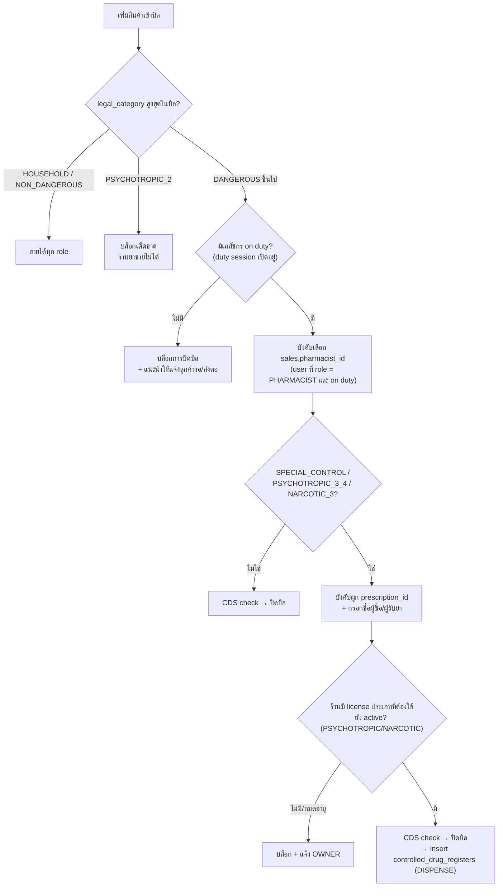
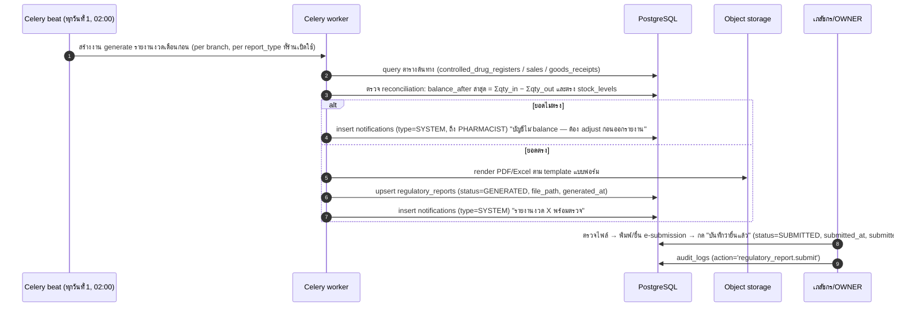
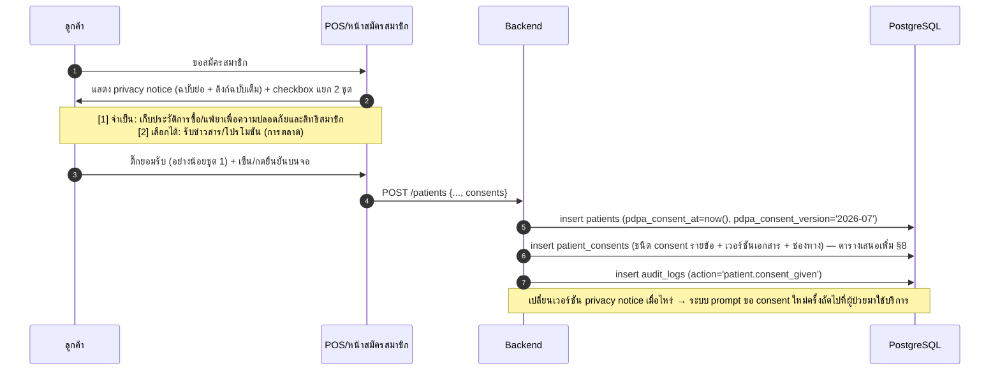

# 05 — GPP, กฎหมายยา และรายงาน ขย.

เอกสารนี้แปลง "ข้อกำหนดทางกฎหมายและ GPP ของร้านยา ขย.1" ให้เป็น requirement ที่ implement ได้จริงในระบบ
โดยอ้างอิงตาราง/enum จาก [02-database-schema.md](./02-database-schema.md) เป็นแหล่งความจริงสุดท้ายของ schema
(ตารางหลักที่ใช้ในเอกสารนี้: `controlled_drug_registers`, `regulatory_reports`, `sales`, `sale_items`,
`goods_receipts`, `goods_receipt_items`, `dispense_records`, `prescriptions`, `licenses`, `audit_logs`, `patients`)

> **หลักการเขียนเอกสารนี้**: ข้อเท็จจริงทางกฎหมายที่ตรวจสอบกับแหล่งทางการแล้วจะเขียนตรง ๆ
> ส่วนที่ยังยืนยันกับประกาศฉบับล่าสุดไม่ได้ 100% จะติดธง ⚠️ ไว้ทุกจุด — **ก่อน freeze schema /
> ออกแบบฟอร์มรายงานจริง ต้องเทียบกับแบบฟอร์มปัจจุบันของ อย./สสจ. อีกครั้งเสมอ**
> เพราะเลขแบบฟอร์มและคอลัมน์ในแบบมีการปรับปรุงเป็นระยะ

---

## 1. ภูมิทัศน์กฎหมายของร้านยา ขย.1

ระบบนี้ออกแบบสำหรับ **ร้านขายยาแผนปัจจุบัน (ขย.1)** ซึ่งมีเภสัชกรเป็นผู้มีหน้าที่ปฏิบัติการ
กฎหมายหลักที่กระทบการออกแบบระบบมี 5 กลุ่ม:

| กฎหมาย/ประกาศ | สาระที่เกี่ยวกับร้านยา | กระทบระบบตรงไหน |
|---|---|---|
| **พ.ร.บ.ยา พ.ศ. 2510** (และฉบับแก้ไขเพิ่มเติม) | นิยามประเภทยา (ยาอันตราย/ยาควบคุมพิเศษ/ยาสามัญประจำบ้าน), ใบอนุญาตขายยา, หน้าที่ผู้รับอนุญาต + ผู้มีหน้าที่ปฏิบัติการ (เภสัชกร), การจัดทำบัญชี | enum `legal_category`, กติกาการขายใน POS (§2), บัญชี ข.ย. ทั้งหมด (§3), ตาราง `licenses` (§5) |
| **กฎกระทรวง การขออนุญาตและการออกใบอนุญาตขายยาแผนปัจจุบัน พ.ศ. 2556** | กำหนดแบบคำขอ/ใบอนุญาต (เช่น ใบอนุญาตขายยาแผนปัจจุบัน = แบบ ข.ย.5) และ **แบบบัญชี ข.ย.9–ข.ย.13**, กำหนดให้ผ่านการตรวจ GPP เป็นเงื่อนไข | โครงสร้างรายงานใน `regulatory_reports.report_type` (§3), วงจรต่ออายุใบอนุญาต (§5) |
| **ประกาศกระทรวงสาธารณสุข เรื่อง การกำหนดเกี่ยวกับสถานที่ อุปกรณ์ และวิธีปฏิบัติทางเภสัชกรรมชุมชน ในสถานที่ขายยาแผนปัจจุบันตามกฎหมายว่าด้วยยา พ.ศ. 2557** ("ประกาศ GPP") | มาตรฐานสถานที่/อุปกรณ์/วิธีปฏิบัติ: การแสดงตนเภสัชกร, การส่งมอบยาโดยเภสัชกร, ฉลาก-คำแนะนำ, การควบคุมอุณหภูมิ, การแยกยาหมดอายุ, การคัดกรอง-ส่งต่อ | ตาราง mapping GPP → feature ทั้ง §4 |
| **ประมวลกฎหมายยาเสพติด พ.ศ. 2564** (ยกเลิกและแทนทั้ง พ.ร.บ.ยาเสพติดให้โทษ พ.ศ. 2522 และ พ.ร.บ.วัตถุที่ออกฤทธิ์ต่อจิตและประสาท พ.ศ. 2559 — มีผล ธ.ค. 2564) | **วัตถุออกฤทธิ์ประเภท 3/4**: ขายได้เฉพาะผู้รับอนุญาต ต้องทำบัญชีรับ-จ่าย + รายงานต่อ อย. ตามรอบ · **ยาเสพติดให้โทษประเภท 3** (ตำรับที่มียาเสพติดประเภท 2 ผสม เช่น ตำรับโคเดอีน): ต้องมีใบอนุญาตจำหน่าย, บัญชีรับ-จ่าย, รายงานต่อ อย. — กฎหมายลำดับรองยุคกฎหมายเดิม (กฎกระทรวง/ประกาศ/แบบฟอร์ม) ยังใช้ต่อได้เท่าที่ไม่ขัดกับประมวลฯ ตามบทเฉพาะกาล ⚠️ ตรวจสถานะรายฉบับ | `legal_category = 'PSYCHOTROPIC_3_4'` / `'NARCOTIC_3'`, `controlled_drug_registers (register_type='PSYCHOTROPIC'/'NARCOTIC')`, license types `PSYCHOTROPIC_LICENSE` / `NARCOTIC_LICENSE` |
| **พ.ร.บ.คุ้มครองข้อมูลส่วนบุคคล พ.ศ. 2562 (PDPA)** | ข้อมูลสุขภาพ = ข้อมูลอ่อนไหว (sensitive personal data) ต้องมีฐานทางกฎหมายเฉพาะ, สิทธิเจ้าของข้อมูล, มาตรการความปลอดภัย, แจ้งเหตุละเมิด | ตาราง `patients` + ตารางคลินิกทั้งหมด, consent flow, มาตรการใน §7 |

ผู้ตรวจที่ระบบต้องรองรับ: **พนักงานเจ้าหน้าที่ สสจ. (ต่างจังหวัด) / อย. (กทม.)** ตรวจ GPP + บัญชี ข.ย. ประจำปี
และตรวจกรณีมีเรื่องร้องเรียน — ระบบต้อง export เอกสารให้ผู้ตรวจดูได้ทันทีหน้าร้าน (§6)

> ⚠️ พ.ร.บ.ยา พ.ศ. 2510 มีการแก้ไขเพิ่มเติมหลายครั้ง และมีร่าง พ.ร.บ.ยาฉบับใหม่อยู่ในกระบวนการมานาน
> การอ้างเลขมาตราในเอกสาร/หน้าจอระบบ ให้ตรวจสอบกับฉบับปัจจุบันในราชกิจจานุเบกษาก่อนทุกครั้ง

---

## 2. การจัดประเภทยาในระบบ (enum `legal_category`)

ทุก product ที่ `is_drug = true` ต้องมี `drug_details.legal_category` — ค่านี้คือ **สวิตช์หลักที่ POS ใช้บังคับกติกาการขาย**
(enum นิยามใน 02-database-schema.md §2 — ห้ามเปลี่ยนชื่อค่าโดยไม่แก้เอกสารทุกฉบับ)

| `legal_category` | ประเภทตามกฎหมาย | ใครส่งมอบได้ | ต้องมีใบสั่งยา | ใบอนุญาตเพิ่มเติมของร้าน | ต้องลงบัญชี/บันทึก |
|---|---|---|---|---|---|
| `HOUSEHOLD` | ยาสามัญประจำบ้าน | พนักงานทุกคน (ขายได้ทั่วไปแม้นอกร้านยา) | ไม่ | ไม่ | บัญชีซื้อ (ข.ย.9 — ในฐานะยาที่ร้านซื้อเข้า) |
| `NON_DANGEROUS` | ยาแผนปัจจุบันบรรจุเสร็จที่ไม่ใช่ยาอันตราย/ยาควบคุมพิเศษ | พนักงานทุกคน | ไม่ | ไม่ | ข.ย.9 |
| `DANGEROUS` | ยาอันตราย | **เภสัชกรเท่านั้น** (ผู้มีหน้าที่ปฏิบัติการ) | ไม่ (แต่เภสัชกรต้องซักถาม-คัดกรอง) | ไม่ | ข.ย.9 + ข.ย.11 เฉพาะรายการที่ อย. กำหนด (เช่น dextromethorphan ⚠️ ดูประกาศรายตัวยาฉบับล่าสุด — หมายเหตุ: tramadol ตำรับยาเดี่ยวชนิดรับประทานถูกยกระดับเป็น**ยาควบคุมพิเศษ**ตามประกาศ สธ. เรื่องยาควบคุมพิเศษ (ฉบับที่ 57) พ.ศ. 2568 จึงไม่ใช่ตัวอย่างยาอันตรายอีกต่อไป) |
| `SPECIAL_CONTROL` | ยาควบคุมพิเศษ | **เภสัชกรเท่านั้น** | **ต้องมีใบสั่งผู้ประกอบวิชาชีพ** | ไม่ | ข.ย.9 + **ข.ย.10** + ข.ย.12 (ฝั่งใบสั่ง) + `controlled_drug_registers` |
| `PSYCHOTROPIC_2` | วัตถุออกฤทธิ์ประเภท 2 | **ร้านยาขายไม่ได้** (จ่ายได้เฉพาะสถานพยาบาล/หน่วยงานที่ได้รับอนุญาตเฉพาะ) | — | — | ระบบเก็บค่านี้ไว้เพื่อ **validation: บล็อกการสร้าง product/การขาย** เท่านั้น |
| `PSYCHOTROPIC_3_4` | วัตถุออกฤทธิ์ประเภท 3 / 4 | **เภสัชกรเท่านั้น** | **ต้องมีใบสั่งแพทย์** (⚠️ เงื่อนไข/ข้อยกเว้นรายตำรับ ให้ยึดประกาศปัจจุบัน) | **ใบอนุญาตขายวัตถุออกฤทธิ์ฯ** (`PSYCHOTROPIC_LICENSE`) | บัญชีรับ-จ่ายวัตถุออกฤทธิ์ + รายงานเดือน/ปี ต่อ อย. (§3.3) |
| `NARCOTIC_3` | ยาเสพติดให้โทษประเภท 3 | **เภสัชกรเท่านั้น** | **ต้องมีใบสั่งแพทย์** (⚠️ บางตำรับ/ปริมาณอาจมีเกณฑ์เฉพาะ — ยึดประกาศปัจจุบัน) | **ใบอนุญาตจำหน่ายยาเสพติดให้โทษประเภท 3** (`NARCOTIC_LICENSE`) | บัญชีรับ-จ่ายยาเสพติดฯ + รายงานเดือน/ปี ต่อ อย. (§3.4) |

### 2.1 การบังคับกติกาใน POS (enforcement flow)

กติกาข้างบนต้อง **บังคับที่ backend** (ไม่ใช่แค่ซ่อนปุ่มใน frontend) — service layer ตรวจก่อน commit ธุรกรรมขายเสมอ:



กติกา implementation ที่ต้องตรงกันทุกโมดูล:

- **ระดับบิล**: ใช้ `legal_category` ที่ "แรงที่สุด" ในบิลเป็นตัวกำหนดเงื่อนไข (ลำดับความแรง:
  `NARCOTIC_3` > `PSYCHOTROPIC_3_4` > `SPECIAL_CONTROL` > `DANGEROUS` > `NON_DANGEROUS` > `HOUSEHOLD`)
- `sales.pharmacist_id` เป็น nullable ใน schema แต่ **application บังคับ NOT NULL เมื่อบิลมียา `DANGEROUS` ขึ้นไป** (ตรงกับหมายเหตุใน schema doc)
- ทุกบิลที่มียา `SPECIAL_CONTROL` / `PSYCHOTROPIC_3_4` / `NARCOTIC_3` ต้อง insert `controlled_drug_registers`
  (entry_type = `DISPENSE`) ใน transaction เดียวกับการขาย พร้อม `prescription_no`, `prescriber_name`,
  `prescriber_license_no`, `buyer_name` — field เหล่านี้บังคับกรอกที่ UI ก่อนปิดบิล
- การจ่ายยา `DANGEROUS` ขึ้นไปให้ insert `dispense_records` เมื่อผูกผู้ป่วยได้ พร้อม `counseling_note`
  (GPP กำหนดให้ส่งมอบพร้อมคำแนะนำ — §4)
- สินค้า `PSYCHOTROPIC_2` สร้างได้ในฐานข้อมูลกลาง (เพื่อรองรับ validation/CDS) แต่ **เพิ่มเข้าบิลไม่ได้เด็ดขาด** —
  ตรวจตั้งแต่ตอนสร้าง product ให้เตือนว่าร้านยา ขย.1 ไม่มีสิทธิขาย

### 2.2 ปริมาณจำกัดต่อครั้ง (quantity cap)

ยาบางกลุ่มมีประกาศจำกัดปริมาณการขายต่อคนต่อครั้ง (เช่น dextromethorphan, ยาแก้แพ้/แก้ไอบางตำรับ,
วัตถุออกฤทธิ์ 3/4 ตามใบสั่ง) — ⚠️ ตัวเลขจำกัดเปลี่ยนตามประกาศ อย. เป็นระยะ ห้าม hardcode

> บทเรียนจากกรณี **tramadol** (ยาอันตราย → ยาควบคุมพิเศษ ตามประกาศ สธ. ปี 2568): ระบบต้องมี
> flow "ยาเปลี่ยน `legal_category` ตามประกาศใหม่" — แก้ค่าใน `drug_details` แล้วกติกา POS/บัญชี
> เปลี่ยนตามทันที (ข.ย.11 → ข.ย.10 + บังคับใบสั่งยา) พร้อมบันทึกการเปลี่ยนใน `audit_logs`
> และใช้กรณีนี้เป็น regression test ของโมดูล compliance

ออกแบบเป็น **config ระดับ product**: เพิ่มคอลัมน์ `max_qty_per_sale NUMERIC(12,3)` และ
`max_qty_note text` ใน `drug_details` (เสนอเป็น schema addendum — ดู §8) แล้วให้ POS
เตือน/บล็อกเมื่อ `sale_items.qty` เกินค่า พร้อมบันทึก override ลง `audit_logs` (action = `sale.qty_cap_override`)

---

## 3. บัญชีและรายงานตามกฎหมาย

### 3.1 ภาพรวม: แบบบัญชี ข.ย. ตามกฎกระทรวงฯ พ.ศ. 2556

เลขแบบ ข.ย.9–ข.ย.13 ตรวจสอบกับกฎกระทรวงการขออนุญาตและการออกใบอนุญาตขายยาแผนปัจจุบัน พ.ศ. 2556 แล้ว
(มีผลใช้บังคับ มิ.ย. 2557) — แต่ **layout คอลัมน์ของแต่ละแบบให้ยึดไฟล์แบบฟอร์มจริงจาก อย./สสจ. ฉบับล่าสุด** ⚠️

| แบบ | ชื่อบัญชี/รายงาน | `report_type` ใน enum | แหล่งข้อมูลหลักในระบบ | รอบ/การส่ง |
|---|---|---|---|---|
| **ข.ย.9** | บัญชีการซื้อยา | `KY9_PURCHASE` | `goods_receipts` + `goods_receipt_items` + `lots` + `suppliers` | ทำต่อเนื่องทุกครั้งที่ซื้อ เก็บไว้ให้ตรวจ ณ ร้าน (ไม่ต้องส่ง) |
| **ข.ย.10** | บัญชีการขายยาควบคุมพิเศษ | `KY10_SPECIAL_CONTROL_SALE` | `controlled_drug_registers (register_type='SPECIAL_CONTROL', entry_type='DISPENSE')` | ทำทุกครั้งที่ขาย เก็บไว้ให้ตรวจ |
| **ข.ย.11** | บัญชีการขายยาอันตราย เฉพาะรายการที่เลขาธิการ อย. กำหนด | `KY11_DANGEROUS_SALE` | `sale_items` join `sales` + `drug_details` (filter ด้วย flag `requires_ky11` — §8) | ทำทุกครั้งที่ขายรายการนั้น เก็บไว้ให้ตรวจ |
| **ข.ย.12** | บัญชีการขายยาตามใบสั่งของผู้ประกอบวิชาชีพเวชกรรม ผู้ประกอบโรคศิลปะ หรือผู้ประกอบวิชาชีพการสัตวแพทย์ | `KY12_PRESCRIPTION_SALE` | `prescriptions` + `prescription_items` + `dispense_records` + `sales` | ทำทุกครั้งที่จ่ายตามใบสั่ง เก็บไว้ให้ตรวจ |
| **ข.ย.13** | รายงานการขายยาตามที่เลขาธิการ อย. กำหนด | `KY13_SALE_REPORT` | aggregate จาก `sale_items` (filter flag `requires_ky13`) | ส่ง อย./สสจ. **ทุก 4 เดือน ยื่นภายใน 30 วันนับแต่ครบงวด** (ตามกฎกระทรวงฯ 2556 + ประกาศ อย. 2558 — หน้าที่ผูกกับการขายส่ง/รายการยาที่ประกาศกำหนด ร้านขายปลีกทั่วไปอาจไม่เข้าเกณฑ์ ⚠️ ตรวจฉบับล่าสุด) |

ข้อกำหนดร่วมของบัญชี ข.ย. (จากแบบฟอร์มจริง — ระบบต้องมี field ครบ):

- **ลงรายการภายในเวลาที่กำหนดหลังการซื้อ/ขาย** — ระบบทำอัตโนมัติ ณ เวลาปิดบิล/รับของ จึงผ่านโดยปริยาย
- **เลขที่/อักษรครั้งที่ผลิต (lot no.)** ต้องปรากฏทั้งฝั่งซื้อและฝั่งขาย → มาจาก `lots.lot_no`
  (นี่คือเหตุผลเชิงกฎหมายที่ `sale_items.lot_id` ต้องไม่ NULL สำหรับยา — ไม่ใช่แค่เรื่อง FEFO)
- **ลายมือชื่อเภสัชกรผู้มีหน้าที่ปฏิบัติการ** กำกับทุกหน้า/ทุกรายการตามแบบ → ระบบพิมพ์ชื่อ + เลขใบประกอบจาก
  `users`/`licenses` ลงในเอกสาร export แล้วให้เภสัชกร **ลงลายมือชื่อบนกระดาษที่พิมพ์ออกมา**
  ⚠️ การใช้ลายมือชื่ออิเล็กทรอนิกส์แทน ให้ตรวจสอบแนวปฏิบัติของ อย./สสจ. พื้นที่ก่อน (พ.ร.บ.ธุรกรรมทางอิเล็กทรอนิกส์รองรับหลักการ แต่ผู้ตรวจบางพื้นที่ยังขอเล่มกระดาษ)
- **อายุการเก็บบัญชี**: เก็บไว้พร้อมให้ตรวจสอบ ณ สถานที่ขายยา **ไม่น้อยกว่า 3 ปี** ⚠️ ยืนยันตัวเลขกับกฎกระทรวงฉบับปัจจุบัน
  → สอดคล้องนโยบาย retention ใน schema doc (ห้าม purge ข้อมูลขาย/บัญชีก่อน 3 ปีเป็นอย่างน้อย — แนะนำเก็บ 5 ปี)

### 3.2 Field ที่กฎหมายบังคับ ต่อแบบ → mapping คอลัมน์

| แบบ | field ตามแบบฟอร์ม (สรุป) | คอลัมน์ต้นทาง |
|---|---|---|
| ข.ย.9 | วันที่ซื้อ, ชื่อยา, เลขที่/อักษรครั้งที่ผลิต, ผู้ขาย (ผู้ผลิต/ผู้นำเข้า/ผู้ขายส่ง), จำนวน, ลายมือชื่อเภสัชกร | `goods_receipts.received_at`, `products.name`, `lots.lot_no`, `suppliers.name`, `goods_receipt_items.qty` |
| ข.ย.10 | วันที่ขาย, ชื่อยา, lot, จำนวน, **ชื่อ-ที่อยู่ผู้ซื้อ**, **เลขที่ใบสั่งยา + ชื่อผู้สั่งจ่าย + เลขใบประกอบ**, ลายมือชื่อเภสัชกร | `controlled_drug_registers.entry_date/qty_out/buyer_name/prescription_no/prescriber_name/prescriber_license_no/pharmacist_id` (+ `lots.lot_no`) — ⚠️ "ที่อยู่ผู้ซื้อ" ยังไม่มีคอลัมน์เฉพาะ ดู §8 |
| ข.ย.11 | วันที่ขาย, ชื่อยา, lot, จำนวน, (ชื่อผู้ซื้อ — ตามเงื่อนไขประกาศรายตัวยา ⚠️), ลายมือชื่อเภสัชกร | `sales.sold_at`, `sale_items.qty/lot_id`, `sales.pharmacist_id`; ชื่อผู้ซื้อจาก `patients` หรือ field ผู้ซื้อของบิล |
| ข.ย.12 | วันที่จ่าย, เลขที่ใบสั่งยา, ผู้สั่งจ่าย + สถานพยาบาล, ชื่อผู้ป่วย, รายการยา + จำนวน, lot, ลายมือชื่อเภสัชกร | `prescriptions.external_ref/prescriber_name/prescriber_license_no/facility_name`, `patients.first_name/last_name`, `dispense_records.qty/lot_id/pharmacist_id/dispensed_at` |
| ข.ย.13 | ยอดขายรวมรายตัวยา ตามช่วงเวลา + ข้อมูลร้าน/ใบอนุญาต | aggregate `sale_items` group by product + `tenants`/`branches`/`licenses` |

### 3.3 วัตถุออกฤทธิ์ประเภท 3/4 (ประมวลกฎหมายยาเสพติด พ.ศ. 2564)

> วัตถุออกฤทธิ์ทุกประเภทปัจจุบันอยู่ภายใต้ **ประมวลกฎหมายยาเสพติด พ.ศ. 2564**
> (พ.ร.บ.วัตถุที่ออกฤทธิ์ต่อจิตและประสาท พ.ศ. 2559 ถูกยกเลิกโดย พ.ร.บ.ให้ใช้ประมวลกฎหมายยาเสพติด
> พ.ศ. 2564) — กฎกระทรวง/ประกาศ/แบบบัญชียุค พ.ร.บ. 2559 ยังใช้ต่อได้เท่าที่ไม่ขัดกับประมวลฯ
> ตามบทเฉพาะกาล ⚠️ ตรวจสถานะกฎหมายลำดับรองรายฉบับกับ อย. ก่อนออกแบบ template

ร้านที่มี `PSYCHOTROPIC_LICENSE` และขายวัตถุออกฤทธิ์ 3/4 มีหน้าที่:

1. **บัญชีรับ-จ่ายวัตถุออกฤทธิ์** — รายการรับเข้า (จากผู้ขายที่รับอนุญาต), จ่ายออก (ตามใบสั่งแพทย์),
   ยอดคงเหลือต่อเนื่อง → ตรงกับโครงสร้าง `controlled_drug_registers` แบบ append-only พอดี:
   `register_type='PSYCHOTROPIC'`, `qty_in`/`qty_out`/`balance_after`, ฝั่งรับผูก `goods_receipt_id`
   ฝั่งจ่ายผูก `sale_id` + `prescription_no` + `prescriber_name`/`prescriber_license_no` + `buyer_name`
2. **รายงานประจำเดือน + รายงานประจำปี ต่อ อย.** → `regulatory_reports` ด้วย `report_type = 'PSY_MONTHLY'` / `'PSY_ANNUAL'`
   generate จากการ aggregate `controlled_drug_registers` ในงวดนั้น
   ⚠️ **เลขแบบฟอร์ม** (แบบบัญชี/แบบรายงาน เช่น ชุด "บ.จ." เดิม — ต้องตรวจว่าแบบปัจจุบันคือแบบใดภายใต้
   กฎหมายลำดับรองของประมวลกฎหมายยาเสพติด พ.ศ. 2564)
   ตรวจยืนยันจากเว็บกองควบคุมวัตถุเสพติด อย. ไม่สำเร็จขณะเขียน — **ให้ดึงแบบฟอร์มปัจจุบันจาก
   narcotic.fda.moph.go.th หรือ สสจ. พื้นที่ก่อนออกแบบ template export** และปัจจุบัน อย. มีระบบ
   e-submission สำหรับรายงานวัตถุเสพติด — ควรออกแบบ export ให้ตรง format ที่ระบบนั้นรับ (Excel/CSV)
3. **กรณีของหาย/ถูกขโมย/ทำลาย** ต้องบันทึกและแจ้งตามระเบียบ → ใช้ `entry_type='DISPOSE'` + `note`
   และ `inventory_movements (DISPOSE)` พร้อมเหตุผล

### 3.4 ยาเสพติดให้โทษประเภท 3 (ประมวลกฎหมายยาเสพติด พ.ศ. 2564)

รูปแบบหน้าที่เหมือนวัตถุออกฤทธิ์: บัญชีรับ-จ่าย + รายงานตามรอบต่อ อย.

- บัญชีรับ-จ่าย → `controlled_drug_registers (register_type='NARCOTIC')`
- รายงานประจำเดือน → `report_type = 'NARC_MONTHLY'` (และรายปีถ้าแบบปัจจุบันกำหนด —
  เพิ่มค่า enum `NARC_ANNUAL` ได้ภายหลังโดย migration เดียว ⚠️ ยืนยันรอบรายงานกับกฎกระทรวง/ประกาศภายใต้ประมวลฯ ฉบับปัจจุบัน)
- ⚠️ เลขแบบฟอร์มบัญชี/รายงานยาเสพติดประเภท 3 (ชุดแบบภายใต้ประมวลกฎหมายยาเสพติด — เดิมเป็นชุดแบบภายใต้
  พ.ร.บ.ยาเสพติดให้โทษ 2522) **ห้ามใช้เลขแบบเดิมโดยไม่ตรวจ** เพราะกฎหมายแม่เพิ่งเปลี่ยนปี 2564
  และแบบฟอร์มถูกออกใหม่ตามกฎกระทรวงลูก

### 3.5 Pipeline การ generate รายงาน

ทุกแบบ generate เป็นไฟล์ (PDF สำหรับพิมพ์เซ็น / Excel สำหรับ e-submission) เก็บใน object storage
แล้วบันทึกสถานะใน `regulatory_reports`:



กติกาสำคัญ:

- `UNIQUE (branch_id, report_type, period_start)` กันการ generate ซ้ำงวดเดียวกัน — การ re-generate
  ให้เขียนทับ `file_path` เดิมได้เฉพาะตอน `status='DRAFT'|'GENERATED'`; ถ้า `SUBMITTED` แล้วห้ามแก้
  (ต้องออกฉบับแก้ไขเป็นรายงานใหม่ + note อ้างฉบับเดิม และลง `audit_logs`)
- บัญชีที่ "ทำต่อเนื่อง" (ข.ย.9–12) ไม่ต้องรอสิ้นเดือน — หน้า UI "บัญชี ข.ย." ต้อง render ได้ real-time
  จากตารางต้นทางเสมอ ไฟล์รายงวดเป็นเพียง snapshot สำหรับพิมพ์เก็บเข้าแฟ้ม/ให้ผู้ตรวจ

---

## 4. ข้อกำหนด GPP → feature ในระบบ

จากประกาศ GPP พ.ศ. 2557 (หมวดสถานที่/อุปกรณ์/วิธีปฏิบัติ) + แบบตรวจ GPP ที่ สสจ. ใช้จริง
⚠️ รายการข้อกำหนดด้านล่างสรุปเชิงสาระ — ก่อนทำ checklist ในระบบให้เทียบกับแบบตรวจประเมิน GPP ฉบับล่าสุดของ อย.

| ข้อกำหนด GPP (สาระ) | Feature ในระบบ |
|---|---|
| ต้องมีเภสัชกรปฏิบัติหน้าที่ตลอดเวลาที่เปิดทำการ + แสดงตน (ป้าย/บัตร) | ปุ่ม **"Pharmacist on duty"** — เภสัชกรกด check-in/check-out, เก็บลง `pharmacist_duty_sessions` (ตารางเสนอเพิ่ม §8), POS บล็อกการขายยา `DANGEROUS` ขึ้นไปเมื่อไม่มี session เปิดอยู่, หน้าจอลูกค้า (customer display) โชว์ชื่อ+เลขใบประกอบเภสัชกรที่ on duty |
| การส่งมอบยาอันตราย/ยาควบคุมพิเศษทำโดยเภสัชกรเท่านั้น | POS **บังคับเลือก `sales.pharmacist_id`** ก่อนปิดบิลที่มียา `DANGEROUS` ขึ้นไป (ตรวจ role + duty session ที่ backend) + insert `dispense_records.pharmacist_id` |
| ยาควบคุมพิเศษต้องมีใบสั่งยา | POS บังคับผูก `prescription_id` / กรอกข้อมูลใบสั่ง ก่อนขาย `SPECIAL_CONTROL` ขึ้นไป (§2.1) |
| ฉลากยาที่ส่งมอบ: ชื่อยา ความแรง ข้อบ่งใช้/สรรพคุณ วิธีใช้ คำเตือน วันที่จ่าย ชื่อผู้ป่วย ชื่อร้าน+เภสัชกร | โมดูล **พิมพ์ฉลากยา** ที่ POS: ดึง `drug_details.default_label_instruction`/`warning_text` + `sale_items.label_instruction` (แก้ per บิลได้) + ชื่อผู้ป่วย + วันที่ + ชื่อร้าน/เภสัชกร — พิมพ์ผ่าน thermal/label printer |
| ให้คำแนะนำการใช้ยาเมื่อส่งมอบ | field `dispense_records.counseling_note` + template คำแนะนำต่อ generic ที่เภสัชกรกดเลือก/แก้ได้ → เก็บเป็นหลักฐานว่าให้คำแนะนำแล้ว |
| การคัดกรองผู้ป่วยและส่งต่อเมื่อเกินขอบเขตร้านยา | ฟอร์ม **screening + referral note** ในหน้า patient: บันทึกอาการ, การซักประวัติ, ผลการตัดสินใจ (จ่ายยา/ส่งต่อ), พิมพ์ใบส่งต่อ — เก็บใน `dispense_records.counseling_note` หรือตารางบันทึกคัดกรอง (ขยายภายหลัง) |
| การควบคุมอุณหภูมิ/แสง สถานที่เก็บยา (ห้องยา, ตู้เย็นยา 2–8°C) | **temperature log**: ตาราง `temperature_logs` (เสนอเพิ่ม §8) — บันทึก manual วันละ ≥2 ครั้ง หรือรับค่าจาก IoT sensor ผ่าน API, แจ้งเตือน (notifications) เมื่อออกนอกช่วง, export กราฟ/ตารางย้อนหลังให้ผู้ตรวจ |
| แยกเก็บยาหมดอายุ/เสื่อมสภาพออกจากยาขายได้ พร้อมป้ายชัดเจน รอทำลาย | สถานะ **quarantine**: `inventory_movements (movement_type='DISPOSE', reason)` + รายการ "ยารอทำลาย" แยกใน UI, ห้าม lot ที่ `exp_date` ผ่านแล้วถูกหยิบขาย (FEFO query กรอง `exp_date > today` เสมอ), รายงานการทำลาย + หลักฐานภาพถ่าย |
| แจ้งเตือนยาใกล้หมดอายุ (จัดการก่อนถึงวันสิ้นอายุ) | Celery beat สแกน `lots.exp_date` (90/60/30 วัน) → `notifications (type='EXPIRY_WARNING')` — spec ตามเอกสาร inventory |
| การจัดซื้อจากผู้ขายที่ถูกกฎหมาย ตรวจรับยา (lot, วันหมดอายุ, สภาพ) | โมดูล goods receipt บังคับกรอก `lot_no` + `exp_date` ทุกรายการยา, `suppliers` เก็บเลขใบอนุญาตผู้ขายส่ง (field `note`/ขยายได้), block รับของจาก supplier ที่ inactive |
| การเก็บรักษาบัญชี/เอกสารพร้อมให้ตรวจสอบ | §3 + §6 — ทุกบัญชีดูได้ real-time + export ได้ทันที |
| **สื่อโฆษณายาภายในร้าน** ต้องเป็นโฆษณาที่ได้รับอนุญาตตามหมวดการโฆษณาของ พ.ร.บ.ยา (มีเลขที่ใบอนุญาตโฆษณา) และผ่านการตรวจสอบ/คัดกรองโดยเภสัชกรผู้มีหน้าที่ปฏิบัติการก่อนติดตั้ง | **ทะเบียนสื่อโฆษณาในร้าน** (`advertising_media` — ตารางเสนอเพิ่ม §8): บันทึกสื่อแต่ละชิ้น + เลขที่ใบอนุญาตโฆษณา + วันหมดอายุ + เภสัชกรผู้ตรวจ + รูปถ่าย; แจ้งเตือน (`notifications`) เมื่อใบอนุญาตโฆษณาใกล้หมดอายุ; ผูกเข้า GPP self-audit checklist ให้ auto-fill พร้อมหลักฐาน ⚠️ เกณฑ์/ข้อยกเว้นการโฆษณา ณ จุดขาย ตรวจกับ อย. ฉบับล่าสุด |
| การแต่งกาย/ป้ายสัญลักษณ์/ป้ายแสดงใบอนุญาต | นอกขอบเขต software — ใส่ไว้ใน **GPP self-audit checklist** ในระบบ (หน้า checklist ให้ร้านประเมินตนเอง + แนบรูป ก่อนถึงรอบตรวจจริง) |
| พื้นที่ให้คำปรึกษา (counseling area) ตามผังที่ขออนุญาต | อยู่ใน GPP self-audit checklist เช่นกัน |

**GPP self-audit checklist** เป็น feature ร่ม: แปลงแบบตรวจประเมิน GPP ของ อย. เป็น checklist ดิจิทัล
ให้ร้านทำ self-audit รายไตรมาส แนบหลักฐาน (รูป/ไฟล์) เก็บประวัติไว้โชว์ผู้ตรวจ — ข้อที่ระบบมีข้อมูลอยู่แล้ว
(เช่น temperature log, duty sessions, บัญชี ข.ย.) ให้ auto-fill สถานะ "ผ่าน" พร้อมลิงก์หลักฐาน

---

## 5. วงจรใบอนุญาตและการแจ้งเตือน (ตาราง `licenses`)

| ประเภท (`license_type`) | ผูกกับ | อายุ/รอบต่อ | กติกาที่ระบบต้องรู้ |
|---|---|---|---|
| `PHARMACY_LICENSE` — ใบอนุญาตขายยาแผนปัจจุบัน (แบบ ข.ย.5) | `branch_id` (ใบอนุญาตต่อสถานที่ — **หลายสาขา = หลายใบ**) | **สิ้นอายุ 31 ธันวาคม ของปีที่ออก** ต่ออายุรายปี (คำขอต่ออายุ = แบบ ข.ย.15 ⚠️ ยืนยันเลขแบบกับกฎกระทรวงฯ 2556 ฉบับปัจจุบัน) | ยื่นก่อนสิ้นปี — ยื่นช้าหลังสิ้นอายุมีค่าปรับรายวัน และการต่ออายุผูกกับผลตรวจ GPP; ปัจจุบันหลายจังหวัดยื่นผ่านระบบ e-submission ของ อย. |
| `GPP_CERTIFICATE` — หนังสือรับรอง/ผลผ่านการตรวจ GPP | `branch_id` | รอบตรวจโดย สสจ. โดยทั่วไปผูกกับการต่ออายุรายปี; หนังสือรับรองมาตรฐาน (เช่น "ร้านยาคุณภาพ" ของสภาเภสัชกรรม) มีอายุ **3 ปี** ⚠️ ยืนยันอายุ/เงื่อนไขกับสภาเภสัชกรรมและ สสจ. พื้นที่ | ระบบเตือน **ล่วงหน้า ~90 วัน** ก่อนหมดอายุเพื่อเผื่อเวลานัดตรวจ + แก้ข้อบกพร่อง |
| `PHARMACIST_PROFESSIONAL` — ใบอนุญาตประกอบวิชาชีพเภสัชกรรม | `user_id` | ต่ออายุทุก **5 ปี** โดยต้องมีหน่วยกิตการศึกษาต่อเนื่อง (**CPE ≥100 หน่วยกิต ต่อรอบ 5 ปี และ ≥10 หน่วยกิต/ปี** — ตามข้อบังคับสภาเภสัชกรรมปัจจุบัน) | ระบบเก็บ `expiry_date` + ฟีเจอร์เสริม: ให้เภสัชกรกรอกหน่วยกิต CPE สะสมรายปี → เตือนเมื่อปีนั้นยังไม่ถึง 10 หน่วยและใกล้สิ้นปี |
| `PSYCHOTROPIC_LICENSE` — ใบอนุญาตขายวัตถุออกฤทธิ์ 3/4 | `branch_id` | ต่อรายปี (สิ้นอายุ 31 ธ.ค. เช่นเดียวกับใบอนุญาตด้านยา ⚠️ ยืนยัน) | ถ้าไม่ active → POS บล็อกขาย `PSYCHOTROPIC_3_4` ทันที (§2.1) |
| `NARCOTIC_LICENSE` — ใบอนุญาตจำหน่ายยาเสพติดให้โทษประเภท 3 | `branch_id` | ต่อรายปี ⚠️ ยืนยันรอบกับกฎกระทรวงภายใต้ประมวลกฎหมายยาเสพติด | ถ้าไม่ active → POS บล็อกขาย `NARCOTIC_3` |

### 5.1 Alert pipeline

Celery beat สแกน `licenses.expiry_date` ทุกวัน (index `idx_licenses_expiry` มีให้แล้ว) →
insert `notifications (type='LICENSE_EXPIRY')` ถึง OWNER + PHARMACIST ที่เกี่ยวข้อง ตามบันได:

| เหลือเวลา | การแจ้งเตือน |
|---|---|
| 90 วัน | in-app — "เริ่มเตรียมเอกสารต่ออายุ" (สำคัญมากสำหรับ GPP/ตรวจประเมิน) |
| 60 วัน | in-app + email |
| 30 วัน | in-app + email + LINE — ยกระดับเป็น warning |
| 14 วัน / 7 วัน / ทุกวันในสัปดาห์สุดท้าย | ทุก channel — critical |
| หมดอายุแล้ว | banner แดงทั้งระบบ + **enforcement**: ใบอนุญาตวัตถุออกฤทธิ์/ยาเสพติดหมดอายุ → บล็อกการขาย category นั้น; ใบอนุญาตร้าน (ข.ย.5) หมดอายุ → banner เตือนหนัก (ไม่ auto-block ทั้งร้าน แต่ log ทุกบิลลง `audit_logs` ว่าขายระหว่างใบอนุญาตขาดอายุ — การตัดสินใจปิดร้านเป็นเรื่องของ OWNER/กฎหมาย ไม่ใช่ซอฟต์แวร์) |

กรณีต่ออายุแล้ว: **insert แถวใหม่** ใน `licenses` (เลขที่เดิม อายุใหม่) — ไม่ UPDATE ทับ เพื่อเก็บประวัติใบอนุญาตทุกงวดให้ผู้ตรวจดูย้อนได้

---

## 6. Audit trail สำหรับพนักงานเจ้าหน้าที่ (สสจ./อย.)

สิ่งที่ผู้ตรวจขอดูบ่อยที่สุดเวลาเข้าตรวจร้าน และระบบต้อง **export ได้ในไม่กี่คลิก (PDF สำหรับพิมพ์ / Excel สำหรับส่งไฟล์)**:

| # | เอกสาร/มุมมองที่ผู้ตรวจขอ | แหล่งข้อมูล | รูปแบบ export |
|---|---|---|---|
| 1 | บัญชี ข.ย.9–ข.ย.12 ช่วงวันที่ที่กำหนด | ตาม §3.1 | PDF (layout ตรงแบบฟอร์มราชการ) + Excel |
| 2 | บัญชีรับ-จ่ายวัตถุออกฤทธิ์/ยาเสพติด 3 พร้อม **ยอดคงเหลือ ณ วันตรวจ** เทียบของจริงบนชั้น | `controlled_drug_registers` (`balance_after` แถวล่าสุด per product) + `stock_levels` | PDF/Excel + หน้าจอ "นับสต็อกยาควบคุม" เทียบยอดสด |
| 3 | หลักฐานเภสัชกรอยู่ปฏิบัติหน้าที่ (ช่วงเวลาใด ใครอยู่) | `pharmacist_duty_sessions` (§8) + `sales.pharmacist_id` | ตารางรายวัน/รายเดือน |
| 4 | รายการขายยาควบคุมพิเศษ/วัตถุออกฤทธิ์ย้อนหลัง ราย lot — "lot X ขายให้ใครไปบ้าง" (recall trace) | `sale_items.lot_id` → `sales` → `patients` / `controlled_drug_registers` | Excel |
| 5 | บันทึกการทำลาย/ส่งคืนยาหมดอายุ | `inventory_movements (DISPOSE/RETURN)` + เหตุผล + ผู้ทำ | PDF |
| 6 | Temperature log ย้อนหลัง | `temperature_logs` (§8) | PDF กราฟ + ตาราง |
| 7 | ประวัติการแก้ไข/ยกเลิกบิล (ตรวจการทุจริต/ขายนอกบัญชี) | `sales (status='VOIDED')` + `void_reason` + `audit_logs (action='sale.void')` | Excel |
| 8 | สำเนาใบอนุญาตทุกฉบับ + ประวัติการต่ออายุ | `licenses` + ไฟล์สแกนใน `file_path` | PDF bundle |

### 6.1 Immutability — ทำไมผู้ตรวจเชื่อบันทึกของระบบได้

- ตารางหลักฐาน (`controlled_drug_registers`, `inventory_movements`, `audit_logs`, `cds_alerts`, `point_transactions`)
  เป็น **append-only บังคับด้วย DB trigger** (`forbid_update_delete()`) — ต่อให้เป็น OWNER ก็แก้ย้อนหลังไม่ได้
  การแก้รายการผิดทำได้ทางเดียวคือ insert รายการปรับปรุงที่อ้างรายการเดิม (เหมือนหลักบัญชี)
- ทุกการกระทำสำคัญ (void บิล, adjust สต็อก, override CDS, แก้ข้อมูลผู้ป่วย, generate/submit รายงาน,
  แก้ราคา/ส่วนลดเกินเกณฑ์) ลง `audit_logs` พร้อม `actor_id`, `before`/`after` (jsonb), `ip`, เวลา UTC
- **ห้ามมี "โหมดแก้เงียบ"**: ไม่มี endpoint ใดที่แก้ตารางหลักฐานโดยไม่ผ่าน service layer ที่เขียน audit log —
  DB role ของ application ไม่มีสิทธิ์ superuser/bypass trigger
- แนะนำเพิ่มความน่าเชื่อถืออีกชั้น (optional, phase หลัง): hash-chain ใน `audit_logs`
  (คอลัมน์ `prev_hash` — hash ของแถวก่อนหน้า) ทำให้พิสูจน์ได้ว่าไม่มีการลบแถวกลาง chain
- เวลาในเอกสาร export แสดงเป็น **พ.ศ. + เวลาไทย (UTC+7)** เสมอ พร้อม footnote ว่าเก็บจริงเป็น UTC

---

## 7. PDPA สำหรับข้อมูลผู้ป่วย

ข้อมูลใน `patients`, `patient_allergies`, `patient_conditions`, `prescriptions`, `dispense_records`
เป็น **ข้อมูลสุขภาพ = ข้อมูลส่วนบุคคลอ่อนไหว** ตาม PDPA (มาตรา 26) — เก็บ/ใช้ได้ต่อเมื่อเข้าข้อยกเว้นหรือได้ความยินยอมโดยชัดแจ้ง

### 7.1 ฐานทางกฎหมาย (lawful basis) ต่อกิจกรรม

| กิจกรรมประมวลผล | ฐานที่ใช้ | หมายเหตุ |
|---|---|---|
| บันทึกการขาย/จ่ายยาควบคุม, บัญชี ข.ย., รายงาน อย. | **หน้าที่ตามกฎหมาย** (legal obligation) | ไม่ต้องขอ consent และ**ผู้ป่วยขอลบไม่ได้** ตลอดอายุการเก็บตามกฎหมาย |
| ประวัติแพ้ยา/โรคประจำตัว/ประวัติจ่ายยา เพื่อความปลอดภัยในการจ่ายยา (CDS) | ข้อยกเว้นข้อมูลอ่อนไหวด้าน **เวชศาสตร์ป้องกัน/การรักษาทางการแพทย์โดยผู้ประกอบวิชาชีพ** + ประโยชน์สำคัญต่อชีวิต (vital interest) กรณีฉุกเฉิน | ⚠️ ให้ที่ปรึกษากฎหมายยืนยันการอ้างอนุมาตราที่ถูกต้องตามแนวปฏิบัติของ สคส. (คณะกรรมการคุ้มครองข้อมูลส่วนบุคคล) |
| สมัครสมาชิก/สะสมแต้ม/ส่วนลด | **สัญญา** (การเข้าร่วมโปรแกรมสมาชิก) | ข้อมูลที่จำเป็นต่อการเป็นสมาชิกเท่านั้น |
| การตลาด: แจ้งโปรโมชัน, broadcast LINE/SMS | **ความยินยอม (consent)** — แยก checkbox ต่างหาก ถอนได้ตลอด | ห้ามมัดรวมกับ consent สมัครสมาชิก |
| แจ้งเตือนนัดรับยาต่อเนื่อง (refill reminder) | consent ตอนสมัคร (แนะนำ) หรือประโยชน์โดยชอบธรรม ⚠️ เลือกแนวใดให้ DPO/ที่ปรึกษาชี้ขาด แล้วเขียนลง privacy notice ให้ตรง | เป็นการสื่อสารเชิงบริการสุขภาพ ไม่ใช่การตลาดแท้ |

### 7.2 Consent flow ตอนสมัครสมาชิก



- `patients.pdpa_consent_version` ผูกกับเวอร์ชันเอกสาร privacy notice ที่เก็บในระบบ (แสดงย้อนหลังได้ว่า ณ วันนั้นผู้ป่วยเห็นข้อความอะไร)
- การถอน consent การตลาด: ปุ่มใน profile ผู้ป่วย + ทุกข้อความ broadcast มีช่องทาง opt-out →
  insert แถวถอนใน `patient_consents` (ไม่ลบแถวเดิม — ประวัติ consent เป็นหลักฐาน)

### 7.3 สิทธิเจ้าของข้อมูล → การรองรับในระบบ

| สิทธิ | การรองรับ | ข้อจำกัด |
|---|---|---|
| เข้าถึง/ขอสำเนา (access) | ปุ่ม export "ข้อมูลของฉัน" — โปรไฟล์ + ประวัติซื้อ/จ่ายยา + แพ้ยา (PDF/JSON) ภายใน 30 วันตามกฎหมาย | — |
| แก้ไขให้ถูกต้อง (rectification) | แก้ผ่านหน้าร้าน (พนักงานทำให้) + ลง `audit_logs` before/after | ข้อมูลคลินิก (แพ้ยา) แก้โดยเภสัชกรเท่านั้น |
| ลบ/ทำลาย (erasure) | soft delete `patients.deleted_at` + **anonymize** ข้อมูลติดต่อ (ชื่อ→"ลูกค้าถอนตัว", phone/citizen_id→NULL) | **บันทึกที่กฎหมายยาบังคับเก็บ (บัญชี ข.ย., controlled_drug_registers) ลบไม่ได้** — คงไว้ตามหน้าที่ตามกฎหมาย และแจ้งข้อจำกัดนี้ใน privacy notice |
| ระงับการใช้ (restriction) / คัดค้าน (objection) | flag ระงับการตลาดใน `patient_consents`; ระงับการประมวลผลอื่นพิจารณารายกรณี | — |
| โอนย้ายข้อมูล (portability) | export JSON/CSV โครงสร้างมาตรฐาน | — |
| ถอนความยินยอม | §7.2 | ไม่กระทบการประมวลผลก่อนถอน |

### 7.4 มาตรการความปลอดภัย (security measures) ขั้นต่ำ

- **เข้ารหัส**: เลขบัตรประชาชนเข้ารหัสระดับ app (AES-GCM → `citizen_id_enc`) + ค้นหาด้วย hash
  (`citizen_id_hash`) ตาม schema; TLS ทุกการเชื่อมต่อ; disk encryption ที่ DB/object storage
- **การเข้าถึง**: RBAC — CASHIER เห็นข้อมูลผู้ป่วยเท่าที่จำเป็นต่อการขาย (ชื่อ/แต้ม/แพ้ยาแบบ banner เตือน)
  ข้อมูลคลินิกเต็มเห็นเฉพาะ PHARMACIST; RLS กันข้ามร้าน (tenant) ที่ระดับ DB
- **บันทึกการเข้าถึง**: การเปิดดูโปรไฟล์ผู้ป่วย/ประวัติคลินิก ลง `audit_logs (action='patient.view')` —
  ผู้ป่วยขอดูได้ว่าใครเข้าถึงข้อมูลตน และใช้ตรวจการเข้าถึงผิดปกติ
- **Retention**: ข้อมูลคลินิก/บัญชีตามกฎหมายเก็บตามรอบกฎหมาย (≥3 ปี ⚠️ — แนะนำ 5 ปี) แล้วจึงเข้า
  กระบวนการ archive/ทำลายตามนโยบายใน schema doc; ข้อมูลการตลาดลบทันทีที่ถอน consent
- **แจ้งเหตุละเมิด**: มี runbook — ตรวจพบ breach → ประเมิน → **แจ้ง สคส. ภายใน 72 ชั่วโมง**
  (และแจ้งเจ้าของข้อมูลเมื่อความเสี่ยงสูง) — ระบบต้อง export รายชื่อผู้ได้รับผลกระทบจาก `audit_logs`/ขอบเขตข้อมูลได้เร็ว

### 7.5 บทบาท controller/processor และ DPO

- **ร้านยา (tenant) = ผู้ควบคุมข้อมูล (data controller)** ของข้อมูลผู้ป่วยตน;
  **ผู้ให้บริการระบบ (SaaS) = ผู้ประมวลผลข้อมูล (data processor)** → ต้องมี **Data Processing Agreement (DPA)**
  เป็นส่วนหนึ่งของสัญญาใช้บริการ ระบุขอบเขต คำสั่งประมวลผล มาตรการความปลอดภัย และหน้าที่แจ้ง breach ต่อร้าน
- **DPO**: ฝั่งผู้ให้บริการระบบประมวลผลข้อมูลอ่อนไหวจำนวนมากเป็นกิจกรรมหลัก → **ควรแต่งตั้ง DPO**
  (⚠️ เกณฑ์บังคับตามมาตรา 41 + ประกาศ สคส. ที่เกี่ยวข้อง — ให้ที่ปรึกษายืนยัน แต่แนวทางปลอดภัยคือแต่งตั้งไว้เลย);
  ร้านยารายเดี่ยวขนาดเล็กโดยทั่วไปยังไม่เข้าเกณฑ์บังคับ แต่ระบบมีหน้า "ผู้ประสานงานข้อมูลส่วนบุคคล" ให้ร้านกรอกได้

---

## 8. ส่วนที่ต้องเพิ่มใน schema (addendum เสนอเข้า 02-database-schema.md)

เอกสารนี้พบ gap 5 จุดที่ schema ปัจจุบันยังไม่มี — เสนอ DDL ให้ schema doc รับไปพิจารณา merge
(schema doc เป็นผู้กำหนดรายละเอียดสุดท้าย):

```sql
-- 1) เซสชันปฏิบัติหน้าที่ของเภสัชกร (GPP: การแสดงตน + หลักฐานเวลาปฏิบัติหน้าที่)
CREATE TABLE pharmacist_duty_sessions (
  id            uuid PRIMARY KEY DEFAULT uuid_generate_v7(),
  tenant_id     uuid NOT NULL REFERENCES tenants(id),
  branch_id     uuid NOT NULL REFERENCES branches(id),
  pharmacist_id uuid NOT NULL REFERENCES users(id),   -- role ต้องเป็น PHARMACIST (ตรวจที่ app)
  checked_in_at  timestamptz NOT NULL DEFAULT now(),
  checked_out_at timestamptz,                         -- NULL = ยังอยู่เวร; ปิดอัตโนมัติเมื่อสิ้นวันถ้าลืม (พร้อม flag)
  auto_closed   boolean NOT NULL DEFAULT false,
  created_at    timestamptz NOT NULL DEFAULT now()
);

-- 2) บันทึกอุณหภูมิ (GPP: การควบคุมสภาวะการเก็บยา) — รองรับทั้งกรอกมือและ IoT
CREATE TABLE temperature_logs (
  id           uuid PRIMARY KEY DEFAULT uuid_generate_v7(),
  tenant_id    uuid NOT NULL REFERENCES tenants(id),
  branch_id    uuid NOT NULL REFERENCES branches(id),
  location     text NOT NULL,                 -- 'ชั้นวางยา', 'ตู้เย็นยา 1'
  temp_c       NUMERIC(5,2) NOT NULL,
  humidity_pct NUMERIC(5,2),
  source       text NOT NULL DEFAULT 'MANUAL',-- 'MANUAL' | 'IOT'
  recorded_by  uuid REFERENCES users(id),     -- NULL เมื่อ source = IOT
  recorded_at  timestamptz NOT NULL DEFAULT now(),
  is_out_of_range boolean NOT NULL DEFAULT false, -- คำนวณจาก config ช่วงที่ยอมรับต่อ location
  created_at   timestamptz NOT NULL DEFAULT now()
);

-- 3) ประวัติ consent รายข้อ (PDPA) — patients.pdpa_consent_at เก็บได้แค่ครั้งแรก ไม่พอสำหรับถอน/ต่อเวอร์ชัน
CREATE TABLE patient_consents (
  id           uuid PRIMARY KEY DEFAULT uuid_generate_v7(),
  tenant_id    uuid NOT NULL REFERENCES tenants(id),
  patient_id   uuid NOT NULL REFERENCES patients(id),
  consent_type text NOT NULL,                 -- 'MEMBERSHIP' | 'MARKETING' | 'REFILL_REMINDER'
  action       text NOT NULL,                 -- 'GIVEN' | 'WITHDRAWN'
  notice_version text NOT NULL,               -- เวอร์ชัน privacy notice ที่แสดง ณ ตอนนั้น
  channel      text,                          -- 'IN_STORE' | 'LINE' | ...
  actor_id     uuid REFERENCES users(id),
  created_at   timestamptz NOT NULL DEFAULT now()
);
-- append-only: ประวัติ consent เป็นหลักฐานทางกฎหมาย
CREATE TRIGGER patient_consents_append_only
  BEFORE UPDATE OR DELETE ON patient_consents
  FOR EACH ROW EXECUTE FUNCTION forbid_update_delete();

-- 4) คอลัมน์เพิ่มใน drug_details (flag รายงาน + quantity cap + ที่อยู่ผู้ซื้อใน register)
ALTER TABLE drug_details ADD COLUMN requires_ky11 boolean NOT NULL DEFAULT false; -- อยู่ในรายการ ข.ย.11 ตามประกาศ อย.
ALTER TABLE drug_details ADD COLUMN requires_ky13 boolean NOT NULL DEFAULT false; -- อยู่ในรายการที่ต้องรายงาน ข.ย.13
ALTER TABLE drug_details ADD COLUMN max_qty_per_sale NUMERIC(12,3);               -- NULL = ไม่จำกัด
ALTER TABLE drug_details ADD COLUMN max_qty_note text;                            -- อ้างประกาศที่กำหนด
ALTER TABLE controlled_drug_registers ADD COLUMN buyer_address text;              -- แบบ ข.ย.10 ต้องการที่อยู่ผู้ซื้อ ⚠️ เทียบแบบจริง

-- 5) ทะเบียนสื่อโฆษณายาภายในร้าน (GPP: การควบคุมสื่อโฆษณา — โฆษณายาต้องได้รับอนุญาต)
CREATE TABLE advertising_media (
  id            uuid PRIMARY KEY DEFAULT uuid_generate_v7(),
  tenant_id     uuid NOT NULL REFERENCES tenants(id),
  branch_id     uuid NOT NULL REFERENCES branches(id),
  description   text NOT NULL,                 -- สื่ออะไร ติดตั้งตรงไหน (เช่น 'โปสเตอร์หน้าชั้นยาแก้ปวด')
  ad_permit_no  text,                          -- เลขที่ใบอนุญาตโฆษณาจาก อย. (NULL = สื่อที่ไม่เข้าข่ายต้องขออนุญาต ⚠️ เภสัชกรวินิจฉัย)
  permit_expiry date,                          -- ใช้ตั้ง alert ใบอนุญาตโฆษณาหมดอายุ
  reviewed_by   uuid REFERENCES users(id),     -- เภสัชกรผู้ตรวจสื่อก่อนติดตั้ง
  photo_path    text,                          -- รูปถ่ายสื่อ (หลักฐาน GPP checklist)
  installed_at  date,
  removed_at    date,                          -- NULL = ยังติดตั้งอยู่
  created_at    timestamptz NOT NULL DEFAULT now(),
  updated_at    timestamptz NOT NULL DEFAULT now()
);
```

---

## 9. Checklist ก่อน implement + รายการที่ต้องตรวจกับแหล่งทางการ

**ธง ⚠️ ทั้งหมดในเอกสารนี้ (ต้อง resolve ก่อน freeze):**

1. เลขแบบคำขอต่ออายุใบอนุญาตขายยา (ข.ย.15?) และรอบ/ค่าปรับ — เทียบกฎกระทรวงฯ 2556 ฉบับปัจจุบัน + คู่มือ e-submission อย.
2. Layout คอลัมน์จริงของ ข.ย.9–ข.ย.13 — ดาวน์โหลดแบบฟอร์มจาก อย./สสจ. แล้วทำ template ให้ตรงทุกคอลัมน์
3. เลขแบบบัญชี/รายงานวัตถุออกฤทธิ์ 3/4 (ชุด "บ.จ." เดิม ฯลฯ) + รอบส่ง + format ระบบ e-submission วัตถุเสพติด — ตรวจจากกฎหมายลำดับรองภายใต้**ประมวลกฎหมายยาเสพติด พ.ศ. 2564** (แบบยุค พ.ร.บ. 2559 ใช้ได้เท่าที่ไม่ขัดตามบทเฉพาะกาล) ผ่าน narcotic.fda.moph.go.th
4. เลขแบบบัญชี/รายงานยาเสพติดให้โทษประเภท 3 ภายใต้ประมวลกฎหมายยาเสพติด 2564 (แบบใหม่ — ห้ามใช้เลขแบบยุค พ.ร.บ. 2522 โดยไม่ตรวจ)
5. รายการยาที่ต้องทำ ข.ย.11 / รายงาน ข.ย.13 + ปริมาณจำกัดต่อครั้ง (เช่น dextromethorphan — ระวัง: tramadol ตำรับเดี่ยวชนิดรับประทานเป็นยาควบคุมพิเศษแล้วตามประกาศ สธ. ปี 2568, ตำรับผสมตรวจสถานะแยก) — ประกาศ อย. รายตัวยาฉบับล่าสุด → เก็บเป็น seed data ของ flag `requires_ky11/ky13` + `max_qty_per_sale`
6. อายุการเก็บบัญชี (3 ปี?) — กฎกระทรวงฯ 2556
7. อายุ/เงื่อนไขหนังสือรับรอง GPP และ "ร้านยาคุณภาพ" (3 ปี?) — สภาเภสัชกรรม + สสจ. พื้นที่
8. เกณฑ์เงื่อนไขใบสั่งแพทย์/ข้อยกเว้นรายตำรับของวัตถุออกฤทธิ์ 3/4 และยาเสพติด 3
9. การยอมรับลายมือชื่ออิเล็กทรอนิกส์บนบัญชี ข.ย. — สอบถาม สสจ. พื้นที่นำร่อง
10. อนุมาตรา PDPA ที่อ้างสำหรับข้อมูลสุขภาพ + เกณฑ์บังคับแต่งตั้ง DPO — ที่ปรึกษากฎหมาย/แนวปฏิบัติ สคส.
11. เกณฑ์การโฆษณายา ณ จุดขาย (สื่อชนิดใดต้องมีเลขอนุญาตโฆษณา/ข้อยกเว้น) — หมวดการโฆษณาตาม พ.ร.บ.ยา + ประกาศ/คู่มือ อย. ฉบับล่าสุด

**Definition of done ของโมดูล compliance:**

- [ ] POS บังคับกติกาตาม §2.1 ที่ backend ครบทุก legal_category (มี test ครอบทุก branch ของ flow)
- [ ] ปิดบิลยาควบคุม → `controlled_drug_registers` ถูก insert ใน transaction เดียวกัน และ `balance_after` reconcile กับ `stock_levels` ได้ทุกวัน
- [ ] หน้า "บัญชี ข.ย." render real-time + export PDF/Excel ตรง template ราชการ
- [ ] Celery job รายเดือน generate `regulatory_reports` ครบทุก report_type ที่ร้านเปิดใช้ + แจ้งเตือนเมื่อบัญชีไม่ balance
- [ ] License alert ครบบันได 90/60/30/14/7 วัน + enforcement เมื่อใบอนุญาตยาควบคุมหมดอายุ
- [ ] ตาราง append-only ทุกตารางมี trigger + test ยืนยันว่า UPDATE/DELETE โดน reject
- [ ] Consent flow + export "ข้อมูลของฉัน" + anonymize flow ทำงานโดยไม่แตะบันทึกที่กฎหมายยาบังคับเก็บ
- [ ] GPP self-audit checklist พร้อม auto-fill จากข้อมูลระบบ (duty sessions, temperature logs, บัญชี ข.ย.)
