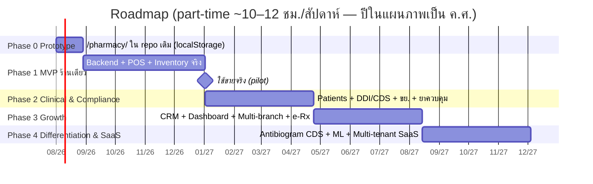
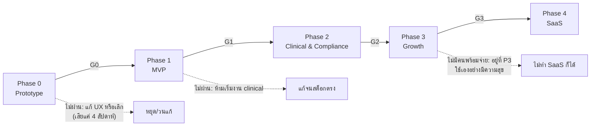

# 06 — แผนการพัฒนา (Roadmap)

เอกสารนี้กำหนดลำดับการสร้าง **ระบบจัดการร้านยาครบวงจร** จาก prototype ใน repo เดิม
ไปจนถึง SaaS multi-tenant โดยยึด stack และการตัดสินใจใน `01-architecture.md` และ
`02-database-schema.md` เป็นค่าคงที่ (React 19 + Vite + Tailwind v4 / FastAPI +
SQLAlchemy 2.x + PostgreSQL 16 / Modular Monolith / RLS multi-tenant / FEFO / UUIDv7)

**สมมุติฐานกำลังคน (ใช้ตลอดเอกสาร):** ผู้พัฒนา 1 คน ทำ **part-time ~10–12 ชั่วโมง/สัปดาห์**
(เภสัชกรที่เขียนโค้ดได้ ทำนอกเวลางาน) — ตัวเลข "สัปดาห์" ทุกตารางคิดบนฐานนี้
ถ้าเพิ่มเวลาเป็น full-time ให้หารตัวเลขด้วย ~3–4 ได้เลย

## 1. หลักการจัดเฟส

1. **ขายได้/ใช้ได้จริงเร็วที่สุด** — จุดตายของโปรเจกต์ side-project คือทำนานเกินไปโดยไม่มีใครใช้
   ดังนั้น Phase 0–1 มุ่งให้ POS + สต็อก **ใช้ขายจริงที่หน้าร้านของผู้พัฒนาเอง** ให้เร็วที่สุด
   ฟีเจอร์ clinical/compliance/SaaS ทั้งหมดรอได้ แต่ "ขายของแล้วสต็อกตรง" รอไม่ได้
2. **Prototype ก่อนลงทุน backend** — UX ของ POS (hotkey, ลำดับจอ, ความเร็วคีย์)
   ต้องพิสูจน์กับหน้างานจริงก่อน เพราะแก้ UI ใน localStorage prototype ถูกกว่าแก้
   API + schema หลายเท่า จึงมี Phase 0 ที่ **ไม่มี backend เลย**
3. **Schema คิดเผื่ออนาคต แต่โค้ดไม่ทำเผื่อ** — `tenant_id`/`branch_id` + RLS ใส่ตั้งแต่
   migration แรก (เพิ่มทีหลังแพงมาก) แต่ *ฟีเจอร์* multi-branch/multi-tenant ยังไม่เขียน
   จนกว่าจะถึงเฟสของมัน
4. **Clinical depth มาหลังรากฐานนิ่ง** — DDI/CDS/บัญชียาควบคุม สร้างบนข้อมูลขายจริง
   ที่สะสมจาก Phase 1 (ทั้ง master data ยาและพฤติกรรมการใช้จริง)
5. **ทุกเฟสจบด้วย gate** — มี decision point ให้หยุดประเมินก่อนไปต่อ (ดู §8)
   เฟสถัดไป *ห้ามเริ่ม* จนกว่า gate ของเฟสก่อนหน้าจะผ่าน

### 1.1 ภาพรวมเส้นเวลา (สมมุติเริ่ม ส.ค. 2569 / Aug 2026)



### 1.2 ตารางสรุปเฟส

| เฟส | ชื่อ | แก่นของเฟส | ประเมิน (สัปดาห์ part-time) | ผลลัพธ์เมื่อจบ |
|---|---|---|---|---|
| 0 | Prototype | ทดลอง UX POS+สต็อกใน repo เดิม ไม่มี backend | 3–4 | รู้ว่า UI แบบไหน "คีย์เร็วพอ" กับหน้างานจริง |
| 1 | MVP ร้านเดียว | POS + Inventory (FEFO/expiry) + ฉลากยา + รายงานขาย บน FastAPI/PostgreSQL | 16–20 | ร้านของผู้พัฒนาใช้ขายจริงทุกวัน |
| 2 | Clinical & Compliance | ผู้ป่วย/แพ้ยา + DDI engine + บัญชียาควบคุม + รายงาน ขย. + license alert | 14–18 | ระบบช่วยงานเภสัชกรรมและงานเอกสารกฎหมายจริง |
| 3 | Growth | CRM/loyalty + dashboard บริหาร + multi-branch + e-prescription | 14–18 | รองรับสาขาที่ 2 และรับใบสั่งยาดิจิทัล |
| 4 | Differentiation & SaaS | Antibiogram CDS + ML alert ranking + multi-tenant SaaS | 16+ (ต่อเนื่อง) | ขาย/ให้บริการร้านอื่นได้ พร้อมจุดขายด้าน AMR |

รวมถึง Phase 3 ≈ **1 ปีครึ่ง แบบ part-time** — ตัวเลขนี้จงใจไม่มองโลกสวย
ถ้าทำได้เร็วกว่าคือกำไร ถ้าอยากเร็วกว่านี้ ทางเดียวที่ได้ผลจริงคือเพิ่มชั่วโมง ไม่ใช่ตัด gate

## 2. Phase 0 — Prototype ใน repo เดิม (`my-web-app`)

### 2.1 เป้าหมาย

สร้าง **เว็บ Vite multi-page ใหม่ที่ `/pharmacy/`** ในแบบเดียวกับ `/drugai/` และ
`/schedule/` ที่มีอยู่แล้วใน repo นี้: เก็บข้อมูลใน `localStorage`, ไม่ต้องล็อกอิน,
deploy ขึ้น GitHub Pages อัตโนมัติพร้อมเว็บอื่น — เพื่อเอา **POS + สต็อกจำลอง**
ไปยืนคีย์จริงที่หน้าร้าน แล้วเก็บคำตอบ 3 ข้อ:

1. Flow การคีย์ขาย 1 บิล (สแกน/ค้นหา → ตะกร้า → รับเงิน → ใบเสร็จ/ฉลากยา) ใช้กี่วินาที
   และ hotkey ชุดไหนที่มือจำได้จริง
2. หน้าจอสต็อกแบบ lot/expiry อ่านง่ายพอไหม การจำลอง FEFO ตรงกับที่หยิบของจริงหรือเปล่า
3. Master data ยาต้องมี field อะไรบ้าง *ขั้นต่ำ* ที่ทำให้ขายได้ (จะกลายเป็น seed ของ Phase 1)

### 2.2 ไฟล์/โครงที่ต้องสร้าง (ให้สอดคล้องโครงเดิมของ repo)

```
pharmacy/
└── index.html                  # entry ของเว็บ /pharmacy/ (แบบเดียวกับ schedule/index.html
                                #   <div id="root"> + <script src="/src/pharmacy/main.tsx">)
src/pharmacy/
├── main.tsx                    # createRoot + StrictMode (แบบเดียวกับ src/schedule/main.tsx)
├── pharmacy.css                # Tailwind v4 + print CSS (ใบเสร็จ 80mm, ฉลากยา)
├── App.tsx                     # เชลล์ + แท็บ (ขายหน้าร้าน / สต็อก / รับของเข้า / ตั้งค่า)
│                               #   + global hotkey handler + persistence
├── types.ts                    # Product, Barcode, Lot, StockMovement, Sale, SaleItem,
│                               #   Payment, Settings — ตั้งชื่อ field ให้ล้อกับตารางใน
│                               #   02-database-schema.md เพื่อให้ย้ายขึ้น backend ได้ตรง ๆ
├── store.ts                    # โหลด/บันทึก localStorage (key: 'pharmacy-pos-v1')
├── seed.ts                     # ยาตัวอย่าง ~50 รายการจากร้านจริง (ชื่อการค้า/generic/
│                               #   barcode/ราคา/lot สมมุติ) — ห้ามใส่ข้อมูลผู้ป่วยจริง
├── utils.ts                    # วันที่ไทย พ.ศ., format เงินบาท, เลขบิลจำลอง (ใช้ร่วมแนวทาง
│                               #   เดียวกับ src/schedule/utils.ts)
├── lib/
│   ├── fefo.ts                 # จำลองตัดสต็อกแบบ FEFO ระดับ lot (pure function — โค้ดนี้
│   │                           #   คือ spec ที่จะ port ไปเขียนเป็น SQL/service ใน Phase 1)
│   └── receipt.ts              # โครงใบเสร็จย่อ + ฉลากยา (คำแนะนำวิธีใช้) สำหรับ print
└── components/
    ├── PosView.tsx             # จอขาย: ช่องสแกน/ค้นหา (autofocus), ตะกร้า, ยอดรวม
    ├── PaymentModal.tsx        # รับเงินสด/โอน (QR mock), เงินทอน, ปิดบิล
    ├── ReceiptPrint.tsx        # ใบเสร็จ print-only (แนว print-only/no-print ของ /schedule/)
    ├── LabelPrint.tsx          # ฉลากยา: ชื่อยา วิธีใช้ คำเตือน ชื่อร้าน/เภสัชกร
    ├── StockView.tsx           # ตารางสต็อกราย lot + ไฮไลต์ใกล้หมดอายุ/ต่ำกว่า min
    ├── ReceiveModal.tsx        # รับของเข้า: เลือกยา + lot + expiry + จำนวน + ทุน
    └── SettingsView.tsx        # ข้อมูลร้าน/เภสัชกร, เกณฑ์แจ้งเตือน, ล้างข้อมูล/export JSON
```

และแก้ `vite.config.ts` เพิ่ม entry ใหม่ใน `build.rollupOptions.input`:

```ts
input: {
  main:     fileURLToPath(new URL('./index.html', import.meta.url)),
  drugai:   fileURLToPath(new URL('./drugai/index.html', import.meta.url)),
  schedule: fileURLToPath(new URL('./schedule/index.html', import.meta.url)),
  pharmacy: fileURLToPath(new URL('./pharmacy/index.html', import.meta.url)), // เพิ่มบรรทัดนี้
},
```

> กติกาเดียวกับ `/schedule/`: สโตร์/สถานะแยกของตัวเอง ไม่แตะระบบ QMR เดิม,
> ไลบรารีหนัก (ถ้ามี) โหลดแบบ lazy, deploy อัตโนมัติผ่าน workflow เดิม
> (`.github/workflows/deploy-pages.yml`) โดยไม่ต้องแก้อะไรเพิ่ม

### 2.3 Deliverables + Effort

| งาน | รายละเอียด | สัปดาห์ |
|---|---|---|
| โครงเว็บ + types + store/seed | entry, แท็บ, persistence, ยาตัวอย่าง 50 รายการ | 1.0 |
| จอขาย POS | สแกน (barcode = พิมพ์+Enter), ค้นหาไทย/อังกฤษ, ตะกร้า, hotkey (F2 ค้นหา, F9 ปิดบิล ฯลฯ), รับเงิน/ทอน | 1.5 |
| สต็อก + FEFO + รับของ | ตารางราย lot, `lib/fefo.ts`, ReceiveModal, ป้ายเตือนใกล้หมดอายุ (90/60/30 วัน) และต่ำกว่า min | 1.0 |
| พิมพ์ใบเสร็จ + ฉลากยา | print CSS 80mm + ฉลากยา, ทดสอบกับเครื่องพิมพ์จริงของร้าน | 0.5 |
| **รวม** | | **3–4** |

### 2.4 Definition of Done (เกณฑ์ผ่าน)

- [ ] คีย์ขายบิลจริง (จำลองคู่ขนานกับวิธีเดิมของร้าน) ได้ **≥ 30 บิล** โดยไม่เปิด DevTools แก้อะไร
- [ ] เวลาเฉลี่ยต่อบิล ≤ ที่วิธีปัจจุบันของร้าน (จับเวลาจริง จดไว้เป็น baseline)
- [ ] FEFO จำลองหยิบ lot ตรงกับที่มือหยิบจริงทุกเคสที่ทดสอบ (รวมเคส lot หมดพอดี/ข้าม lot)
- [ ] ใบเสร็จและฉลากยาพิมพ์ออกเครื่องพิมพ์จริงอ่านรู้เรื่อง
- [ ] จดรายการ "field ที่ขาด / ปุ่มที่กดพลาดบ่อย / จุดที่ช้า" ได้อย่างน้อย 10 ข้อ → เป็น input ของ Phase 1

### 2.5 สิ่งที่ **ไม่ทำ** ใน Phase 0

- ไม่มี backend, ไม่มีล็อกอิน, ไม่มี multi-user — `localStorage` เท่านั้น
- ไม่ทำข้อมูลผู้ป่วย/สมาชิก (PDPA — ห้ามเก็บข้อมูลบุคคลจริงใน localStorage ของเดโม)
- ไม่ทำ DDI/CDS, ไม่ทำรายงาน ขย., ไม่ทำ PO/supplier — แค่ "รับของเข้า" พอ
- ไม่เก็บสวยงาน animation — เอาความเร็วคีย์เป็นหลัก
- ไม่พยายามให้ localStorage เป็นระบบถาวร — ข้อมูลใน Phase 0 คือข้อมูลทิ้งได้ (มี export JSON ไว้กันเหนียวพอ)

### 2.6 ความเสี่ยงหลัก + Mitigation

| ความเสี่ยง | ผลกระทบ | Mitigation |
|---|---|---|
| ติดหล่มขัดเกลา prototype จน Phase 1 ไม่เริ่มสักที | เสียเวลาเฟสที่ไม่ใช่ของจริง | timebox แข็ง 4 สัปดาห์ — ครบแล้วต้องเข้า gate ทันทีไม่ว่าสวยแค่ไหน |
| localStorage เต็ม/หาย ระหว่างทดลอง | เสียข้อมูลทดลอง | ปุ่ม export/import JSON ตั้งแต่สัปดาห์แรก |
| UX ที่ได้ผูกกับเครื่อง/เครื่องพิมพ์เครื่องเดียว | สรุปผิดว่า "ใช้ได้" | ทดสอบอย่างน้อย 2 อุปกรณ์ (PC + tablet) และเครื่องพิมพ์จริงของร้าน |

## 3. Phase 1 — MVP ร้านเดียว (POS + Inventory ของจริง)

### 3.1 ขอบเขต

ย้ายสิ่งที่พิสูจน์แล้วจาก Phase 0 ขึ้น backend จริง: **FastAPI + PostgreSQL 16 + Redis
+ Docker Compose บน VPS** (ตาม `01-architecture.md` §4.1) ครอบคลุม module `core`,
`pos`, `inventory` และ `reporting` ขั้นต่ำ

ตารางที่ต้อง migrate ในเฟสนี้ (subset ของ `02-database-schema.md` — โครงสร้างตาม
schema doc เป๊ะ ๆ รวม `tenant_id`/`branch_id`/RLS แม้ยังมีร้านเดียว):
`tenants, branches, users, products, product_barcodes, drug_details (field พื้นฐาน),
suppliers, lots, stock_levels, inventory_movements, purchase_orders,
purchase_order_items, goods_receipts, goods_receipt_items, sales, sale_items,
sale_payments, notifications, audit_logs`

### 3.2 Deliverables + Effort

| # | งาน | รายละเอียด | สัปดาห์ |
|---|---|---|---|
| 1 | Backend skeleton | โครง Modular Monolith ตาม `01-architecture.md` §2, Pydantic Settings, Alembic, docker-compose (api/db/redis/worker), CI GitHub Actions | 2.5 |
| 2 | Auth + RBAC + audit | JWT access/refresh, บทบาท OWNER/PHARMACIST/ASSISTANT/CASHIER, middleware tenant context (`SET LOCAL`), `audit_logs` + trigger append-only | 2.0 |
| 3 | Schema + RLS migration แรก | ตารางตาม §3.1, RLS policy, seed จากข้อมูล Phase 0 (export JSON → script import) | 2.0 |
| 4 | Inventory service | รับของ (GR) → สร้าง lot → `stock_levels`/`inventory_movements`, FEFO pick เป็น SQL (ตาม `02-database-schema.md` §5.1), ปรับสต็อก/ตัดจำหน่าย, PO แบบ manual | 3.0 |
| 5 | POS service | ขาย 1 บิล = 1 DB transaction (sale + items + payments + ตัดสต็อก FEFO + movement), เลขใบเสร็จ per-branch atomic, ยกเลิกบิล/คืนของแบบมีเหตุผลบันทึก | 2.5 |
| 6 | POS frontend | port UI จาก Phase 0 มาเรียก API จริง, hotkey ชุดที่สรุปจาก Phase 0, จอสต็อก/รับของ | 2.5 |
| 7 | ใบเสร็จ + ฉลากยา | template จริงของร้าน (ชื่อร้าน เลขที่ใบอนุญาต ชื่อเภสัชกร), พิมพ์ 80mm + ฉลากซองยา | 1.0 |
| 8 | Offline-lite | cache catalog ใน IndexedDB + คิวบิลขายค้างส่งเมื่อเน็ตล่ม (เฉพาะขายเงินสด) ตามแนว `01-architecture.md` §5 แบบย่อ | 1.5 |
| 9 | Alerts | Celery beat รายวัน: ยาใกล้หมดอายุ (90/60/30 วัน), สต็อกต่ำกว่า reorder point → `notifications` + อีเมล/LINE | 1.0 |
| 10 | รายงานขายพื้นฐาน | ยอดขาย/กำไรขั้นต้นรายวัน–รายเดือน, ขายดี/ค้างสต็อก, export CSV | 1.0 |
| 11 | Deploy + pilot | VPS จริง, HTTPS, backup อัตโนมัติ (pgBackRest/pg_dump ตาม `01-architecture.md` §4.5), ใช้ขายจริงคู่ขนาน 2 สัปดาห์แล้วตัดเข้าระบบเดียว | 1.5 |
| | **รวม** | | **16–20** |

### 3.3 Definition of Done

- [ ] ร้านใช้ระบบนี้ **เป็นระบบขายหลักติดต่อกัน ≥ 4 สัปดาห์** (ไม่ใช่คู่ขนาน)
- [ ] นับสต็อกจริงเทียบระบบ (cycle count อย่างน้อย 100 SKU): ตรง **≥ 98%** และทุกเคสที่ไม่ตรงอธิบายได้จาก `inventory_movements`
- [ ] เน็ตล่มระหว่างขาย: ปิดบิลเงินสดต่อได้ และ sync กลับครบเมื่อออนไลน์ (ทดสอบด้วยการถอดสาย LAN จริง)
- [ ] restore backup ลง VPS เปล่าสำเร็จภายใน 1 ชั่วโมง (ซ้อมจริงอย่างน้อย 1 ครั้ง)
- [ ] `audit_logs` UPDATE/DELETE แล้ว error จาก trigger (มี test ยืนยัน)
- [ ] ปิด lot แรกที่หมดอายุ: ระบบเตือนล่วงหน้าและตัดจำหน่ายมีร่องรอยครบ

### 3.4 สิ่งที่ **ไม่ทำ** ใน Phase 1

- ไม่ทำข้อมูลผู้ป่วย/DDI/ยาควบคุม — ขายยาอันตรายบันทึกแบบ manual ตามที่ร้านทำอยู่เดิมไปก่อน (ระบบยังไม่รับหน้าที่ทางกฎหมายใด ๆ)
- ไม่ทำ multi-branch UI (schema รองรับแล้วพอ), ไม่ทำ onboarding ร้านอื่น
- ไม่ทำ PO อัตโนมัติ — PO manual พอ (เก็บข้อมูลการสั่งจริงไว้เป็นฐานคำนวณ reorder ใน Phase 2–3)
- ไม่ทำ dashboard สวย ๆ — รายงานตาราง + CSV พอ
- ไม่ integrate payment gateway จริง — PromptPay QR แบบ static/รูปภาพพอ ยอดกรอกมือ
- ไม่ทำ offline เต็มรูปแบบ (conflict resolution ซับซ้อน) — เอาแค่คิวบิลเงินสดค้างส่ง

### 3.5 ความเสี่ยงหลัก + Mitigation

| ความเสี่ยง | ผลกระทบ | Mitigation |
|---|---|---|
| Master data ยา (หลายร้อย SKU) คีย์ไม่เสร็จ | ระบบใช้จริงไม่ได้แม้โค้ดเสร็จ | เริ่มคีย์ตั้งแต่สัปดาห์แรกของเฟส (คู่ขนานกับเขียนโค้ด), ทำหน้า import CSV, คีย์เฉพาะ SKU ที่ขายจริง 80% แรกก่อน (Pareto) |
| Transaction ขายมี bug ทำสต็อกเพี้ยน | ความเชื่อมั่นพัง แก้ยากย้อนหลัง | ทุกการแตะสต็อกผ่าน `inventory_movements` เท่านั้น (ห้าม UPDATE `stock_levels` ตรง ๆ), มี invariant test: ผลรวม movement = stock_level |
| ทำคนเดียว part-time — เฟสลากยาว หมดไฟ | โปรเจกต์ตาย | ตัดตามตาราง §3.2 เป็นงานจบได้ใน 1–2 สัปดาห์/ชิ้น, ขึ้นใช้จริงแบบ incremental (ใช้จอสต็อกจริงได้ก่อนจอขายเสร็จ) |
| VPS/เน็ตร้านล่มช่วงเร่งด่วน | ขายไม่ได้ | offline-lite (ข้อ 8) + runbook กระดาษสำรอง 1 หน้า (จดมือแล้วคีย์ย้อน) |
| ข้อมูลจริงหาย | หายนะ | backup อัตโนมัติรายวัน + ซ้อม restore เป็นส่วนหนึ่งของ DoD ไม่ใช่ของแถม |

## 4. Phase 2 — Clinical & Compliance

### 4.1 ขอบเขต

เพิ่มความลึกทางวิชาชีพและกฎหมาย: module `patients`, `cds`, `compliance`
ตารางใหม่: `patients, patient_allergies, patient_conditions, ddi_rules,
allergy_cross_groups, cds_alerts, controlled_drug_registers, regulatory_reports,
licenses` (+ เติม `drug_details` ให้ครบ: ประเภทยาตามกฎหมาย, ATC, คำเตือน)

### 4.2 Deliverables + Effort

| # | งาน | รายละเอียด | สัปดาห์ |
|---|---|---|---|
| 1 | Patients + PDPA | ทะเบียนผู้ป่วย, consent บันทึกได้/ถอนได้, ประวัติแพ้ยา (`patient_allergies` + ระดับความรุนแรง), โรคประจำตัว (`patient_conditions`), ผูกผู้ป่วยกับบิลขาย | 2.5 |
| 2 | Drug master เชิงคลินิก | เติม `drug_details`: generic, ATC code, ประเภทยาตามกฎหมาย (ยาอันตราย/ยาควบคุมพิเศษ/ยาสามัญประจำบ้าน), mapping brand→generic | 2.0 |
| 3 | DDI rule engine | `ddi_rules` + `allergy_cross_groups`, severity 4 ระดับ (`CONTRAINDICATED/MAJOR/MODERATE/MINOR` — ตาม `04-ddi-engine.md`), นำเข้า rule set เริ่มต้น + กระบวนการ pharmacist review ก่อน publish | 3.0 |
| 4 | CDS ที่ POS แบบ real-time | ตรวจตอนเพิ่มยาเข้าตะกร้า + ก่อนปิดบิล (DDI, แพ้ยา+cross-allergy, drug-disease, ยาซ้ำ 90 วัน), บันทึกทุก alert ลง `cds_alerts`, override CONTRAINDICATED/MAJOR ต้องเป็น PHARMACIST + เหตุผล | 3.0 |
| 5 | บัญชียาควบคุมพิเศษ | `controlled_drug_registers`: บังคับกรอกข้อมูลผู้ซื้อ/ผู้สั่งใช้ตามประเภทยา ณ จุดขาย, ห้ามปิดบิลถ้าไม่ครบ, มุมมองสมุดบัญชีย้อนหลัง append-only | 2.0 |
| 6 | รายงาน ขย. | สร้างบัญชี/รายงานตามแบบที่กฎหมายกำหนด (บัญชีซื้อยา/ขายยาอันตราย/ขายยาควบคุมพิเศษ ฯลฯ) จากข้อมูลขาย–ซื้อที่มีอยู่ → `regulatory_reports` + export PDF/Excel ⚠️ *แบบฟอร์ม/หัวข้อคอลัมน์ต้องเทียบกับประกาศ อย. ฉบับล่าสุดก่อน implement — ห้าม hardcode ตามความจำ* | 2.5 |
| 7 | Licenses + GPP alert | ทะเบียนใบอนุญาต (ขย., ใบประกอบวิชาชีพ, GPP) + Celery เตือนล่วงหน้า 90/60/30 วันก่อนครบกำหนดต่ออายุ | 1.0 |
| 8 | Pilot clinical | ใช้จริง 2–4 สัปดาห์, tune alert threshold ลด alert fatigue, เก็บสถิติ override | 1.5 |
| | **รวม** | | **14–18** |

### 4.3 Definition of Done

- [ ] ขายยาที่ผู้ป่วยมีประวัติแพ้ (test case จัดฉาก): ระบบ block และต้องใช้สิทธิ์ PHARMACIST + เหตุผลจึง override ได้ และเห็นบันทึกใน `cds_alerts`
- [ ] คู่ยา CONTRAINDICATED ที่รู้จักดี (เช่นชุด test 20 คู่ที่เภสัชกร curate เอง) ตรวจเจอครบ 100%; latency การตรวจที่ POS < 100ms (p95)
- [ ] ขายยาควบคุมพิเศษโดยไม่กรอกข้อมูลผู้ซื้อ → ปิดบิลไม่ได้
- [ ] รายงาน ขย. ประจำเดือนที่ระบบสร้าง ถูกตรวจเทียบกับที่ทำมือแบบเดิม 1 รอบเดือนเต็ม แล้วตรงกัน (หรืออธิบายผลต่างได้ทุกรายการ)
- [ ] อัตรา override ของ alert ระดับ MODERATE/MINOR < 80% (ถ้าสูงกว่านี้ = alert fatigue, ต้อง tune ก่อนผ่านเฟส)
- [ ] ข้อมูลผู้ป่วยทุกคนมี consent record; ทดสอบ "ขอลบข้อมูล" (PDPA) แล้ว flow ทำงานตามที่ออกแบบ

### 4.4 สิ่งที่ **ไม่ทำ** ใน Phase 2

- ไม่ซื้อ commercial drug database (Micromedex/FDB) — เริ่มจาก rule set ที่ curate เอง
  เฉพาะยาที่ร้านมีจริง (~หลักร้อยคู่ที่สำคัญ) ตัดสินใจซื้อ/ไม่ซื้อที่ gate เฟสนี้
- ไม่ทำ ML ใด ๆ ใน CDS — rule-based ล้วน (ML rank/NER เป็นของ Phase 4)
- ไม่ทำ e-prescription — ใบสั่งยากระดาษคีย์มือไปก่อน
- ไม่ทำ vital signs/แฟ้มประวัติการรักษาเต็มรูปแบบ — เก็บเฉพาะที่กระทบการจ่ายยา (แพ้ยา, โรคประจำตัว, ตั้งครรภ์/ให้นม)
- ไม่ยื่นรายงานอิเล็กทรอนิกส์ตรงเข้าระบบ อย. — export ไฟล์ให้คนยื่นเอง (integration ทางการค่อยประเมินเมื่อมีช่องทาง API จริง ⚠️ ตรวจสอบระบบรายงานของ อย. ณ เวลานั้น)

### 4.5 ความเสี่ยงหลัก + Mitigation

| ความเสี่ยง | ผลกระทบ | Mitigation |
|---|---|---|
| Rule set DDI ไม่ครอบคลุม → ให้ความมั่นใจเทียม | อันตรายคลินิก + ความรับผิด | แสดงชัดใน UI ว่าตรวจจาก rule set ภายใน ไม่ใช่ฐานข้อมูลสมบูรณ์; เภสัชกรยังเป็นผู้ตัดสินเสมอ (human-in-the-loop ตาม `04-ddi-engine.md`); มีหน้ารายงาน "คู่ยาที่ยังไม่มี rule" |
| แบบฟอร์ม/เงื่อนไขรายงาน ขย. เข้าใจคลาดเคลื่อน | งานกฎหมายผิด | เทียบกับเอกสารจริงที่ร้านใช้ยื่นปีล่าสุด + ให้เภสัชกรผู้มีหน้าที่ปฏิบัติการตรวจก่อนใช้แทนระบบมือ ⚠️ ยึดประกาศฉบับล่าสุดเสมอ |
| Alert fatigue ทำให้ผู้ใช้กดข้ามทุกอย่าง | CDS ไร้ค่า | เริ่มจากแสดงเฉพาะ CONTRAINDICATED/MAJOR ก่อน แล้วค่อยเปิดระดับล่างเมื่อ tune แล้ว; วัดอัตรา override เป็นตัวเลขตั้งแต่วันแรก |
| ข้อมูลผู้ป่วย = ข้อมูลอ่อนไหว PDPA | ความเสี่ยงกฎหมาย/ความเชื่อมั่น | เข้ารหัส field อ่อนไหว, RBAC เข้ม (CASHIER ไม่เห็นประวัติโรค), audit ทุกการเปิดดูประวัติ |

## 5. Phase 3 — Growth (CRM · Dashboard · Multi-branch · e-Prescription)

### 5.1 ขอบเขต

module `crm`, `reporting` (เต็มรูปแบบ), `eprescription` และเปิดใช้ multi-branch จริง
ตารางใหม่: `loyalty_tiers, point_transactions, prescriptions, prescription_items,
dispense_records` (+ เปิดใช้ `branches` มากกว่า 1 แถวจริง ๆ)

### 5.2 Deliverables + Effort

| # | งาน | รายละเอียด | สัปดาห์ |
|---|---|---|---|
| 1 | Loyalty / แต้ม | `loyalty_tiers` + `point_transactions` (append-only ledger), สะสม/แลกแต้มที่ POS, ส่วนลดตาม tier | 2.5 |
| 2 | นัดรับยาต่อเนื่อง | refill reminder จากรอบการซื้อยาโรคเรื้อรัง → LINE/SMS ผ่าน adapter, หน้าจัดการนัดของร้าน | 1.5 |
| 3 | Dashboard บริหาร | ยอดขาย/กำไรขั้นต้น/stock turnover/expiry loss รายวัน–เดือน–สาขา, top movers, dead stock — materialized view + Celery refresh | 2.5 |
| 4 | Multi-branch | เปิดสาขาใน UI, สต็อกแยกสาขา (schema รองรับอยู่แล้ว), โอนของระหว่างสาขาผ่าน `inventory_movements` คู่ (out/in), เลขใบเสร็จ per-branch, รายงานแยก/รวมสาขา | 3.0 |
| 5 | PO อัตโนมัติ | คำนวณ reorder จากค่าเฉลี่ยขายจริง (moving average + lead time ต่อ supplier) → draft PO ให้คนกดยืนยัน | 1.5 |
| 6 | e-Prescription adapter | รับใบสั่งยาดิจิทัลผ่าน adapter interface (`01-architecture.md` §7.1): `prescriptions`/`prescription_items` → คิวจ่ายยา → `dispense_records` ผูกกับบิลขายและ CDS ⚠️ มาตรฐานการเชื่อมต่อ (รูปแบบข้อมูล/ช่องทางของ HIS หรือแพลตฟอร์มใบสั่งยาที่ใช้จริง) ต้องสำรวจของจริงก่อน implement | 3.5 |
| 7 | Offline sync เต็มรูปแบบ | ยกระดับจาก offline-lite: conflict resolution, sync สองทางของ catalog/ราคา, monitoring คิวค้าง | 2.0 |
| | **รวม** | | **14–18** |

### 5.3 Definition of Done

- [ ] สาขาที่ 2 (จริงหรือจำลองเต็มรูปแบบ) ขายคู่ขนานกับสาขาแรกได้ 2 สัปดาห์ โดยสต็อก/เลขใบเสร็จ/รายงานไม่ปนกัน
- [ ] โอนของข้ามสาขา: ยอดสองฝั่ง reconcile ได้ 100% จาก `inventory_movements`
- [ ] รับใบสั่งยาดิจิทัลจากระบบต้นทางจริงอย่างน้อย 1 ราย (คลินิก/HIS) จ่ายยาผ่าน flow เต็ม: รับ → ตรวจ CDS → จ่าย → `dispense_records`
- [ ] สมาชิกสะสมแต้มใช้งานจริง ≥ 50 คน และ point ledger ตรวจสอบย้อนกลับได้ทุกรายการ
- [ ] Dashboard โหลด < 3 วินาที ณ ข้อมูลขายจริง ≥ 1 ปี
- [ ] Refill reminder ส่งจริงและมีผู้ป่วยกลับมารับยาตามนัดวัดผลได้

### 5.4 สิ่งที่ **ไม่ทำ** ใน Phase 3

- ไม่ทำ onboarding ร้านภายนอก — multi-branch คือ "สาขาของ tenant เดียว" เท่านั้น
- ไม่ทำ app มือถือสำหรับสมาชิก — LINE OA พอ (สมาชิกดูแต้ม/รับแจ้งเตือนผ่าน LINE)
- ไม่ทำ marketing automation ซับซ้อน (segment/campaign builder) — reminder ตามรอบยาพอ
- ไม่รับ payment gateway online เต็มรูปแบบ ถ้า PromptPay QR ที่มียังพอ
- ไม่ทำ forecast ML สำหรับ reorder — moving average ก่อน (ML คือ Phase 4 และต้องมีข้อมูลขาย ≥ 1 ปี)

### 5.5 ความเสี่ยงหลัก + Mitigation

| ความเสี่ยง | ผลกระทบ | Mitigation |
|---|---|---|
| ฝั่ง HIS/คลินิกไม่มี API หรือรูปแบบข้อมูลไม่นิ่ง | e-Rx ลากยาวไม่จบ | คุยกับต้นทางจริงก่อนเขียนโค้ด (spec-first), ออกแบบผ่าน adapter interface ตั้งแต่แรก, ถ้าไม่มี partner จริง → เลื่อนข้อ 6 ออกทั้งก้อนโดยไม่กระทบข้ออื่น |
| Multi-branch เพิ่ม edge case สต็อกมหาศาล | สต็อกเพี้ยนแบบตามยาก | ห้ามมี "ของกลางทาง" นอกระบบ: การโอนต้องเป็น movement คู่ที่ commit พร้อมกันหรือมีสถานะ in-transit ชัดเจน |
| ฟีเจอร์ growth เยอะจนดูแลของเดิมไม่ไหว | คุณภาพรวมตก | คง test suite ของ Phase 1–2 เป็น regression gate ใน CI ทุก PR |

## 6. Phase 4 — Differentiation & SaaS

### 6.1 ขอบเขต

จุดต่างที่คู่แข่ง POS ร้านยาทั่วไปไม่มี (ทุน ML/AMR ของผู้พัฒนา) + เปิดรับ tenant ภายนอก
เป็น SaaS จริงตาม `01-architecture.md` §4.2

### 6.2 Deliverables + Effort

| # | งาน | รายละเอียด | สัปดาห์ |
|---|---|---|---|
| 1 | Multi-tenant onboarding | สมัครร้านใหม่ self-service: สร้าง tenant + OWNER + seed, isolation test อัตโนมัติ (ยิง query ข้าม tenant ต้องเป็นศูนย์แถวเสมอ), จำกัด quota ต่อ tenant | 3.0 |
| 2 | Billing & plan | แผนราคา (ต่อสาขา/ต่อเดือน), ใบแจ้งหนี้, ระงับ tenant ค้างชำระแบบ read-only (ห้าม lock ข้อมูลเขา) | 2.0 |
| 3 | Antibiogram CDS | นำเข้า antibiogram (ท้องถิ่น/รพ.แม่ข่าย/ข้อมูลระดับประเทศที่เผยแพร่) → แนะนำ empiric antibiotic ราย indication ที่หน้าจ่ายยา ตาม `04-ddi-engine.md` §5 + เก็บข้อมูล dispensing เพื่อ antibiotic stewardship | 3.5 |
| 4 | ML alert ranking | จัดลำดับ/ลดเสียงรบกวน alert ระดับ MODERATE/MINOR จากประวัติ override (ML **ห้าม** ลด severity หรือซ่อน CONTRAINDICATED/MAJOR — กติกาเหล็กจาก `04-ddi-engine.md` §4) + offline evaluation ก่อนเปิดใช้ | 3.5 |
| 5 | Security hardening | ทบทวน RLS/authz ทั้งระบบ, rate limit ต่อ tenant, เอกสาร PDPA (DPA, privacy policy, ROPA), external pentest อย่างน้อย 1 รอบ | 2.5 |
| 6 | Ops สำหรับ SaaS | monitoring/alerting ต่อ tenant, SLO, runbook, ช่องทาง support, status page | 2.0 |
| | **รวม (รอบแรก)** | หลังจากนี้เป็นงานต่อเนื่อง ไม่ใช่เฟสที่ "จบ" | **16+** |

### 6.3 Definition of Done (รอบแรก)

- [ ] ร้านภายนอก (ไม่ใช่ของผู้พัฒนา) ใช้งานจริง **≥ 2 ร้าน ≥ 1 เดือน** และจ่ายเงินจริงอย่างน้อย 1 ร้าน
- [ ] Isolation test ข้าม tenant ผ่าน 100% ใน CI + ผล pentest ไม่มี finding ระดับ high ค้าง
- [ ] Antibiogram CDS ถูกใช้ประกอบการตัดสินใจจริง และมี disclaimer/ที่มาข้อมูลชัดเจนทุกคำแนะนำ (advisory เท่านั้น — เภสัชกรตัดสิน)
- [ ] ML ranking ผ่าน offline evaluation (ลด alert ที่ถูก override ได้จริงโดย recall ของ alert ที่ถูก accept ไม่ตก) ก่อนเปิด production และปิดสวิตช์กลับเป็น rule-only ได้ทันที
- [ ] มีตัวเลขต้นทุนต่อ tenant ต่อเดือน และ break-even ที่คำนวณจากของจริง

### 6.4 สิ่งที่ **ไม่ทำ** ใน Phase 4 (รอบแรก)

- ไม่ทำ on-premise version ให้ลูกค้า (dual-mode ฆ่าทีมเล็ก) — cloud เท่านั้น
- ไม่ทำ white-label/custom feature รายลูกค้า — configuration ได้ code fork ไม่ได้
- ไม่ให้ ML ตัดสินเชิงคลินิกใด ๆ แทนคน — เป็น advisory + ranking เท่านั้น
- ไม่ขยายไป vertical อื่น (คลินิก, รพ.สต.) จนกว่าร้านยาจะ retention ดีจริง

### 6.5 ความเสี่ยงหลัก + Mitigation

| ความเสี่ยง | ผลกระทบ | Mitigation |
|---|---|---|
| ไม่มีร้านอื่นยอมจ่ายจริง | ลงแรง SaaS ฟรี | gate G3→4 บังคับมี "ร้านที่ตกลงจะจ่าย" ก่อนเริ่มเฟส (ดู §8) — ห้ามสร้างก่อนขาย |
| ข้อมูล antibiogram หายาก/ไม่เป็นตัวแทนบริบทร้านยา | คำแนะนำ misleading | ระบุแหล่ง+ปี+ขนาดตัวอย่างบนทุกคำแนะนำ, เริ่มจาก indication ที่ evidence ชัด, ทำร่วมกับเครือข่ายวิชาการ/รพ.แม่ข่ายถ้าเป็นไปได้ |
| ภาระ support กินเวลา dev หมด | พัฒนาต่อไม่ได้ | onboarding self-service + เอกสาร/วิดีโอ, จำกัดจำนวน tenant รอบแรก (≤ 5 ร้าน) จนกว่า ops จะนิ่ง |
| ความรับผิดจากคำแนะนำคลินิก | กฎหมาย/วิชาชีพ | ToS ชัดว่าเป็น decision support ไม่ใช่ผู้ประกอบวิชาชีพ, ทุก alert/คำแนะนำ log ครบใน `cds_alerts`, ปรึกษาที่ปรึกษากฎหมายก่อนเปิดขายจริง |

## 7. สิ่งที่ "ไม่ทำเลยตลอดโครงการ" (จนกว่าจะมีเหตุให้ทบทวน)

| ไม่ทำ | เหตุผล |
|---|---|
| Microservices / Kubernetes | Modular Monolith + Docker Compose/managed service พอถึง scale หลายสิบร้าน (`01-architecture.md` §1.2) |
| Mobile app native | POS เป็นเว็บ (จอใหญ่+คีย์บอร์ด), ฝั่งสมาชิกใช้ LINE |
| เขียน drug database เองทั้งระบบ | curate เฉพาะที่ร้านใช้ + ประเมินซื้อ commercial DB ที่ gate Phase 2 |
| ระบบบัญชีการเงินเต็มรูปแบบ (GL/ภาษี) | export ข้อมูลให้โปรแกรมบัญชี/สำนักงานบัญชีทำ |
| Blockchain / อะไรที่ใส่มาเพื่อ pitch | ไม่มีปัญหาจริงข้อไหนต้องใช้ |

## 8. Decision Gates — จุดหยุดประเมินก่อนไปต่อ

ทุก gate ตอบเป็นลายลักษณ์อักษรสั้น ๆ (1 หน้า) เก็บไว้ใน `docs/` — กัน sunk-cost bias



| Gate | คำถามที่ต้องตอบ | เกณฑ์ไปต่อ | ถ้าไม่ผ่าน |
|---|---|---|---|
| **G0 → 1** | UX POS เร็วกว่า/เท่าวิธีเดิมไหม? field ยาขั้นต่ำครบหรือยัง? ยังอยากทำต่อไหมหลังลองจริง 1 เดือน? | DoD §2.4 ครบ + ตัดสินใจ "ลงทุน backend" อย่างมีสติ | วนแก้ UX ใน prototype (ถูกกว่า) หรือหยุดทั้งโครงการ — เสียหายแค่ ~4 สัปดาห์ |
| **G1 → 2** | ระบบเป็นระบบขายหลักของร้านจริงไหม? สต็อกเชื่อถือได้ไหม? | DoD §3.3 ครบ (โดยเฉพาะสต็อกตรง ≥ 98% และใช้จริง ≥ 4 สัปดาห์) | **ห้าม**เริ่มงาน clinical บนรากฐานที่สต็อกยังเพี้ยน — แก้ Phase 1 จนผ่าน |
| **G2 → 3** | CDS/ขย. ช่วยงานจริงหรือเป็นภาระ? ตัดสินใจ: ซื้อ commercial drug DB ไหม? จะโตแบบไหน (สาขาตัวเอง vs ขายร้านอื่น)? | DoD §4.3 ครบ + เขียนคำตอบเรื่องทิศทางโตชัดเจน | อยู่ที่ Phase 2 ได้สบาย ๆ — ระบบร้านเดียวที่ compliance ครบคือผลิตภัณฑ์ที่สมบูรณ์ในตัวเอง |
| **G3 → 4** | มีร้านภายนอก **ตกลงจะจ่ายเงิน** แล้วอย่างน้อย 2 ร้านไหม? รับภาระ support/ops ไหวไหม? ต้นทุน cloud ต่อ tenant คุ้มไหม? | มี pre-commitment จริง (ไม่ใช่ "น่าสนใจนะ") + ประเมินต้นทุน/ราคาแล้วบวก | **ไม่ทำ SaaS ก็เป็นจุดจบที่ดี** — ใช้เอง multi-branch + antibiogram (ข้อ 3 ของ Phase 4 ทำได้โดยไม่ต้องเป็น SaaS) |

## 9. สรุปสิ่งที่เอกสารอื่นต้องยึดตาม

- ลำดับเฟส: **0 Prototype → 1 MVP → 2 Clinical & Compliance → 3 Growth → 4 SaaS**
  พร้อม gate G0–G3 — เอกสาร module ใดออกแบบฟีเจอร์ ให้ระบุว่าอยู่เฟสไหน
- Prototype อยู่ที่ `pharmacy/index.html` + `src/pharmacy/` ใน repo `my-web-app`
  (Vite multi-page แบบเดียวกับ `/drugai/`, `/schedule/`) — types ตั้งชื่อ field
  ล้อ schema จริงเพื่อ migrate ขึ้น Phase 1
- `tenant_id`/`branch_id` + RLS + `audit_logs` append-only มีตั้งแต่ migration แรกของ
  Phase 1 แม้ยังใช้ร้านเดียว
- ประเมิน effort ทั้งหมดอิง **part-time 10–12 ชม./สัปดาห์, ผู้พัฒนา 1 คน**:
  P0 = 3–4, P1 = 16–20, P2 = 14–18, P3 = 14–18, P4 = 16+ สัปดาห์
- ห้ามเริ่มงาน clinical (Phase 2) ก่อนสต็อก Phase 1 ตรง ≥ 98% และห้ามเริ่ม SaaS
  (Phase 4) ก่อนมีร้านภายนอกตกลงจ่ายจริง ≥ 2 ราย
